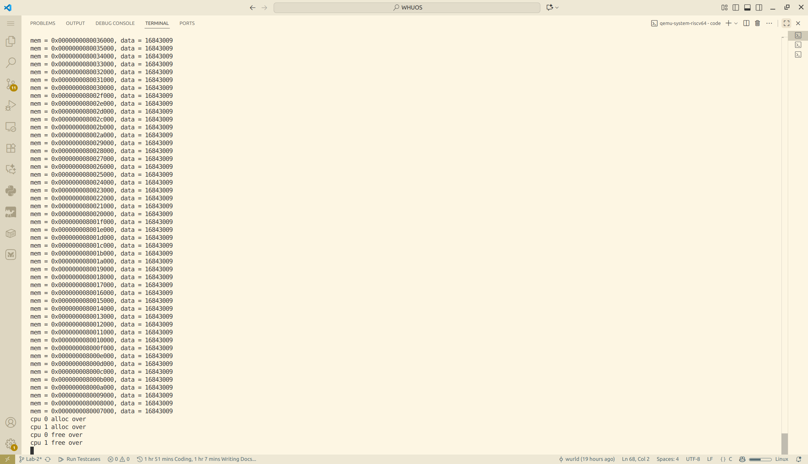
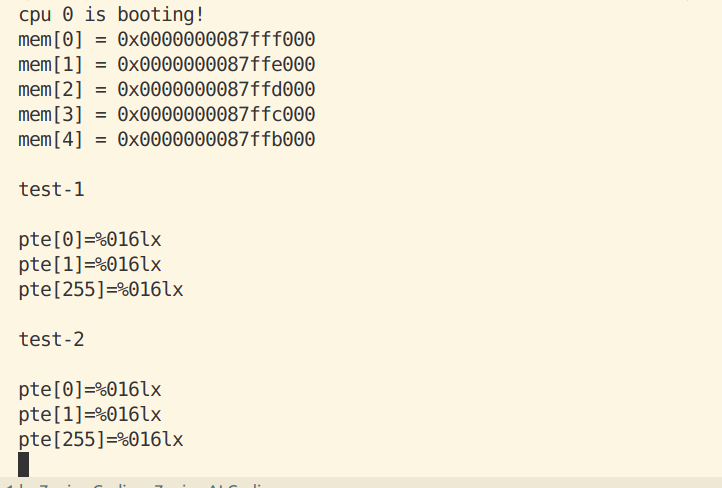

# 实验二: 内存与页表管理

### 关键数据结构

#### page_node_t

- **描述**: 物理页节点，用于链表连接。
- **结构**:
  ```c
  typedef struct page_node {
    struct page_node* next;
  } page_node_t;
  ```

#### alloc_region_t

- **描述**: 可分配区域结构，管理若干物理页。
- **结构**:
  ```c
  typedef struct alloc_region {
    uint64 begin; // 起始物理地址（包含）
    uint64 end;   // 终止物理地址（不包含）
    spinlock_t lk; // 自旋锁，保护下面的链表和计数器
    uint32 allocable;   // 可分配页面计数
    page_node_t list_head; // 哨兵链表头节点（list_head.next 指向第一个可用页）
  } alloc_region_t;
  ```

#### pte_t 和 pgtbl_t

- **描述**: 页表项和页表类型。
- **定义**:
  ```c
  typedef uint64 pte_t;
  typedef uint64* pgtbl_t;
  ```

### 与xv6对比分析

#### pmem.c vs kalloc.c

##### 基本功能

- **kalloc.c**: 单一的全局物理页池（`kmem.freelist`），初始化时把 `end` 到 `PHYSTOP` 的所有页面放入同一个自由链表，分配/释放都从这个池操作。
- **pmem.c**: 把物理页池划分为两个独立的区域：`kern_region`（内核专用）和 `user_region`（用户专用），分区基于 `ALLOC_BEGIN`/`ALLOC_END` 和 `KERNEL_PAGES`。分配/释放时通过 `in_kernel` 参数选择区域。

##### 接口差异

- **kalloc.c**: 提供 `kalloc(void)` 和 `kfree(void *pa)`。分配器不区分调用者是内核还是用户，调用者自己负责语义上的用途区分。
- **pmem.c**: 提供 `pmem_alloc(bool in_kernel)` 和 `pmem_free(uint64 page, bool in_kernel)`，调用者必须显式说明是内核分配还是用户分配，从而使用不同的物理页池。

##### 并发与锁

- **kalloc.c**: 一个全局自旋锁 `kmem.lock` 保护单一 freelist；高并发下该锁可能成为瓶颈。
- **pmem.c**: 每个区域维护自己的自旋锁 `spinlock_t lk`（`kern_region.lk` 和 `user_region.lk`），在理论上减少了跨内核/用户竞争（内核和用户请求通常不在同一锁上竞争），但同一区域内仍可能发生竞争。

##### 安全性与鲁棒性

- **kalloc.c**: 没有区分内核与用户资源，恶意用户不断分配页会耗尽全局物理页，影响内核资源，存在被 DOS 的风险。
- **pmem.c**: 通过 `KERNEL_PAGES` 保留内核专用页，能有效防止用户耗尽内核必须的物理页，提升内核抗攻击性。但若用户区耗尽，用户程序仍会失败/阻塞，这符合设计目标。

##### 配置与适应性

- **kalloc.c**: 依赖链接器符号 `end` 和常量 `PHYSTOP`，对链接脚本要求较低且直接。
- **pmem.c**: 依赖 `ALLOC_BEGIN`/`ALLOC_END` linker 符号，且默认 `KERNEL_PAGES` 为 6（可由 -DKERNEL_PAGES=N 覆盖）。`pmem_init` 会确保区域按页对齐并且总页数至少 >= `KERNEL_PAGES`。

##### 调试/保护措施

- **两者共同点**: 都用 `memset` 在 free/alloc 时填充字节以帮助检测悬空引用；都使用 `panic` 在遇到非法释放或不符合预期的范围时中止。
- **pmem.c 额外**: 增加了对页面是否属于指定区域的边界检查（避免错误地把用户页释放到内核池或反向），从而增加了安全性和调试能力。

##### 时间复杂度

- **两者**: 分配/释放都是 O(1)（在持锁的情况下从链表头插入/弹出），所以性能基线相近。

### 设计决策理由

##### 内存分配器设计决策

- **单链表结构**: 简单高效，分配和释放都是 O(1) 时间复杂度，适合页级分配。
- **零额外内存开销**: 将元数据存放在空闲页面本身，避免额外的位图或数组，节省空间。
- **内核与用户区域分离**: 防止用户进程耗尽内核资源，提升系统安全性。
- **自旋锁保护**: 在多核环境下保证并发安全。
- **填充页面检测悬空引用**: 在分配和释放时用不同值填充页面，便于调试内存错误。

##### 页表管理设计决策

- **SV39 分页模式**: RISC-V 标准，支持 39 位虚拟地址空间。
- **权限位设置**: 区分读、写、执行、用户等权限，确保内存安全。
- **恒等映射内核区域**: 简化内核访问物理内存的逻辑。
- **设备 MMIO 映射**: 将设备地址映射到虚拟地址空间，便于内核访问。

### 实验过程部分

本实验旨在实现一个基于 RISC-V 架构的操作系统内核中的物理内存分配器和虚拟内存管理模块。实验过程分为以下几个阶段：

1. **需求分析与设计**

   - 分析 xv6 操作系统中的内存管理机制，理解物理内存分配器（kalloc.c）和虚拟内存管理（vm.c）的实现原理。
   - 设计改进方案，包括将物理内存分配器分为内核和用户区域，以提高安全性。
2. **代码实现**

   - 基于 xv6 的代码，重新实现物理内存分配器（pmem.c）和虚拟内存管理器（vmem.c）。
   - 确保代码符合项目的接口和宏定义。
3. **集成与调试**

   - 将新实现的模块集成到项目中，解决编译和链接错误，确保模块能正确工作。
4. **测试与验证**

   - 编写测试用例，验证内存分配和虚拟内存映射的功能正确性。

### 实现步骤记录

1. **分析 xv6 源码**
   - 阅读 xv6 的 kalloc.c 和 vm.c 文件，理解物理内存分配和虚拟内存管理的实现。
   - 分析数据结构和关键函数的逻辑。
2. **设计 pmem.c**
   - 定义 page_node_t 和 alloc_region_t 结构体。
   - 实现 pmem_init() 函数，初始化内核和用户区域。
   - 实现 pmem_alloc() 和 pmem_free() 函数，支持从指定区域分配和释放内存。
   - 添加自旋锁保护并发访问。
3. **设计 vmem.c**
   - 定义 pte_t 和 pgtbl_t 类型。
   - 实现 vm_getpte() 函数，遍历页表并返回 PTE 指针。
   - 实现 vm_mappages() 和 vm_unmappages() 函数，进行虚拟地址到物理地址的映射和解除映射。
   - 实现 kvm_init() 函数，创建内核页表并映射设备和内核区域。
   - 实现 kvm_inithart() 函数，激活页表。
4. **解决宏定义冲突**
   - 将重复的宏定义从 riscv.h 移到 vmem.h 中。
   - 更新 vmem.c 使用正确的宏名称。
5. **修复链接符号错误**
   - 将 _etext 改为 etext，以匹配链接脚本中的定义。
6. **集成到项目**
   - 将 pmem.c 和 vmem.c 添加到项目的源文件列表。
   - 更新 Makefile 确保编译包含新文件。
7. **调试与测试**
   - 运行 make 命令，检查编译错误。
   - 修复遇到的语法和链接错误。
   - 编写简单的测试代码验证功能。

### 问题与解决方案

##### 1. 宏定义重复问题

- **问题**: riscv.h 和 vmem.h 中有重复的宏定义，如 PTE_V、PA2PTE 等，导致编译冲突。
- **解决方案**: 将页表相关的宏定义移到 vmem.h 中，并在 riscv.h 中添加注释说明。更新 vmem.c 使用 vmem.h 中的宏。

##### 2. 链接符号未定义错误

- **问题**: 编译时出现 undefined reference to `_etext`，因为链接脚本中使用的是 `etext`。
- **解决方案**: 将 vmem.c 中的 `extern char _etext[]` 改为 `extern char etext[]`，并更新所有引用。

##### 3. 隐式函数声明警告

- **问题**: 编译时出现 implicit declaration of function 'proc_mapstacks'，因为该函数未声明。
- **解决方案**: 暂时移除对 proc_mapstacks 的调用，并在注释中说明稍后实现。

##### 4. 编译器警告处理

- **问题**: 编译时出现 -Werror=implicit-function-declaration，导致编译失败。
- **解决方案**: 移除未实现的函数调用，或添加函数声明。

##### 5. 自旋锁使用导致的 panic 问题

- **问题描述**: 在测试物理内存分配器时，使用自旋锁保护共享变量会导致系统 panic，报错信息为 "panic: double acquire detected"。具体表现为：

  - 在不使用锁时，内存分配和释放功能正常
  - 一旦在循环中使用 `spinlock_acquire()` 和 `spinlock_release()` 保护临界区，系统就会触发 panic
  - 单次获取和释放锁可以正常工作，但在循环中频繁获取释放锁时就会出现问题
- **问题排查过程**:

  1. **初步分析**: 怀疑是重复获取锁导致的，但检查代码逻辑发现并没有嵌套获取同一个锁。
  2. **调试信息**: 在 `spinlock_acquire` 中添加调试输出，发现 panic 时的状态显示：
     - `mycpuid()` = 0
     - `lk->locked` = 0 或 1（不一致）
     - `lk->cpuid` = 0
     - 但 `spinlock_holding(lk)` 却返回 true
  3. **深入分析**: 发现在调用 `spinlock_holding()` 检查时和打印调试信息时，锁的状态不一致，说明存在竞态条件。
  4. **根本原因定位**:
     - 问题出在 `spinlock_init()` 函数中，将 `lk->cpuid` 初始化为 0
     - 同时 `spinlock_release()` 函数在释放锁后也将 `lk->cpuid` 重置为 0
     - 而 CPU 0 的 ID 正好也是 0，导致以下问题：
       - 在锁未被持有时，`lk->cpuid == 0`
       - 当 CPU 0 尝试获取锁时，`spinlock_holding()` 检查 `(lk->locked && lk->cpuid == mycpuid())`
       - 在特定的时序下（例如释放锁后、或初始化状态），`lk->cpuid` 为 0 与 CPU 0 的 ID 相同
       - 导致 `spinlock_holding()` 误判为 CPU 0 已经持有该锁，从而触发 "double acquire" panic
- **解决方案**:

  1. **修改初始化值**: 将 `spinlock_init()` 中的 `lk->cpuid` 初始化值从 0 改为 -1（表示无效的 CPU ID）
  2. **修改释放后的值**: 将 `spinlock_release()` 中释放锁后的 `lk->cpuid` 重置值也改为 -1
  3. **添加 CPU 初始化**: 在 `main()` 函数开始时，添加 `cpu_init()` 函数显式初始化所有 CPU 的结构体（`cpu_t` 中的 `noff` 和 `origin` 字段）
  4. **优化检查逻辑**: 简化 `spinlock_holding()` 的判断逻辑为 `(lk->locked && (lk->cpuid == mycpuid()))`
- **代码修改**:

  在 `kernel/lib/spinlock.c` 中：

  ```c
  // 自旋锁初始化
  void spinlock_init(spinlock_t *lk, char *name)
  {
    lk->name = name;
    lk->locked = 0;
    lk->cpuid = -1;  // 初始化为无效的 CPU ID，避免与 CPU 0 冲突
  }

  // 释放自旋锁
  void spinlock_release(spinlock_t *lk)
  {
    if(!spinlock_holding(lk))
      panic("release");

    lk->cpuid = -1;  // 重置为无效的 CPU ID

    __sync_synchronize();
    __sync_lock_release(&lk->locked);
    pop_off();
  }

  // 检查是否持有锁
  bool spinlock_holding(spinlock_t *lk)
  {
    int r;
    r = (lk->locked && (lk->cpuid == mycpuid()));
    return r;
  }
  ```

  在 `kernel/proc/proc.c` 中添加 CPU 初始化函数：

  ```c
  void cpu_init(void)
  {
      // 显式初始化所有 CPU 结构
      for(int i = 0; i < NCPU; i++) {
          cpus[i].noff = 0;
          cpus[i].origin = 0;
      }
  }
  ```

  在 `kernel/boot/main.c` 中调用初始化：

  ```c
  int main()
  {
      int cpuid = r_tp();
      if(cpuid == 0) {
          cpu_init();           // 初始化 CPU 结构
          spinlock_init(&sum_lock, "sum");
          print_init();
          // ...
      }
      // ...
  }
  ```
- **经验教训**:

  1. **避免使用 0 作为特殊值**: 在设计数据结构时，应该避免使用 0 或其他可能与有效值重叠的数字作为"无效"或"未初始化"的标记值，建议使用 -1 或其他明确的无效值。
  2. **多核并发的复杂性**: 在多核环境下，即使看似简单的初始化值也可能引发竞态条件和难以调试的问题。
  3. **调试技巧**: 当遇到状态不一致的问题时，可能是竞态条件导致的。在调试输出时，状态可能已经被其他操作改变。
  4. **全面的初始化**: 所有全局或静态数据结构都应该显式初始化，不要依赖 C 语言的默认零初始化，特别是在多核环境中。

##### 6. 虚拟内存映射相关问题

###### 6.1 vm_mappages 不允许重新映射导致的 panic

- **问题描述**: 在测试虚拟内存映射功能时，尝试修改已有映射的权限（如从只读改为只写）会触发 panic，报错信息为 "panic: vm_mappages: remap"。具体测试场景：

  ```c
  // test-1: 首次映射虚拟地址 0，权限为只读
  vm_mappages(test_pgtbl, 0, mem[0], PGSIZE, PTE_R);

  // test-2: 尝试修改虚拟地址 0 的映射权限为只写
  vm_mappages(test_pgtbl, 0, mem[0], PGSIZE, PTE_W);  // ← 触发 panic
  ```
- **问题根源**: 在 `vm_mappages` 函数中有严格的重映射检查：

  ```c
  pte_t *pte = vm_getpte(pgtbl, a, true);
  if (!pte)
      panic("vm_mappages: out of memory");
  if (*pte & PTE_V)  // ← 检测到 PTE 已经有效
      panic("vm_mappages: remap");  // ← 直接 panic，不允许更新映射
  ```

  这种设计虽然可以防止意外的重复映射，但过于严格，不支持合法的权限修改需求。
- **设计考量**:

  - **禁止 remap 的理由**:

    1. 防止内存泄漏：旧的物理页映射被覆盖后无法追踪和释放
    2. 防止权限混乱：不经意地改变已有映射的权限可能导致安全问题
    3. 检测编程错误：通常重复映射是逻辑错误的信号
  - **允许 remap 的场景**:

    1. 修改页面权限（如从只读改为可写，用于写时复制）
    2. 更新物理页映射（如页面换出/换入）
    3. 调试和测试场景
- **解决方案**: 允许更新已有映射，移除或修改过于严格的检查：

  ```c
  void vm_mappages(pgtbl_t pgtbl, uint64 va, uint64 pa, uint64 len, int perm)
  {
      if (len == 0)
          panic("vm_mappages: len == 0");

      uint64 a = PG_ROUND_DOWN(va);
      uint64 last = PG_ROUND_DOWN(va + len - 1);

      for (;;) {
          pte_t *pte = vm_getpte(pgtbl, a, true);
          if (!pte)
              panic("vm_mappages: out of memory");

          // 移除严格的 remap 检查，允许更新已有映射
          // if (*pte & PTE_V)
          //     panic("vm_mappages: remap");

          *pte = PA_TO_PTE(pa) | perm | PTE_V;
          if (a == last)
              break;
          a += PGSIZE;
          pa += PGSIZE;
      }
  }
  ```

###### 6.2 vm_unmappages 物理页释放时的区域判断错误

- **问题描述**: 在测试中释放映射的物理页时触发 panic，报错信息为 "panic: pmem_free: page out of range"。具体场景：

  ```c
  // test-1: 从用户区分配物理页并建立映射
  mem[1] = (uint64)pmem_alloc(false);  // false 表示用户区
  vm_mappages(test_pgtbl, PGSIZE * 10, mem[1], PGSIZE, PTE_R | PTE_W);

  // test-2: 解除映射并释放物理页
  vm_unmappages(test_pgtbl, PGSIZE * 10, PGSIZE, true);  // ← 触发 panic
  ```
- **问题根源**: 原始 `vm_unmappages` 函数硬编码将物理页释放到内核区：

  ```c
  void vm_unmappages(pgtbl_t pgtbl, uint64 va, uint64 len, bool freeit)
  {
      // ...
      if (freeit) {
          uint64 pa = PTE_TO_PA(*pte);
          pmem_free(pa, true);  // ← 硬编码 true，总是释放到内核区
      }
      // ...
  }
  ```

  当物理页实际上是从用户区分配的（`pmem_alloc(false)`），但却尝试释放到内核区时，`pmem_free` 会检查地址范围并触发 panic。
- **pmem_free 的区域检查逻辑**:

  ```c
  void pmem_free(uint64 page, bool in_kernel)
  {
      alloc_region_t *r = in_kernel ? &kern_region : &user_region;

      // 检查页面是否在指定区域范围内
      if (page < r->begin || page >= r->end)
          panic("pmem_free: page out of range");
      // ...
  }
  ```
- **解决方案**: 自动检测物理页属于哪个区域，然后释放到正确的区域：

  ```c
  void vm_unmappages(pgtbl_t pgtbl, uint64 va, uint64 len, bool freeit)
  {
      if ((va % PGSIZE) != 0)
          panic("vm_unmappages: not aligned");

      uint64 a;
      for (a = va; a < va + len; a += PGSIZE) {
          pte_t *pte = vm_getpte(pgtbl, a, false);
          if (!pte)
              panic("vm_unmappages: walk");
          if (!(*pte & PTE_V))
              panic("vm_unmappages: not mapped");
          if (PTE_FLAGS(*pte) == PTE_V)
              panic("vm_unmappages: not a leaf");

          if (freeit) {
              uint64 pa = PTE_TO_PA(*pte);

              // 自动判断物理页属于哪个区域
              uint64 kern_end = (uint64)ALLOC_BEGIN + KERNEL_PAGES * PGSIZE;
              bool in_kernel = (pa >= (uint64)ALLOC_BEGIN && pa < kern_end);

              // 释放到正确的区域
              pmem_free(pa, in_kernel);
          }
          *pte = 0;
      }
  }
  ```
- **替代方案**: 如果希望调用者明确指定释放区域，可以添加参数：

  ```c
  void vm_unmappages_ex(pgtbl_t pgtbl, uint64 va, uint64 len, 
                        bool freeit, bool free_to_kernel)
  {
      // ...
      if (freeit) {
          uint64 pa = PTE_TO_PA(*pte);
          pmem_free(pa, free_to_kernel);
      }
      // ...
  }
  ```
- **经验教训**:

  1. **避免硬编码假设**: 不要假设所有映射的物理页都来自同一个区域（内核区或用户区）。
  2. **自动化判断优于手动指定**: 通过地址范围自动判断区域归属，比要求调用者手动指定更不容易出错。
  3. **接口设计的一致性**: `pmem_alloc` 需要指定区域，`pmem_free` 也应该能正确对应，避免分配和释放的区域不匹配。
  4. **测试覆盖不同场景**: 测试应该覆盖内核页和用户页的分配、映射、解除映射和释放，确保所有路径都正确。

### 源码理解总结

#### 物理内存管理

##### struct run 设计巧妙之处

- **简洁的单链表节点**: 只包含一个指针，用来把空闲的物理页面链接成单链表。
- **零额外内存开销**: 空闲页的元数据直接存放在页面内（通常页面最低地址），节省了元数据空间开销。
- **对齐与直接利用**: 页面大小通常大于或等于指针大小，一个页面足够存储 `struct run`。把元数据与页面合体还能利用 CPU cache 更局部访问链表头。

##### kinit() 初始化过程分析

- **如何确定可分配的内存范围？**
  - `kinit()` 通常通过链接器导出的符号 `end` （内核映像末尾）与编译时或配置文件里定义的 `PHYSTOP`（内核可管理物理内存上限）来确定范围：可分配范围是 `[roundup(end), PHYSTOP)`。`end` 指示内核代码和静态数据占用的物理内存末尾，之后的空间就是可以用于分配的内存池。
- **空闲页链表是如何构建的？**
  - `freerange(pa_start, pa_end)` 会把 `pa_start` 向上对齐到页边界，然后从 `pa_start` 开始，步长为 `PGSIZE`，对每个页面调用 `kfree(p)`，而 `kfree()` 会把该页面的首地址填充（用于调试），把页面 reinterpret 为 `struct run *r`，并在持有 `kmem.lock` 的情况下把 `r->next = kmem.freelist; kmem.freelist = r;`。结果是把所有页面按顺序压入自由链表，形成一个 LIFO 链表。
- **为什么要按页对齐？**
  - 分配器以页为单位管理内存（kalloc 返回整页），因此所有页面地址必须和页大小对齐，这样在做物理地址到页索引或页表映射时才能保证正确性。
  - 将 `pa_start` 向上对齐可以避免覆盖内核已有的数据（`end` 可能不是页对齐），确保不会将部分仍被内核使用的页加入 freelist。

##### kalloc() 和 kfree() 实现理解

- **分配算法的时间复杂度**
  - `kalloc()`：在持锁的情况下从链表头取出第一个节点，操作是 O(1)。
  - `kfree()`：把释放的页面插入链表头，操作是 O(1)。
  - 因此分配和释放都具有常数时间复杂度 O(1)，非常高效（在单线程或用自旋锁保护的多核场景中也能快速执行）。
- **如何防止 double-free？**
  - 在 xv6 的简单实现中，`kfree()` 对传入地址做了基本检查（页对齐、地址范围、不能释放内核代码段之前的空间），并会 `memset(pa, 1, PGSIZE)` 把页面填充为垃圾来帮助检测悬挂引用，但它并没有用额外标志位来检测双重释放（double-free）。
  - 因此纯实现上并不能完全防止 double-free；防护依赖于调用者的正确性。然而填充页面和在调试时对 freed page 做特殊模式可以在后续访问中较为快速地暴露问题。
  - 如果想主动检测 double-free，需要额外元数据（比如一个位图或在页面头部写入 magic 值并在 kfree 前校验）。
- **这种设计的优缺点**
  - **优点**：
    - 极其简单，代码短小易懂。
    - 时间复杂度低：分配/释放 O(1)。
    - 零额外内存管理开销（元数据就位于空闲页面内部）。
  - **缺点**：
    - 只支持固定大小的块（整页），不能用于细粒度分配。
    - 不支持合并或块分裂，因此碎片化控制能力有限（但在整页分配场景下碎片不像小粒度分配那样严重）。
    - 无内置安全检查或双重释放检测（需要额外机制来增强可靠性）。
    - 并发性能受限于全局锁（单个 freelist lock 会在高并发下成为瓶颈）。

##### 设计思考

- **如何实现内存统计功能？**
  - 维护全局计数器：在 `kmem` 中添加 `uint64 total_pages; uint64 free_pages;`，在 `kinit()` 初始化 `total_pages = (pa_end - pa_start) / PGSIZE`，在 `kalloc()` 减少 `free_pages`，在 `kfree()` 增加 `free_pages`。这些操作需在持锁状态下修改以保证并发安全。
  - 采样/阈值报警：如果 `free_pages` 低于阈值就触发警告或回收策略。
  - 每个 CPU 统计：为降低锁竞争，可以使用 per-CPU 的分配缓存或统计（例如每个 CPU 有局部缓存的自由链，和本地统计），再周期性合并到全局统计中。
- **如何检测内存泄漏？**
  - 在内核引导/测试时记录总的分配次数与释放次数（或 track 当前分配计数），长期运行若 `allocated_pages - freed_pages` 保持增长并且不下降，可能为内存泄漏。
  - 引入引用计数或更高级的内存审计：给每次分配附加上下文（调用栈、分配时间），在释放时清楚记录。可以把这些信息写入一个可选的哈希表（物理页 -> 元数据），仅在调试或开发构建中启用以避免性能开销。
  - 定期运行内存一致性检查：在某些检查点遍历所有已知对象（例如进程页表中映射的物理页），验证哪些页没有被引用并和 free list 对比，找出被遗忘的页。
- **更高效的分配算法有哪些？**
  - 分级空闲链表（Segregated Free Lists）：对于不同大小类别维护不同的空闲链表（这里若支持小块分配非常适合）。
  - 位图（Bitmap）+ buddy 系统：buddy allocator 支持分裂和合并，适合可变大小的内存管理，内部实现也较为简单且支持 O(log n) 操作。
  - slab/SLUB 分配器：为经常分配/释放相同大小对象优化缓存，本质上预先分配大量相同大小的块并维护高速缓存，适合内核对象分配场景（inode、task_struct 等）。
  - per-CPU caches + lock-free/free-list caches：减少并发场景下的锁竞争，适合多核系统的高并发分配。

#### 虚拟内存与页表管理

##### 分页机制基础

- **satp 寄存器字段**

  - **MODE 字段**: 用于开启分页并选择页表级数。
  - **ASID**: 可用于降低上下文切换的开销。
  - **PPN 字段**: 以 4 KiB 页为单位存放根页表的物理页号。
- **分页启用过程**
  **M** 模式软件在第一次进入 **S** 模式前会将 satp 清零以关闭分页，然后 **S** 模式软件在创建页表后将正确设置 satp 寄存器。satp 寄存器启用分页时，处理器将从根部遍历页表，将 **S** 模式和 **U** 模式的虚拟地址翻译为物理地址。
- **虚拟地址结构**

  - 第 39-30 位为一级页索引 VPN0
  - 第 30-21 位为二级页索引 VPN1
  - 第 21-12 位为三级页索引 VPN2
- **PTE 字段**

  - **V 位**: 表示该 PTE 的其余字段是否有效（V=1 时有效）。若 V=0，则遍历到此 PTE 的虚拟地址翻译过程将触发页故障。
  - **R、W、X 位**: 分别表示该页是否可读、可写、可执行。若 3 位均为 0，则该 PTE 指向下一级页表，否则为叶子节点。
  - **U 位**: 表示该页是否为用户页。若 U=0，则 U 模式不能访问该页，但 S 模式能。若 U=1，则 U 模式能访问该页，但 S 模式不能。
- **地址转换过程**
  从 satp 找到根页表的物理地址，然后按照 L2，L1，L0 的变化找到最终的物理地址。每个页表项 64 位 = 8 字节，每个页表大小都为 512×8=4KiB，512 个页表项。最后的页表项保存了对应的 44 位物理页号。

##### xv6 页表管理代码分析

- **walk() 函数遍历逻辑**

  - **如何从虚拟地址提取各级索引？**
    - **Sv39** 的虚拟地址划分为 VPN[2], VPN[1], VPN[0] 三级索引（每级 9 位），以及页内偏移 12 位。
    - 在 xv6 中常用的宏（或等价位运算）为：
      - 第 i 级索引 idx = (va >> (12 + 9*i)) & 0x1FF；i 从 2..0
      - 或者使用 PX(va, i) 之类的宏提取。
  - **遇到无效页表项（PTE_V == 0）时如何处理？**
    - 若 `walk(pagetable, va, alloc)` 中的 `alloc` 参数为 false：遇到无效 PTE 就返回 NULL（表示找不到对应的下级页表或最终 PTE）。
    - 若 `alloc` 为 true：`walk` 会尝试为缺失的中间页表分配一个新的物理页（通常通过 kalloc/pmem_alloc），清零该页并把对应的父 PTE 设置为该页的物理地址并置 `PTE_V`（有效）。随后继续下钻。
  - **为什么需要 `alloc` 参数？**
    - `alloc` 决定 `walk` 是做"查找"还是做"创建并查找"。
    - 在建立映射（例如 `mappages`）时，需要创建缺失的中间页表，因此会传 `alloc = true`。
    - 在只做地址查询或访问转换（例如查找某个映射以验证权限）时，不需要创建页表，传 `alloc = false` 可以避免不必要的内存分配。
- **mappages() 映射建立细节**

  - **如何处理地址对齐？**
    - `mappages()` 接受一个起始虚拟地址 `va`、长度 `size` 和物理基址 `pa`（或按页映射的基础地址）。它会先把 `va` 向下取整为页边界（PGROUNDDOWN），把 `va+size` 向上取整为页边界（PGROUNDUP），然后以 `PGSIZE` 为步长循环处理每一页映射。
    - 对齐保证：每个映射操作都是整页的 PTE 设置，避免覆盖非页对齐内存。
  - **权限位如何设置？**
    - 每个 PTE 的低位用于权限（PTE_R/W/X/U 等）。`mappages` 在写入最终叶子 PTE 时，会把物理页号（PA）与 `perm`（传入的权限组合）按位或，再加上 `PTE_V`（有效位），例如：`*pte = PA | perm | PTE_V`。
    - `perm` 根据映射用途选择：内核只读代码页可能没有 `W`，用户页需要 `U`，设备内存通常设置为 `R|W` 而不设置 `X`。
  - **映射失败时的清理工作**
    - 在映射循环过程中，`mappages` 可能在中途遇到错误（例如为中间页表分配页失败，或发现已有冲突的 PTE）。良好的实现应该回滚已经成功建立的那些映射（解除已写入的 PTE 并释放在映射过程中为页表分配的临时页面），以保持系统一致性并避免内存泄漏。
    - xv6 的实现通常在中途失败时调用 `panic`（简单处理），或显式在失败路径上反向遍历已映射页并清除 PTEs，同时释放中间分配的页面（如果实现支持回滚）。

##### 地址转换相关宏解释

- **PGROUNDUP(sz) 与 PGROUNDDOWN(a)**
  - PGROUNDUP 将字节大小向上取整到 PGSIZE 的倍数，常用于计算要分配或映射的整页大小。
  - PGROUNDDOWN 将地址向下取整到页边界，用于得到页起始地址。
  - 例：PGROUNDUP(0x1003) = 0x2000（假设 PGSIZE = 0x1000）。
- **PTE_PA(pte) 的位运算**
  - 宏 `#define PTE_PA(pte) (((pte) >> 10) << 12)` 的意图是从 64 位 PTE 中提取物理页号并还原为物理地址：页表项低 10 位保留为标志位和一些额外位（不同实现细节），所以右移 10 去掉低位标志，再左移 12 把页号转换为字节地址（乘以 4096）。
  - 等价理解：`PA = (pte & ~0x3FF) & ~0xFFF`（去掉低 10 位和低 12 位标志），目的是得到高位的物理页帧地址。

##### 实现挑战与对策

- **如何避免页表遍历中的"无限递归"？**
  - xv6 的 `walk()` 实际是按循环下钻（非真正递归函数调用），因此不存在函数递归的无限递归问题。但可能出现的危险是：在 `walk(..., alloc=true)` 时，分配新的页表页需要调用物理页分配器（kalloc/pmem_alloc），而分配器本身可能会在某些实现中访问页表（若有更高层次的缓存或统计），从而产生依赖回环。
  - 对策：保证分配器在分配页时不依赖于页表（例如使用早期初始化的静态内存或独立的 allocator），或者在调用分配器时明确禁止调用能再次触发页表操作的路径；在实现上优先使用简单的物理页分配器（kalloc）来为页表页分配空间。
- **映射过程中的内存分配失败应该如何恢复？**
  - 在 `mappages()` 中，当为中间页表分配内存失败或在映射中途发生错误时，应回滚：
    1. 清除已经建立的叶子 PTE（把那些已写入的 PTE 设为 0 或适当值）；
    2. 释放在映射过程中申请的任何中间页表页；
    3. 返回失败错误码（或在早期教学实现中 `panic`）。
  - 实现时要记录哪些页/页表是新分配的，以便失败时能正确释放，而不会误释放原来已有的页表页。
- **如何确保页表的一致性？**
  - 使用合适的锁：当多个 CPU 或线程可能并发修改同一进程/内核页表时，需要在修改页表（mappages/unmap/walk）时持有页表锁或进程锁（避免竞争和中间状态被其他 CPU 看到）。
  - 原子更新：写入最终叶子 PTE 时，尽量一次性把 PA|flags 写入，确保读者不会看到部分更新的标志。
  - TLB 同步：在更改页表（尤其是修改映射或权限）后调用 `sfence.vma`（或平台的等价 TLB flush）以确保已失效的 TLB 条目在处理器上被清除，避免地址转换不一致。
  - 顺序保证：在修改 PTE 之前先取消旧的映射（或先设置新的映射再 flush），按照硬件规范使用内存屏障，确保可见性。

##### 参考 xv6 的内核初始化：`kvminit()` 和 `kvminithart()`

- **`kvminit()` 的内核页表创建（需要映射哪些内存区域？）**
  - 常见需要映射的区域包括：
    1. 内核文本（代码）段：以只读、可执行映射（去除写权限）。
    2. 内核数据/堆/全局变量区：读写映射（RW）。
    3. 内核使用的物理内存（如内核栈、页表本身、内核动态分配区），通常按恒等映射或偏移映射到高地址空间（KERNBASE + PA）。
    4. 设备 MMIO 区域（UART、PLIC、CLINT、virtio 等），这些地址通常映射为 RW、非可执行、并且 `U`（用户）位为 0（仅内核访问）。
  - 映射方式（为什么采用恒等映射/高地址恒等）
    - xv6 常用把物理地址恒等映射到内核虚拟地址空间（例如把物理地址 0x0 映射到 KERNBASE + 0x0），便于内核使用虚拟地址直接访问物理内存（简化实现）。
    - 恒等映射（或高位偏移映射）可以避免内核在访问某些内存时需要额外的转换逻辑，使早期初始化更简单。
- **设备内存的权限设置**
  - 设备 MMIO 通常设置为 R/W, 无 X, 且 U=0（只有内核可访问）。这可以通过设置相应的 PTE 权限位实现。
- **`kvminithart()` 的页表激活**
  - `satp` 寄存器格式和设置：
    - 在 **RISC‑V Sv39** 下，`satp` 包含 MODE(最高位若干位), ASID, 和 PPN（根页表物理页号）。内核通过宏 `MAKE_SATP(pagetable)` 或等价位运算把根页表物理地址填入 PPN 字段并设置 MODE 为 Sv39 的值，然后写入 `satp`。
  - `sfence.vma` 的作用：
    - 在更改 `satp`（页表切换）或修改页表后，必须执行 `sfence.vma` 指令来刷新处理器的地址转换缓存（TLB），确保新的页表设置生效且旧的条目被清除。
  - 激活页表前后的注意事项：
    - 确保新页表已正确初始化并包含必要的内核映射（否则启用分页后内核可能因缺失映射而异常）。
    - 在多核环境中为每个 hart 分别设置 `satp` 并执行 `sfence.vma`，或在切换后在目标 hart 上执行局部刷新。
    - 激活新页表前通常会把中断/异常处理向量设置好（`stvec`/`mtvec` 等），并确保 trampoline 或切换代码已准备好处理异常。

## 测试验证部分

- 测试代码

  ```c++
  //物理内存
  #include "riscv.h"
  #include "lib/print.h"
  #include "mem/pmem.h"
  #include "lib/str.h"

  volatile static int started = 0;

  volatile static int over_1 = 0, over_2 = 0;

  static int* mem[1024];

  int main()
  {
      int cpuid = r_tp();

      if(cpuid == 0) {

          print_init();
          pmem_init();

          printf("cpu %d is booting!\n", cpuid);
          __sync_synchronize();
          started = 1;

          for(int i = 0; i < 512; i++) {
              mem[i] = pmem_alloc(true);
              memset(mem[i], 1, PGSIZE);
              printf("mem = %p, data = %d\n", mem[i], mem[i][0]);
          }
          printf("cpu %d alloc over\n", cpuid);
          over_1 = 1;

          while(over_1 == 0 || over_2 == 0);

          for(int i = 0; i < 512; i++)
              pmem_free((uint64)mem[i], true);
          printf("cpu %d free over\n", cpuid);

      } else {

          while(started == 0);
          __sync_synchronize();
          printf("cpu %d is booting!\n", cpuid);

          for(int i = 512; i < 1024; i++) {
              mem[i] = pmem_alloc(true);
              memset(mem[i], 1, PGSIZE);
              printf("mem = %p, data = %d\n", mem[i], mem[i][0]);
          }
          printf("cpu %d alloc over\n", cpuid);
          over_2 = 1;

          while(over_1 == 0 || over_2 == 0);

          for(int i = 512; i < 1024; i++)
              pmem_free((uint64)mem[i], true);
          printf("cpu %d free over\n", cpuid);  

      }
      while (1);  
  }
  ```
  ```c++
  int main()
  {
      int cpuid = r_tp();

      if(cpuid == 0) {

          print_init();
          pmem_init();
          kvm_init();
          kvm_inithart();

          printf("cpu %d is booting!\n", cpuid);
          __sync_synchronize();
          // started = 1;

          pgtbl_t test_pgtbl = pmem_alloc(true);
          uint64 mem[5];
          for(int i = 0; i < 5; i++)
              mem[i] = (uint64)pmem_alloc(false);

          printf("\ntest-1\n\n");  
          vm_mappages(test_pgtbl, 0, mem[0], PGSIZE, PTE_R);
          vm_mappages(test_pgtbl, PGSIZE * 10, mem[1], PGSIZE / 2, PTE_R | PTE_W);
          vm_mappages(test_pgtbl, PGSIZE * 512, mem[2], PGSIZE - 1, PTE_R | PTE_X);
          vm_mappages(test_pgtbl, PGSIZE * 512 * 512, mem[2], PGSIZE, PTE_R | PTE_X);
          vm_mappages(test_pgtbl, VA_MAX - PGSIZE, mem[4], PGSIZE, PTE_W);
          vm_print(test_pgtbl);

          printf("\ntest-2\n\n");  
          vm_mappages(test_pgtbl, 0, mem[0], PGSIZE, PTE_W);
          vm_unmappages(test_pgtbl, PGSIZE * 10, PGSIZE, true);
          vm_unmappages(test_pgtbl, PGSIZE * 512, PGSIZE, true);
          vm_print(test_pgtbl);

      } else {

          while(started == 0);
          __sync_synchronize();
          printf("cpu %d is booting!\n", cpuid);

      }
      while (1);  
  }

  ```
- 测试结果

  

  
