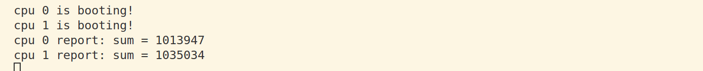
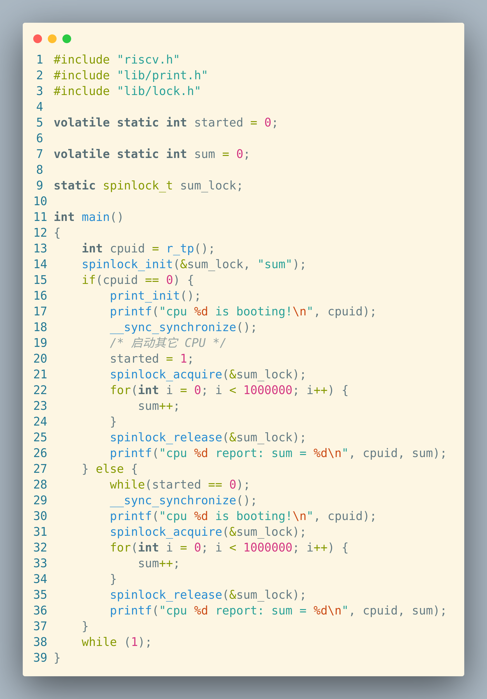
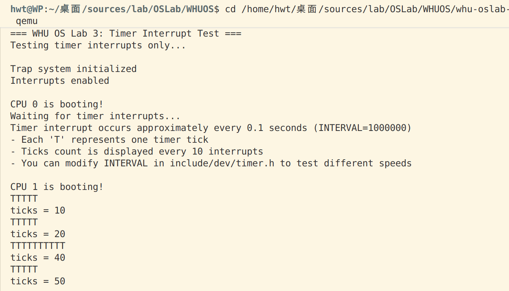
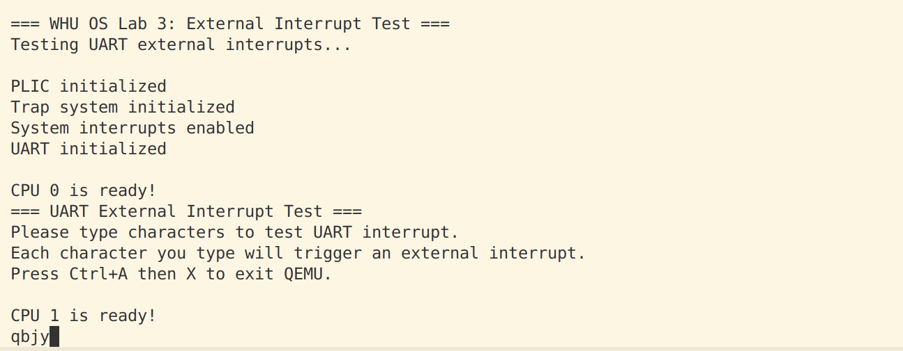
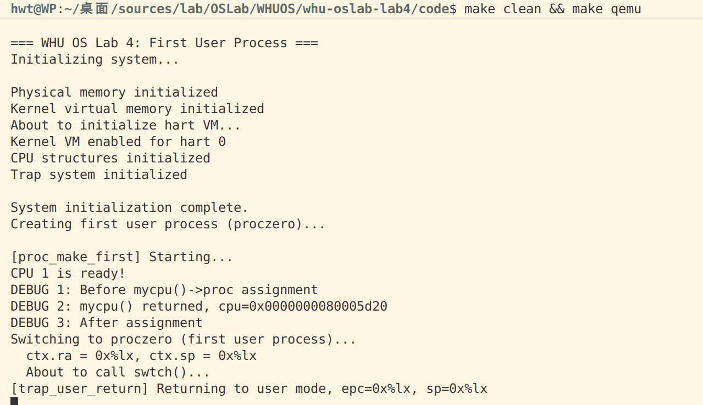
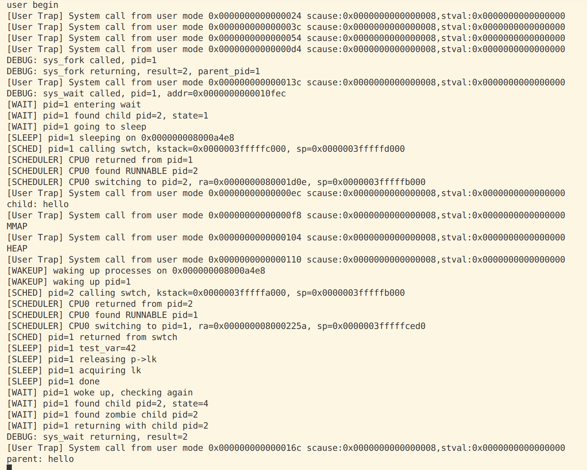
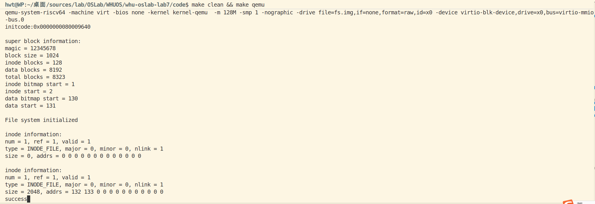
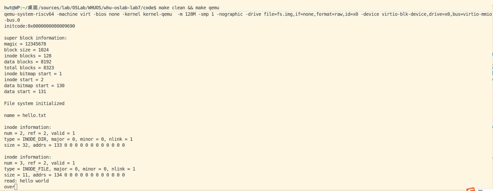
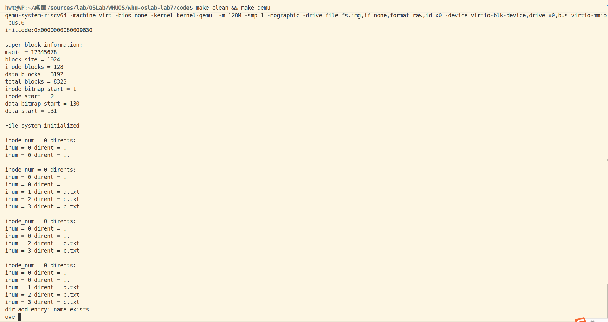

# 实验一：RISC-V 引导与裸机启动

## 1. 实验目的

- 理解 RISC-V 的启动流程（从 entry.S -> start.c -> main.c）以及多核引导的基本思路。
- 实现最小串口输出（基于 UART），能在 QEMU 上看到指定输出。
- 掌握调试方法（GDB + QEMU），能定位启动或输出问题。

## 2. 系统设计与代码组织

仓库主结构（与本次实验相关）：

- `kernel/boot/`：启动入口与 C 启动代码（`entry.S`, `start.c`, `main.c`）
- `kernel/dev/`：设备驱动（`uart.c`）
- `kernel/lib/`：打印与同步库（`print.c`, `spinlock.c`）
- `kernel/proc/`：与处理器/多核相关代码
- `kernel/kernel.ld`：链接脚本，定义入口与段布局

设计说明要点：

- 入口点 `_entry` 被放置在 `0x80000000`（由链接脚本指定），QEMU 会从这里开始执行。
- `entry.S` 负责最早期的处理：设置栈、将控制权交给 C 代码（`start.c`）。
- `start.c` 完成从 Machine mode 到 Supervisor/User mode 的必要设置，并最终跳转到 `main.c`。
- `uart.c` 提供最小的串口字符发送函数；`print.c` 封装 `printf`，并使用自旋锁保护输出以避免并发混乱。

## 3. 关键数据结构与符号

- `CPU_stack`：为每个 hart 保留一段内核栈空间，通常在 `start.c` 中定义为 `uint8 CPU_stack[NCPU * STACKSIZE]`。
- 链接脚本中常见符号：`_entry`, `etext`, `edata`, `end`，用于代码/数据段边界和 BSS 清零。

## 4. 实现步骤

1. 阅读并理解 `kernel/entry.S` 中的启动序列：设置初始栈地址、调用 `start`。
2. 在 `start.c` 中完成多核/模式切换逻辑（必要时），并跳转到 `main`。
3. 在 `lib/print.c` 中实现 `print_init` 与 `printf`。
4. 实现 `spinlock.c` 的简单自旋锁（基于原子交换或 `lr/sc` 指令），并在 `printf` 中使用锁保护串口操作。
5. 使用 Makefile 生成两个产物：
   - `kernel-qemu.elf`（带调试符号的 ELF，用于 gdb 加载）
   - `kernel-qemu`（裸二进制镜像，用于 QEMU 启动，使用 `objcopy -O binary` 从 ELF 生成）

## 5. 调试与测试流程

1. 编译并生成镜像：

```sh
make clean
make build --directory=kernel
```

2. 在一个终端启动 QEMU，并暂停等待 gdb 连接（端口示例 26000）：

```sh
qemu-system-riscv64 -machine virt -bios none -kernel kernel-qemu -m 128M -smp 2 -nographic -serial mon:stdio -S -gdb tcp::26000
```

3. 在另一终端启动 gdb 并加载 ELF（带符号文件）：

```sh
gdb-multiarch kernel-qemu.elf
(gdb) target remote :26000
(gdb) b _entry
(gdb) c
```

4. 到达入口或 `main` 后，使用 `n` / `s` 单步执行，或启用 TUI（`layout asm` 或 `gdb -tui`）查看源码与汇编。
5. 检查 UART 输出函数（`uart_putc` 与 `uart_init`）是否被调用：设置断点 `b uart_putc`、`b uart_init`。
6. 典型调试指令：'`(gdb) x/10i $pc`

## 6. 问题与解决方案

- 没有任何串口输出。

  - 排查：确认 `_entry` 是否被暴露并正确链接到 0x80000000；检查 `uart` 基地址是否与 QEMU 的 `virt` 设备一致（通常为 `0x10000000`）；在汇编最早阶段直接写一个字符到 UART 来验证硬件连通。
  - 解决：在 `entry.S` 中添加 `.globl _entry` 并重新编译；确认 `kernel.ld` 将 `_entry` 放到 `0x80000000`。
- gdb 无法定位函数（`Cannot find bounds of current function` / 无调试符号）

  - 排查：确认 ELF 未被 strip，且 gdb 加载的是 ELF（非裸二进制）。
  - 解决：链接产生 `kernel-qemu.elf`（保留符号），用 `objcopy` 生成裸二进制；在 gdb 中加载 `kernel-qemu.elf`。
- 执行 `make qemu` 后观察到以下现象：

  - 链接警告：`riscv64-linux-gnu-ld: 警告: 无法找到项目符号 _entry; 缺省为 0000000080000000`。原因是 `entry.S` 中 `_entry` 未被 `.globl` 导出。
  - 在早期 Makefile 中，`ls` 的通配符写法不当导致 `ls` 报错（`ls: 无法访问 './*/*/*.o': 没有那个文件或目录`），已修正为只匹配 `./*/*.o`。
  - gdb 报 `file format not recognized` 是因为使用了裸二进制 `kernel-qemu` 作 gdb 加载对象。已改为生成 `kernel-qemu.elf` 并用其进行调试。

## 8. 运行结果

- 添加输出前
- 添加输出后

  
- 加法使用锁前

  
- 加法使用锁后

  - 问题回答：要修复 sum 的不一致性，保证每次更新都在临界区内或使用原子操作；为最佳性能，采用本地累加 + 一次合并或原子加，而不要在持锁期间做 printf 等长操作
  - 结果图
  - 对应代码
- print去掉锁

  - 结果图
  - 对应修改：去掉start变量和print中使用了spin_lock的相关语句

# 实验二: 内存与页表管理

### 关键数据结构

#### page_node_t

- **描述**: 物理页节点，用于链表连接。
- **结构**:
  ```c
  typedef struct page_node {
    struct page_node* next;
  } page_node_t;
  ```

#### alloc_region_t

- **描述**: 可分配区域结构，管理若干物理页。
- **结构**:
  ```c
  typedef struct alloc_region {
    uint64 begin; // 起始物理地址（包含）
    uint64 end;   // 终止物理地址（不包含）
    spinlock_t lk; // 自旋锁，保护下面的链表和计数器
    uint32 allocable;   // 可分配页面计数
    page_node_t list_head; // 哨兵链表头节点（list_head.next 指向第一个可用页）
  } alloc_region_t;
  ```

#### pte_t 和 pgtbl_t

- **描述**: 页表项和页表类型。
- **定义**:
  ```c
  typedef uint64 pte_t;
  typedef uint64* pgtbl_t;
  ```

### 与xv6对比分析

#### pmem.c vs kalloc.c

##### 基本功能

- **kalloc.c**: 单一的全局物理页池（`kmem.freelist`），初始化时把 `end` 到 `PHYSTOP` 的所有页面放入同一个自由链表，分配/释放都从这个池操作。
- **pmem.c**: 把物理页池划分为两个独立的区域：`kern_region`（内核专用）和 `user_region`（用户专用），分区基于 `ALLOC_BEGIN`/`ALLOC_END` 和 `KERNEL_PAGES`。分配/释放时通过 `in_kernel` 参数选择区域。

##### 接口差异

- **kalloc.c**: 提供 `kalloc(void)` 和 `kfree(void *pa)`。分配器不区分调用者是内核还是用户，调用者自己负责语义上的用途区分。
- **pmem.c**: 提供 `pmem_alloc(bool in_kernel)` 和 `pmem_free(uint64 page, bool in_kernel)`，调用者必须显式说明是内核分配还是用户分配，从而使用不同的物理页池。

##### 并发与锁

- **kalloc.c**: 一个全局自旋锁 `kmem.lock` 保护单一 freelist；高并发下该锁可能成为瓶颈。
- **pmem.c**: 每个区域维护自己的自旋锁 `spinlock_t lk`（`kern_region.lk` 和 `user_region.lk`），在理论上减少了跨内核/用户竞争（内核和用户请求通常不在同一锁上竞争），但同一区域内仍可能发生竞争。

##### 安全性与鲁棒性

- **kalloc.c**: 没有区分内核与用户资源，恶意用户不断分配页会耗尽全局物理页，影响内核资源，存在被 DOS 的风险。
- **pmem.c**: 通过 `KERNEL_PAGES` 保留内核专用页，能有效防止用户耗尽内核必须的物理页，提升内核抗攻击性。但若用户区耗尽，用户程序仍会失败/阻塞，这符合设计目标。

##### 配置与适应性

- **kalloc.c**: 依赖链接器符号 `end` 和常量 `PHYSTOP`，对链接脚本要求较低且直接。
- **pmem.c**: 依赖 `ALLOC_BEGIN`/`ALLOC_END` linker 符号，且默认 `KERNEL_PAGES` 为 6（可由 -DKERNEL_PAGES=N 覆盖）。`pmem_init` 会确保区域按页对齐并且总页数至少 >= `KERNEL_PAGES`。

##### 调试/保护措施

- **两者共同点**: 都用 `memset` 在 free/alloc 时填充字节以帮助检测悬空引用；都使用 `panic` 在遇到非法释放或不符合预期的范围时中止。
- **pmem.c 额外**: 增加了对页面是否属于指定区域的边界检查（避免错误地把用户页释放到内核池或反向），从而增加了安全性和调试能力。

##### 时间复杂度

- **两者**: 分配/释放都是 O(1)（在持锁的情况下从链表头插入/弹出），所以性能基线相近。

### 设计决策理由

##### 内存分配器设计决策

- **单链表结构**: 简单高效，分配和释放都是 O(1) 时间复杂度，适合页级分配。
- **零额外内存开销**: 将元数据存放在空闲页面本身，避免额外的位图或数组，节省空间。
- **内核与用户区域分离**: 防止用户进程耗尽内核资源，提升系统安全性。
- **自旋锁保护**: 在多核环境下保证并发安全。
- **填充页面检测悬空引用**: 在分配和释放时用不同值填充页面，便于调试内存错误。

##### 页表管理设计决策

- **SV39 分页模式**: RISC-V 标准，支持 39 位虚拟地址空间。
- **权限位设置**: 区分读、写、执行、用户等权限，确保内存安全。
- **恒等映射内核区域**: 简化内核访问物理内存的逻辑。
- **设备 MMIO 映射**: 将设备地址映射到虚拟地址空间，便于内核访问。

### 实验过程部分

本实验旨在实现一个基于 RISC-V 架构的操作系统内核中的物理内存分配器和虚拟内存管理模块。实验过程分为以下几个阶段：

1. **需求分析与设计**

   - 分析 xv6 操作系统中的内存管理机制，理解物理内存分配器（kalloc.c）和虚拟内存管理（vm.c）的实现原理。
   - 设计改进方案，包括将物理内存分配器分为内核和用户区域，以提高安全性。
2. **代码实现**

   - 基于 xv6 的代码，重新实现物理内存分配器（pmem.c）和虚拟内存管理器（vmem.c）。
   - 确保代码符合项目的接口和宏定义。
3. **集成与调试**

   - 将新实现的模块集成到项目中，解决编译和链接错误，确保模块能正确工作。
4. **测试与验证**

   - 编写测试用例，验证内存分配和虚拟内存映射的功能正确性。

### 实现步骤记录

1. **分析 xv6 源码**
   - 阅读 xv6 的 kalloc.c 和 vm.c 文件，理解物理内存分配和虚拟内存管理的实现。
   - 分析数据结构和关键函数的逻辑。
2. **设计 pmem.c**
   - 定义 page_node_t 和 alloc_region_t 结构体。
   - 实现 pmem_init() 函数，初始化内核和用户区域。
   - 实现 pmem_alloc() 和 pmem_free() 函数，支持从指定区域分配和释放内存。
   - 添加自旋锁保护并发访问。
3. **设计 vmem.c**
   - 定义 pte_t 和 pgtbl_t 类型。
   - 实现 vm_getpte() 函数，遍历页表并返回 PTE 指针。
   - 实现 vm_mappages() 和 vm_unmappages() 函数，进行虚拟地址到物理地址的映射和解除映射。
   - 实现 kvm_init() 函数，创建内核页表并映射设备和内核区域。
   - 实现 kvm_inithart() 函数，激活页表。
4. **解决宏定义冲突**
   - 将重复的宏定义从 riscv.h 移到 vmem.h 中。
   - 更新 vmem.c 使用正确的宏名称。
5. **修复链接符号错误**
   - 将 _etext 改为 etext，以匹配链接脚本中的定义。
6. **集成到项目**
   - 将 pmem.c 和 vmem.c 添加到项目的源文件列表。
   - 更新 Makefile 确保编译包含新文件。
7. **调试与测试**
   - 运行 make 命令，检查编译错误。
   - 修复遇到的语法和链接错误。
   - 编写简单的测试代码验证功能。

### 问题与解决方案

##### 1. 宏定义重复问题

- **问题**: riscv.h 和 vmem.h 中有重复的宏定义，如 PTE_V、PA2PTE 等，导致编译冲突。
- **解决方案**: 将页表相关的宏定义移到 vmem.h 中，并在 riscv.h 中添加注释说明。更新 vmem.c 使用 vmem.h 中的宏。

##### 2. 链接符号未定义错误

- **问题**: 编译时出现 undefined reference to `_etext`，因为链接脚本中使用的是 `etext`。
- **解决方案**: 将 vmem.c 中的 `extern char _etext[]` 改为 `extern char etext[]`，并更新所有引用。

##### 3. 隐式函数声明警告

- **问题**: 编译时出现 implicit declaration of function 'proc_mapstacks'，因为该函数未声明。
- **解决方案**: 暂时移除对 proc_mapstacks 的调用，并在注释中说明稍后实现。

##### 4. 编译器警告处理

- **问题**: 编译时出现 -Werror=implicit-function-declaration，导致编译失败。
- **解决方案**: 移除未实现的函数调用，或添加函数声明。

##### 5. 自旋锁使用导致的 panic 问题

- **问题描述**: 在测试物理内存分配器时，使用自旋锁保护共享变量会导致系统 panic，报错信息为 "panic: double acquire detected"。具体表现为：

  - 在不使用锁时，内存分配和释放功能正常
  - 一旦在循环中使用 `spinlock_acquire()` 和 `spinlock_release()` 保护临界区，系统就会触发 panic
  - 单次获取和释放锁可以正常工作，但在循环中频繁获取释放锁时就会出现问题
- **问题排查过程**:

  1. **初步分析**: 怀疑是重复获取锁导致的，但检查代码逻辑发现并没有嵌套获取同一个锁。
  2. **调试信息**: 在 `spinlock_acquire` 中添加调试输出，发现 panic 时的状态显示：
     - `mycpuid()` = 0
     - `lk->locked` = 0 或 1（不一致）
     - `lk->cpuid` = 0
     - 但 `spinlock_holding(lk)` 却返回 true
  3. **深入分析**: 发现在调用 `spinlock_holding()` 检查时和打印调试信息时，锁的状态不一致，说明存在竞态条件。
  4. **根本原因定位**:
     - 问题出在 `spinlock_init()` 函数中，将 `lk->cpuid` 初始化为 0
     - 同时 `spinlock_release()` 函数在释放锁后也将 `lk->cpuid` 重置为 0
     - 而 CPU 0 的 ID 正好也是 0，导致以下问题：
       - 在锁未被持有时，`lk->cpuid == 0`
       - 当 CPU 0 尝试获取锁时，`spinlock_holding()` 检查 `(lk->locked && lk->cpuid == mycpuid())`
       - 在特定的时序下（例如释放锁后、或初始化状态），`lk->cpuid` 为 0 与 CPU 0 的 ID 相同
       - 导致 `spinlock_holding()` 误判为 CPU 0 已经持有该锁，从而触发 "double acquire" panic
- **解决方案**:

  1. **修改初始化值**: 将 `spinlock_init()` 中的 `lk->cpuid` 初始化值从 0 改为 -1（表示无效的 CPU ID）
  2. **修改释放后的值**: 将 `spinlock_release()` 中释放锁后的 `lk->cpuid` 重置值也改为 -1
  3. **添加 CPU 初始化**: 在 `main()` 函数开始时，添加 `cpu_init()` 函数显式初始化所有 CPU 的结构体（`cpu_t` 中的 `noff` 和 `origin` 字段）
  4. **优化检查逻辑**: 简化 `spinlock_holding()` 的判断逻辑为 `(lk->locked && (lk->cpuid == mycpuid()))`
- **代码修改**:

  在 `kernel/lib/spinlock.c` 中：

  ```c
  // 自旋锁初始化
  void spinlock_init(spinlock_t *lk, char *name)
  {
    lk->name = name;
    lk->locked = 0;
    lk->cpuid = -1;  // 初始化为无效的 CPU ID，避免与 CPU 0 冲突
  }

  // 释放自旋锁
  void spinlock_release(spinlock_t *lk)
  {
    if(!spinlock_holding(lk))
      panic("release");

    lk->cpuid = -1;  // 重置为无效的 CPU ID

    __sync_synchronize();
    __sync_lock_release(&lk->locked);
    pop_off();
  }

  // 检查是否持有锁
  bool spinlock_holding(spinlock_t *lk)
  {
    int r;
    r = (lk->locked && (lk->cpuid == mycpuid()));
    return r;
  }
  ```

  在 `kernel/proc/proc.c` 中添加 CPU 初始化函数：

  ```c
  void cpu_init(void)
  {
      // 显式初始化所有 CPU 结构
      for(int i = 0; i < NCPU; i++) {
          cpus[i].noff = 0;
          cpus[i].origin = 0;
      }
  }
  ```

  在 `kernel/boot/main.c` 中调用初始化：

  ```c
  int main()
  {
      int cpuid = r_tp();
      if(cpuid == 0) {
          cpu_init();           // 初始化 CPU 结构
          spinlock_init(&sum_lock, "sum");
          print_init();
          // ...
      }
      // ...
  }
  ```
- **经验教训**:

  1. **避免使用 0 作为特殊值**: 在设计数据结构时，应该避免使用 0 或其他可能与有效值重叠的数字作为"无效"或"未初始化"的标记值，建议使用 -1 或其他明确的无效值。
  2. **多核并发的复杂性**: 在多核环境下，即使看似简单的初始化值也可能引发竞态条件和难以调试的问题。
  3. **调试技巧**: 当遇到状态不一致的问题时，可能是竞态条件导致的。在调试输出时，状态可能已经被其他操作改变。
  4. **全面的初始化**: 所有全局或静态数据结构都应该显式初始化，不要依赖 C 语言的默认零初始化，特别是在多核环境中。

##### 6. 虚拟内存映射相关问题

###### 6.1 vm_mappages 不允许重新映射导致的 panic

- **问题描述**: 在测试虚拟内存映射功能时，尝试修改已有映射的权限（如从只读改为只写）会触发 panic，报错信息为 "panic: vm_mappages: remap"。具体测试场景：

  ```c
  // test-1: 首次映射虚拟地址 0，权限为只读
  vm_mappages(test_pgtbl, 0, mem[0], PGSIZE, PTE_R);

  // test-2: 尝试修改虚拟地址 0 的映射权限为只写
  vm_mappages(test_pgtbl, 0, mem[0], PGSIZE, PTE_W);  // ← 触发 panic
  ```
- **问题根源**: 在 `vm_mappages` 函数中有严格的重映射检查：

  ```c
  pte_t *pte = vm_getpte(pgtbl, a, true);
  if (!pte)
      panic("vm_mappages: out of memory");
  if (*pte & PTE_V)  // ← 检测到 PTE 已经有效
      panic("vm_mappages: remap");  // ← 直接 panic，不允许更新映射
  ```

  这种设计虽然可以防止意外的重复映射，但过于严格，不支持合法的权限修改需求。
- **设计考量**:

  - **禁止 remap 的理由**:

    1. 防止内存泄漏：旧的物理页映射被覆盖后无法追踪和释放
    2. 防止权限混乱：不经意地改变已有映射的权限可能导致安全问题
    3. 检测编程错误：通常重复映射是逻辑错误的信号
  - **允许 remap 的场景**:

    1. 修改页面权限（如从只读改为可写，用于写时复制）
    2. 更新物理页映射（如页面换出/换入）
    3. 调试和测试场景
- **解决方案**: 允许更新已有映射，移除或修改过于严格的检查：

  ```c
  void vm_mappages(pgtbl_t pgtbl, uint64 va, uint64 pa, uint64 len, int perm)
  {
      if (len == 0)
          panic("vm_mappages: len == 0");

      uint64 a = PG_ROUND_DOWN(va);
      uint64 last = PG_ROUND_DOWN(va + len - 1);

      for (;;) {
          pte_t *pte = vm_getpte(pgtbl, a, true);
          if (!pte)
              panic("vm_mappages: out of memory");

          // 移除严格的 remap 检查，允许更新已有映射
          // if (*pte & PTE_V)
          //     panic("vm_mappages: remap");

          *pte = PA_TO_PTE(pa) | perm | PTE_V;
          if (a == last)
              break;
          a += PGSIZE;
          pa += PGSIZE;
      }
  }
  ```

###### 6.2 vm_unmappages 物理页释放时的区域判断错误

- **问题描述**: 在测试中释放映射的物理页时触发 panic，报错信息为 "panic: pmem_free: page out of range"。具体场景：

  ```c
  // test-1: 从用户区分配物理页并建立映射
  mem[1] = (uint64)pmem_alloc(false);  // false 表示用户区
  vm_mappages(test_pgtbl, PGSIZE * 10, mem[1], PGSIZE, PTE_R | PTE_W);

  // test-2: 解除映射并释放物理页
  vm_unmappages(test_pgtbl, PGSIZE * 10, PGSIZE, true);  // ← 触发 panic
  ```
- **问题根源**: 原始 `vm_unmappages` 函数硬编码将物理页释放到内核区：

  ```c
  void vm_unmappages(pgtbl_t pgtbl, uint64 va, uint64 len, bool freeit)
  {
      // ...
      if (freeit) {
          uint64 pa = PTE_TO_PA(*pte);
          pmem_free(pa, true);  // ← 硬编码 true，总是释放到内核区
      }
      // ...
  }
  ```

  当物理页实际上是从用户区分配的（`pmem_alloc(false)`），但却尝试释放到内核区时，`pmem_free` 会检查地址范围并触发 panic。
- **pmem_free 的区域检查逻辑**:

  ```c
  void pmem_free(uint64 page, bool in_kernel)
  {
      alloc_region_t *r = in_kernel ? &kern_region : &user_region;

      // 检查页面是否在指定区域范围内
      if (page < r->begin || page >= r->end)
          panic("pmem_free: page out of range");
      // ...
  }
  ```
- **解决方案**: 自动检测物理页属于哪个区域，然后释放到正确的区域：

  ```c
  void vm_unmappages(pgtbl_t pgtbl, uint64 va, uint64 len, bool freeit)
  {
      if ((va % PGSIZE) != 0)
          panic("vm_unmappages: not aligned");

      uint64 a;
      for (a = va; a < va + len; a += PGSIZE) {
          pte_t *pte = vm_getpte(pgtbl, a, false);
          if (!pte)
              panic("vm_unmappages: walk");
          if (!(*pte & PTE_V))
              panic("vm_unmappages: not mapped");
          if (PTE_FLAGS(*pte) == PTE_V)
              panic("vm_unmappages: not a leaf");

          if (freeit) {
              uint64 pa = PTE_TO_PA(*pte);

              // 自动判断物理页属于哪个区域
              uint64 kern_end = (uint64)ALLOC_BEGIN + KERNEL_PAGES * PGSIZE;
              bool in_kernel = (pa >= (uint64)ALLOC_BEGIN && pa < kern_end);

              // 释放到正确的区域
              pmem_free(pa, in_kernel);
          }
          *pte = 0;
      }
  }
  ```
- **替代方案**: 如果希望调用者明确指定释放区域，可以添加参数：

  ```c
  void vm_unmappages_ex(pgtbl_t pgtbl, uint64 va, uint64 len, 
                        bool freeit, bool free_to_kernel)
  {
      // ...
      if (freeit) {
          uint64 pa = PTE_TO_PA(*pte);
          pmem_free(pa, free_to_kernel);
      }
      // ...
  }
  ```
- **经验教训**:

  1. **避免硬编码假设**: 不要假设所有映射的物理页都来自同一个区域（内核区或用户区）。
  2. **自动化判断优于手动指定**: 通过地址范围自动判断区域归属，比要求调用者手动指定更不容易出错。
  3. **接口设计的一致性**: `pmem_alloc` 需要指定区域，`pmem_free` 也应该能正确对应，避免分配和释放的区域不匹配。
  4. **测试覆盖不同场景**: 测试应该覆盖内核页和用户页的分配、映射、解除映射和释放，确保所有路径都正确。

### 源码理解总结

#### 物理内存管理

##### struct run 设计巧妙之处

- **简洁的单链表节点**: 只包含一个指针，用来把空闲的物理页面链接成单链表。
- **零额外内存开销**: 空闲页的元数据直接存放在页面内（通常页面最低地址），节省了元数据空间开销。
- **对齐与直接利用**: 页面大小通常大于或等于指针大小，一个页面足够存储 `struct run`。把元数据与页面合体还能利用 CPU cache 更局部访问链表头。

##### kinit() 初始化过程分析

- **如何确定可分配的内存范围？**
  - `kinit()` 通常通过链接器导出的符号 `end` （内核映像末尾）与编译时或配置文件里定义的 `PHYSTOP`（内核可管理物理内存上限）来确定范围：可分配范围是 `[roundup(end), PHYSTOP)`。`end` 指示内核代码和静态数据占用的物理内存末尾，之后的空间就是可以用于分配的内存池。
- **空闲页链表是如何构建的？**
  - `freerange(pa_start, pa_end)` 会把 `pa_start` 向上对齐到页边界，然后从 `pa_start` 开始，步长为 `PGSIZE`，对每个页面调用 `kfree(p)`，而 `kfree()` 会把该页面的首地址填充（用于调试），把页面 reinterpret 为 `struct run *r`，并在持有 `kmem.lock` 的情况下把 `r->next = kmem.freelist; kmem.freelist = r;`。结果是把所有页面按顺序压入自由链表，形成一个 LIFO 链表。
- **为什么要按页对齐？**
  - 分配器以页为单位管理内存（kalloc 返回整页），因此所有页面地址必须和页大小对齐，这样在做物理地址到页索引或页表映射时才能保证正确性。
  - 将 `pa_start` 向上对齐可以避免覆盖内核已有的数据（`end` 可能不是页对齐），确保不会将部分仍被内核使用的页加入 freelist。

##### kalloc() 和 kfree() 实现理解

- **分配算法的时间复杂度**
  - `kalloc()`：在持锁的情况下从链表头取出第一个节点，操作是 O(1)。
  - `kfree()`：把释放的页面插入链表头，操作是 O(1)。
  - 因此分配和释放都具有常数时间复杂度 O(1)，非常高效（在单线程或用自旋锁保护的多核场景中也能快速执行）。
- **如何防止 double-free？**
  - 在 xv6 的简单实现中，`kfree()` 对传入地址做了基本检查（页对齐、地址范围、不能释放内核代码段之前的空间），并会 `memset(pa, 1, PGSIZE)` 把页面填充为垃圾来帮助检测悬挂引用，但它并没有用额外标志位来检测双重释放（double-free）。
  - 因此纯实现上并不能完全防止 double-free；防护依赖于调用者的正确性。然而填充页面和在调试时对 freed page 做特殊模式可以在后续访问中较为快速地暴露问题。
  - 如果想主动检测 double-free，需要额外元数据（比如一个位图或在页面头部写入 magic 值并在 kfree 前校验）。
- **这种设计的优缺点**
  - **优点**：
    - 极其简单，代码短小易懂。
    - 时间复杂度低：分配/释放 O(1)。
    - 零额外内存管理开销（元数据就位于空闲页面内部）。
  - **缺点**：
    - 只支持固定大小的块（整页），不能用于细粒度分配。
    - 不支持合并或块分裂，因此碎片化控制能力有限（但在整页分配场景下碎片不像小粒度分配那样严重）。
    - 无内置安全检查或双重释放检测（需要额外机制来增强可靠性）。
    - 并发性能受限于全局锁（单个 freelist lock 会在高并发下成为瓶颈）。

##### 设计思考

- **如何实现内存统计功能？**
  - 维护全局计数器：在 `kmem` 中添加 `uint64 total_pages; uint64 free_pages;`，在 `kinit()` 初始化 `total_pages = (pa_end - pa_start) / PGSIZE`，在 `kalloc()` 减少 `free_pages`，在 `kfree()` 增加 `free_pages`。这些操作需在持锁状态下修改以保证并发安全。
  - 采样/阈值报警：如果 `free_pages` 低于阈值就触发警告或回收策略。
  - 每个 CPU 统计：为降低锁竞争，可以使用 per-CPU 的分配缓存或统计（例如每个 CPU 有局部缓存的自由链，和本地统计），再周期性合并到全局统计中。
- **如何检测内存泄漏？**
  - 在内核引导/测试时记录总的分配次数与释放次数（或 track 当前分配计数），长期运行若 `allocated_pages - freed_pages` 保持增长并且不下降，可能为内存泄漏。
  - 引入引用计数或更高级的内存审计：给每次分配附加上下文（调用栈、分配时间），在释放时清楚记录。可以把这些信息写入一个可选的哈希表（物理页 -> 元数据），仅在调试或开发构建中启用以避免性能开销。
  - 定期运行内存一致性检查：在某些检查点遍历所有已知对象（例如进程页表中映射的物理页），验证哪些页没有被引用并和 free list 对比，找出被遗忘的页。
- **更高效的分配算法有哪些？**
  - 分级空闲链表（Segregated Free Lists）：对于不同大小类别维护不同的空闲链表（这里若支持小块分配非常适合）。
  - 位图（Bitmap）+ buddy 系统：buddy allocator 支持分裂和合并，适合可变大小的内存管理，内部实现也较为简单且支持 O(log n) 操作。
  - slab/SLUB 分配器：为经常分配/释放相同大小对象优化缓存，本质上预先分配大量相同大小的块并维护高速缓存，适合内核对象分配场景（inode、task_struct 等）。
  - per-CPU caches + lock-free/free-list caches：减少并发场景下的锁竞争，适合多核系统的高并发分配。

#### 虚拟内存与页表管理

##### 分页机制基础

- **satp 寄存器字段**

  - **MODE 字段**: 用于开启分页并选择页表级数。
  - **ASID**: 可用于降低上下文切换的开销。
  - **PPN 字段**: 以 4 KiB 页为单位存放根页表的物理页号。
- **分页启用过程**
  **M** 模式软件在第一次进入 **S** 模式前会将 satp 清零以关闭分页，然后 **S** 模式软件在创建页表后将正确设置 satp 寄存器。satp 寄存器启用分页时，处理器将从根部遍历页表，将 **S** 模式和 **U** 模式的虚拟地址翻译为物理地址。
- **虚拟地址结构**

  - 第 39-30 位为一级页索引 VPN0
  - 第 30-21 位为二级页索引 VPN1
  - 第 21-12 位为三级页索引 VPN2
- **PTE 字段**

  - **V 位**: 表示该 PTE 的其余字段是否有效（V=1 时有效）。若 V=0，则遍历到此 PTE 的虚拟地址翻译过程将触发页故障。
  - **R、W、X 位**: 分别表示该页是否可读、可写、可执行。若 3 位均为 0，则该 PTE 指向下一级页表，否则为叶子节点。
  - **U 位**: 表示该页是否为用户页。若 U=0，则 U 模式不能访问该页，但 S 模式能。若 U=1，则 U 模式能访问该页，但 S 模式不能。
- **地址转换过程**
  从 satp 找到根页表的物理地址，然后按照 L2，L1，L0 的变化找到最终的物理地址。每个页表项 64 位 = 8 字节，每个页表大小都为 512×8=4KiB，512 个页表项。最后的页表项保存了对应的 44 位物理页号。

##### xv6 页表管理代码分析

- **walk() 函数遍历逻辑**

  - **如何从虚拟地址提取各级索引？**
    - **Sv39** 的虚拟地址划分为 VPN[2], VPN[1], VPN[0] 三级索引（每级 9 位），以及页内偏移 12 位。
    - 在 xv6 中常用的宏（或等价位运算）为：
      - 第 i 级索引 idx = (va >> (12 + 9*i)) & 0x1FF；i 从 2..0
      - 或者使用 PX(va, i) 之类的宏提取。
  - **遇到无效页表项（PTE_V == 0）时如何处理？**
    - 若 `walk(pagetable, va, alloc)` 中的 `alloc` 参数为 false：遇到无效 PTE 就返回 NULL（表示找不到对应的下级页表或最终 PTE）。
    - 若 `alloc` 为 true：`walk` 会尝试为缺失的中间页表分配一个新的物理页（通常通过 kalloc/pmem_alloc），清零该页并把对应的父 PTE 设置为该页的物理地址并置 `PTE_V`（有效）。随后继续下钻。
  - **为什么需要 `alloc` 参数？**
    - `alloc` 决定 `walk` 是做"查找"还是做"创建并查找"。
    - 在建立映射（例如 `mappages`）时，需要创建缺失的中间页表，因此会传 `alloc = true`。
    - 在只做地址查询或访问转换（例如查找某个映射以验证权限）时，不需要创建页表，传 `alloc = false` 可以避免不必要的内存分配。
- **mappages() 映射建立细节**

  - **如何处理地址对齐？**
    - `mappages()` 接受一个起始虚拟地址 `va`、长度 `size` 和物理基址 `pa`（或按页映射的基础地址）。它会先把 `va` 向下取整为页边界（PGROUNDDOWN），把 `va+size` 向上取整为页边界（PGROUNDUP），然后以 `PGSIZE` 为步长循环处理每一页映射。
    - 对齐保证：每个映射操作都是整页的 PTE 设置，避免覆盖非页对齐内存。
  - **权限位如何设置？**
    - 每个 PTE 的低位用于权限（PTE_R/W/X/U 等）。`mappages` 在写入最终叶子 PTE 时，会把物理页号（PA）与 `perm`（传入的权限组合）按位或，再加上 `PTE_V`（有效位），例如：`*pte = PA | perm | PTE_V`。
    - `perm` 根据映射用途选择：内核只读代码页可能没有 `W`，用户页需要 `U`，设备内存通常设置为 `R|W` 而不设置 `X`。
  - **映射失败时的清理工作**
    - 在映射循环过程中，`mappages` 可能在中途遇到错误（例如为中间页表分配页失败，或发现已有冲突的 PTE）。良好的实现应该回滚已经成功建立的那些映射（解除已写入的 PTE 并释放在映射过程中为页表分配的临时页面），以保持系统一致性并避免内存泄漏。
    - xv6 的实现通常在中途失败时调用 `panic`（简单处理），或显式在失败路径上反向遍历已映射页并清除 PTEs，同时释放中间分配的页面（如果实现支持回滚）。

##### 地址转换相关宏解释

- **PGROUNDUP(sz) 与 PGROUNDDOWN(a)**
  - PGROUNDUP 将字节大小向上取整到 PGSIZE 的倍数，常用于计算要分配或映射的整页大小。
  - PGROUNDDOWN 将地址向下取整到页边界，用于得到页起始地址。
  - 例：PGROUNDUP(0x1003) = 0x2000（假设 PGSIZE = 0x1000）。
- **PTE_PA(pte) 的位运算**
  - 宏 `#define PTE_PA(pte) (((pte) >> 10) << 12)` 的意图是从 64 位 PTE 中提取物理页号并还原为物理地址：页表项低 10 位保留为标志位和一些额外位（不同实现细节），所以右移 10 去掉低位标志，再左移 12 把页号转换为字节地址（乘以 4096）。
  - 等价理解：`PA = (pte & ~0x3FF) & ~0xFFF`（去掉低 10 位和低 12 位标志），目的是得到高位的物理页帧地址。

##### 实现挑战与对策

- **如何避免页表遍历中的"无限递归"？**
  - xv6 的 `walk()` 实际是按循环下钻（非真正递归函数调用），因此不存在函数递归的无限递归问题。但可能出现的危险是：在 `walk(..., alloc=true)` 时，分配新的页表页需要调用物理页分配器（kalloc/pmem_alloc），而分配器本身可能会在某些实现中访问页表（若有更高层次的缓存或统计），从而产生依赖回环。
  - 对策：保证分配器在分配页时不依赖于页表（例如使用早期初始化的静态内存或独立的 allocator），或者在调用分配器时明确禁止调用能再次触发页表操作的路径；在实现上优先使用简单的物理页分配器（kalloc）来为页表页分配空间。
- **映射过程中的内存分配失败应该如何恢复？**
  - 在 `mappages()` 中，当为中间页表分配内存失败或在映射中途发生错误时，应回滚：
    1. 清除已经建立的叶子 PTE（把那些已写入的 PTE 设为 0 或适当值）；
    2. 释放在映射过程中申请的任何中间页表页；
    3. 返回失败错误码（或在早期教学实现中 `panic`）。
  - 实现时要记录哪些页/页表是新分配的，以便失败时能正确释放，而不会误释放原来已有的页表页。
- **如何确保页表的一致性？**
  - 使用合适的锁：当多个 CPU 或线程可能并发修改同一进程/内核页表时，需要在修改页表（mappages/unmap/walk）时持有页表锁或进程锁（避免竞争和中间状态被其他 CPU 看到）。
  - 原子更新：写入最终叶子 PTE 时，尽量一次性把 PA|flags 写入，确保读者不会看到部分更新的标志。
  - TLB 同步：在更改页表（尤其是修改映射或权限）后调用 `sfence.vma`（或平台的等价 TLB flush）以确保已失效的 TLB 条目在处理器上被清除，避免地址转换不一致。
  - 顺序保证：在修改 PTE 之前先取消旧的映射（或先设置新的映射再 flush），按照硬件规范使用内存屏障，确保可见性。

##### 参考 xv6 的内核初始化：`kvminit()` 和 `kvminithart()`

- **`kvminit()` 的内核页表创建（需要映射哪些内存区域？）**
  - 常见需要映射的区域包括：
    1. 内核文本（代码）段：以只读、可执行映射（去除写权限）。
    2. 内核数据/堆/全局变量区：读写映射（RW）。
    3. 内核使用的物理内存（如内核栈、页表本身、内核动态分配区），通常按恒等映射或偏移映射到高地址空间（KERNBASE + PA）。
    4. 设备 MMIO 区域（UART、PLIC、CLINT、virtio 等），这些地址通常映射为 RW、非可执行、并且 `U`（用户）位为 0（仅内核访问）。
  - 映射方式（为什么采用恒等映射/高地址恒等）
    - xv6 常用把物理地址恒等映射到内核虚拟地址空间（例如把物理地址 0x0 映射到 KERNBASE + 0x0），便于内核使用虚拟地址直接访问物理内存（简化实现）。
    - 恒等映射（或高位偏移映射）可以避免内核在访问某些内存时需要额外的转换逻辑，使早期初始化更简单。
- **设备内存的权限设置**
  - 设备 MMIO 通常设置为 R/W, 无 X, 且 U=0（只有内核可访问）。这可以通过设置相应的 PTE 权限位实现。
- **`kvminithart()` 的页表激活**
  - `satp` 寄存器格式和设置：
    - 在 **RISC‑V Sv39** 下，`satp` 包含 MODE(最高位若干位), ASID, 和 PPN（根页表物理页号）。内核通过宏 `MAKE_SATP(pagetable)` 或等价位运算把根页表物理地址填入 PPN 字段并设置 MODE 为 Sv39 的值，然后写入 `satp`。
  - `sfence.vma` 的作用：
    - 在更改 `satp`（页表切换）或修改页表后，必须执行 `sfence.vma` 指令来刷新处理器的地址转换缓存（TLB），确保新的页表设置生效且旧的条目被清除。
  - 激活页表前后的注意事项：
    - 确保新页表已正确初始化并包含必要的内核映射（否则启用分页后内核可能因缺失映射而异常）。
    - 在多核环境中为每个 hart 分别设置 `satp` 并执行 `sfence.vma`，或在切换后在目标 hart 上执行局部刷新。
    - 激活新页表前通常会把中断/异常处理向量设置好（`stvec`/`mtvec` 等），并确保 trampoline 或切换代码已准备好处理异常。

## 测试验证部分

- 测试代码

  ```c++
  //物理内存
  #include "riscv.h"
  #include "lib/print.h"
  #include "mem/pmem.h"
  #include "lib/str.h"

  volatile static int started = 0;

  volatile static int over_1 = 0, over_2 = 0;

  static int* mem[1024];

  int main()
  {
      int cpuid = r_tp();

      if(cpuid == 0) {

          print_init();
          pmem_init();

          printf("cpu %d is booting!\n", cpuid);
          __sync_synchronize();
          started = 1;

          for(int i = 0; i < 512; i++) {
              mem[i] = pmem_alloc(true);
              memset(mem[i], 1, PGSIZE);
              printf("mem = %p, data = %d\n", mem[i], mem[i][0]);
          }
          printf("cpu %d alloc over\n", cpuid);
          over_1 = 1;

          while(over_1 == 0 || over_2 == 0);

          for(int i = 0; i < 512; i++)
              pmem_free((uint64)mem[i], true);
          printf("cpu %d free over\n", cpuid);

      } else {

          while(started == 0);
          __sync_synchronize();
          printf("cpu %d is booting!\n", cpuid);

          for(int i = 512; i < 1024; i++) {
              mem[i] = pmem_alloc(true);
              memset(mem[i], 1, PGSIZE);
              printf("mem = %p, data = %d\n", mem[i], mem[i][0]);
          }
          printf("cpu %d alloc over\n", cpuid);
          over_2 = 1;

          while(over_1 == 0 || over_2 == 0);

          for(int i = 512; i < 1024; i++)
              pmem_free((uint64)mem[i], true);
          printf("cpu %d free over\n", cpuid);  

      }
      while (1);  
  }
  ```
  ```c++
  int main()
  {
      int cpuid = r_tp();

      if(cpuid == 0) {

          print_init();
          pmem_init();
          kvm_init();
          kvm_inithart();

          printf("cpu %d is booting!\n", cpuid);
          __sync_synchronize();
          // started = 1;

          pgtbl_t test_pgtbl = pmem_alloc(true);
          uint64 mem[5];
          for(int i = 0; i < 5; i++)
              mem[i] = (uint64)pmem_alloc(false);

          printf("\ntest-1\n\n");  
          vm_mappages(test_pgtbl, 0, mem[0], PGSIZE, PTE_R);
          vm_mappages(test_pgtbl, PGSIZE * 10, mem[1], PGSIZE / 2, PTE_R | PTE_W);
          vm_mappages(test_pgtbl, PGSIZE * 512, mem[2], PGSIZE - 1, PTE_R | PTE_X);
          vm_mappages(test_pgtbl, PGSIZE * 512 * 512, mem[2], PGSIZE, PTE_R | PTE_X);
          vm_mappages(test_pgtbl, VA_MAX - PGSIZE, mem[4], PGSIZE, PTE_W);
          vm_print(test_pgtbl);

          printf("\ntest-2\n\n");  
          vm_mappages(test_pgtbl, 0, mem[0], PGSIZE, PTE_W);
          vm_unmappages(test_pgtbl, PGSIZE * 10, PGSIZE, true);
          vm_unmappages(test_pgtbl, PGSIZE * 512, PGSIZE, true);
          vm_print(test_pgtbl);

      } else {

          while(started == 0);
          __sync_synchronize();
          printf("cpu %d is booting!\n", cpuid);

      }
      while (1);  
  }

  ```
- 测试结果

  

  

# 实验三：中断处理实现

## 一、实验目的

本实验旨在实现 RISC-V 操作系统内核的中断处理机制，主要包括：

1. 理解 RISC-V 中断处理的基本原理和流程
2. 实现 M-mode 时钟中断的初始化和处理
3. 实现 S-mode 中断分发和处理机制
4. 实现外设中断（UART）的处理
5. 掌握中断上下文的保存和恢复
6. 理解多核环境下的中断处理

---

## 二、实验原理

### 2.1 RISC-V 特权级架构

RISC-V 定义了三个特权级：

- **M-mode (Machine Mode)**: 最高特权级，可访问所有硬件资源
- **S-mode (Supervisor Mode)**: 操作系统内核运行级别
- **U-mode (User Mode)**: 用户程序运行级别

### 2.2 中断处理机制

#### 2.2.1 中断类型

RISC-V 将 trap 分为两类：

- **中断 (Interrupt)**: 异步事件，由外部硬件触发
  - 时钟中断 (Timer Interrupt)
  - 外设中断 (External Interrupt)
  - 软件中断 (Software Interrupt)
- **异常 (Exception)**: 同步事件，由指令执行引起
  - 非法指令、页错误、系统调用等

#### 2.2.2 关键 CSR 寄存器

| 寄存器            | 功能                       | 读写权限 |
| ----------------- | -------------------------- | -------- |
| **stvec**   | S-mode trap 向量基地址     | 读写     |
| **sepc**    | 异常发生时的 PC            | 读写     |
| **scause**  | trap 原因 (中断/异常类型)  | 只读     |
| **stval**   | trap 附加信息 (如出错地址) | 只读     |
| **sstatus** | S-mode 状态寄存器          | 读写     |
| **sie**     | S-mode 中断使能            | 读写     |
| **sip**     | S-mode 中断挂起            | 读写     |

#### 2.2.3 scause 寄存器格式

```
63        62-0
┌─┬───────────┐
│I│ Exception │
│ │   Code    │
└─┴───────────┘

I=1: 中断
I=0: 异常

常用中断代码:
  1: S-mode 软件中断 (M-mode 时钟中断转发)
  5: S-mode 时钟中断
  9: S-mode 外设中断

常用异常代码:
  0: 指令地址不对齐
  2: 非法指令
  8: U-mode 系统调用 (ecall)
 12: 指令页错误
 13: 加载页错误
 15: 存储页错误
```

### 2.3 中断处理硬件

#### 2.3.1 CLINT (Core Local Interruptor)

- **地址**: 0x2000000
- **功能**: 提供定时器中断和核间软件中断
- **关键寄存器**:
  - `CLINT_MTIME`: 当前时间 (64位计数器)
  - `CLINT_MTIMECMP(hartid)`: 时钟比较值

#### 2.3.2 PLIC (Platform-Level Interrupt Controller)

- **地址**: 0x0c000000
- **功能**: 管理外部设备中断
- **特性**:
  - 支持中断优先级
  - 支持多核中断分发
  - Claim/Complete 机制防止中断丢失

#### 2.3.3 UART (串口)

- **地址**: 0x10000000
- **IRQ**: 10
- **功能**: 串口输入输出，支持中断模式

---

## 三、实验内容

### 3.1 实现的文件和函数

#### 3.1.1 kernel/dev/timer.c - 时钟管理

##### `timer_init()` - M-mode 时钟初始化

**功能**: 在 M-mode 下初始化时钟中断

**实现代码**:

```c
void timer_init()
{
    // 获取当前CPU的hartid
    int hartid = r_mhartid();

    // 设置第一次时钟中断的时间
    *(uint64*)CLINT_MTIMECMP(hartid) = *(uint64*)CLINT_MTIME + INTERVAL;

    // 准备timer_vector需要的信息
    uint64 *scratch = &mscratch[hartid][0];
    scratch[3] = CLINT_MTIMECMP(hartid);
    scratch[4] = INTERVAL;
    w_mscratch((uint64)scratch);

    // 设置M-mode trap处理函数为timer_vector
    w_mtvec((uint64)timer_vector);

    // 使能M-mode中断和时钟中断
    w_mstatus(r_mstatus() | MSTATUS_MIE);
    w_mie(r_mie() | MIE_MTIE);
}
```

**实现要点**:

- 设置 `CLINT_MTIMECMP` 为当前时间 + 间隔
- 配置 mscratch 数组供 timer_vector 使用
- 设置 mtvec 指向 timer_vector
- 使能 M-mode 时钟中断

##### `timer_create()` - 创建系统时钟

**功能**: 初始化 S-mode 系统时钟

**实现代码**:

```c
void timer_create()
{
    sys_timer.ticks = 0;
    initlock(&sys_timer.lk, "timer");
}
```

##### `timer_update()` - 更新时钟

**功能**: 线程安全地增加系统滴答计数

**实现代码**:

```c
void timer_update()
{
    acquire(&sys_timer.lk);
    sys_timer.ticks++;
    release(&sys_timer.lk);
}
```

##### `timer_get_ticks()` - 获取时钟滴答数

**功能**: 线程安全地读取当前 ticks

**实现代码**:

```c
uint64 timer_get_ticks()
{
    uint64 ticks;
    acquire(&sys_timer.lk);
    ticks = sys_timer.ticks;
    release(&sys_timer.lk);
    return ticks;
}
```

---

#### 3.1.2 kernel/trap/trap_kernel.c - 内核态中断处理

##### `trap_kernel_init()` - 初始化全局 trap 资源

**功能**: 初始化内核 trap 系统的全局资源

**实现代码**:

```c
void trap_kernel_init()
{
    timer_create();
}
```

##### `trap_kernel_inithart()` - 每个 CPU 核心的 trap 初始化

**功能**: 为每个 CPU 核心设置 trap 处理

**实现代码**:

```c
void trap_kernel_inithart()
{
    w_stvec((uint64)kernel_vector);
}
```

##### `trap_kernel_handler()` - 核心中断/异常处理逻辑

**功能**: 分发和处理所有内核态的中断和异常

**实现代码**:

```c
void trap_kernel_handler()
{
    uint64 sepc = r_sepc();
    uint64 sstatus = r_sstatus();
    uint64 scause = r_scause();
    uint64 stval = r_stval();

    // 安全性检查
    assert(sstatus & SSTATUS_SPP, "trap_kernel_handler: not from s-mode");
    assert(intr_get() == 0, "trap_kernel_handler: interrupt enabled");

    int trap_id = scause & 0xf;

    if (scause & (1ULL << 63)) {
        // 中断处理
        switch (trap_id) {
            case 1:  // S-mode 软件中断
                timer_interrupt_handler();
                break;
            case 5:  // S-mode 时钟中断
                printk("S-mode timer interrupt\n");
                break;
            case 9:  // S-mode 外设中断
                external_interrupt_handler();
                break;
            default:
                printk("Unknown interrupt: %s\n", interrupt_info[trap_id]);
                break;
        }
    } else {
        // 异常处理
        printk("Exception in kernel at sepc=0x%lx: %s\n", 
               sepc, exception_info[trap_id]);
        printk("  stval = 0x%lx\n", stval);
        panic("Unhandled exception in kernel mode");
    }
}
```

**实现要点**:

- 读取所有关键 CSR 寄存器
- 进行安全性检查
- 根据 scause 最高位判断中断/异常
- 分发到对应的处理函数

##### `timer_interrupt_handler()` - 时钟中断处理

**功能**: 处理由 M-mode 转发的时钟中断

**实现代码**:

```c
void timer_interrupt_handler()
{
    // 清除S-mode软件中断挂起位
    w_sip(r_sip() & ~2);

    // 更新系统时钟
    timer_update();

    // 打印时钟中断信息
    printk("Timer interrupt: ticks = %d\n", timer_get_ticks());
}
```

**实现要点**:

- 清除 SIP.SSIP 位
- 调用 timer_update() 增加 ticks
- 打印调试信息

##### `external_interrupt_handler()` - 外设中断处理

**功能**: 处理 PLIC 管理的外部设备中断

**实现代码**:

```c
void external_interrupt_handler()
{
    int irq = plic_claim();

    if (irq == UART_IRQ) {
        uart_intr();
    } else if (irq) {
        printk("Unexpected external interrupt irq=%d\n", irq);
    }

    if (irq) {
        plic_complete(irq);
    }
}
```

**实现要点**:

- 调用 plic_claim() 获取中断号
- 根据 IRQ 分发到具体设备驱动
- 调用 plic_complete() 通知 PLIC 完成

---

#### 3.1.3 kernel/trap/trap.S - 汇编中断入口

##### kernel_vector - S-mode 中断向量

**功能**: 保存/恢复上下文，调用 C 语言处理函数

**实现代码** (部分):

```assembly
kernel_vector:
    # 分配栈空间
    addi sp, sp, -256

    # 保存所有通用寄存器
    sd ra, 0(sp)
    sd sp, 8(sp)
    sd gp, 16(sp)
    # ... 保存 x4-x31

    # 调用 C 处理函数
    call trap_kernel_handler

    # 恢复所有寄存器
    ld ra, 0(sp)
    # ... 恢复其他寄存器

    # 恢复栈指针
    addi sp, sp, 256

    # 返回
    sret
```

##### timer_vector - M-mode 时钟中断向量

**功能**: 处理 M-mode 时钟中断，转发到 S-mode

**实现代码** (部分):

```assembly
timer_vector:
    # 暂存寄存器到 mscratch
    csrrw a0, mscratch, a0
    sd a1, 0(a0)
    sd a2, 8(a0)
    sd a3, 16(a0)

    # 更新 CLINT_MTIMECMP += INTERVAL
    ld a1, 24(a0)     # CLINT_MTIMECMP 地址
    ld a2, 32(a0)     # INTERVAL
    ld a3, 0(a1)
    add a3, a3, a2
    sd a3, 0(a1)

    # 触发 S-mode 软件中断
    li a1, 2
    csrw sip, a1

    # 恢复寄存器
    ld a3, 16(a0)
    ld a2, 8(a0)
    ld a1, 0(a0)
    csrrw a0, mscratch, a0

    mret
```

---

### 3.2 函数调用关系

#### 3.2.1 启动阶段函数调用

**kernel/boot/start.c** (M-mode):

```c
void start()
{
    // ... 配置特权级和内存保护
  
    // 初始化时钟中断
    timer_init();
  
    // 切换到 S-mode
    mret;
}
```

**kernel/boot/main.c** (S-mode):

```c
int main()
{
    int cpuid = r_tp();

    if(cpuid == 0) {
        print_init();
  
        // 初始化设备和中断系统
        uart_init();
        plic_init();
        trap_kernel_init();
        trap_kernel_inithart();
        plic_inithart();
  
        // 使能中断
        intr_on();
  
        started = 1;
    } else {
        while(started == 0);
  
        // 其他CPU核心初始化
        trap_kernel_inithart();
        plic_inithart();
        intr_on();
    }

    while (1);
}
```

---

## 四、中断处理流程

### 4.1 时钟中断完整流程

```
1. CLINT 时钟到期 (CLINT_MTIME >= CLINT_MTIMECMP)
    ↓
2. 触发 M-mode 时钟中断
    ↓
3. CPU 跳转到 mtvec (timer_vector)
    ↓
4. [trap.S] timer_vector:
    ├─ 保存寄存器 a0-a3 到 mscratch
    ├─ 更新 CLINT_MTIMECMP += INTERVAL
    ├─ 设置 SIP.SSIP (触发 S-mode 软件中断)
    └─ mret 返回
    ↓
5. 触发 S-mode 软件中断
    ↓
6. CPU 跳转到 stvec (kernel_vector)
    ↓
7. [trap.S] kernel_vector:
    ├─ 保存所有寄存器到栈
    └─ call trap_kernel_handler()
        ↓
8. [trap_kernel.c] trap_kernel_handler():
    ├─ 读取 scause = 0x8000000000000001
    └─ 调用 timer_interrupt_handler()
        ├─ 清除 SIP.SSIP
        ├─ timer_update() (ticks++)
        └─ printk("Timer interrupt: ticks = %d")
        ↓
9. 返回到 kernel_vector
    ├─ 恢复所有寄存器
    └─ sret 返回到被中断的代码
```

### 4.2 UART 中断完整流程

```
1. UART 接收到数据
    ↓
2. UART 硬件产生中断请求
    ↓
3. PLIC 接收中断请求并设置挂起位
    ↓
4. 触发 S-mode 外设中断
    ↓
5. CPU 跳转到 stvec (kernel_vector)
    ↓
6. [trap.S] kernel_vector:
    ├─ 保存所有寄存器到栈
    └─ call trap_kernel_handler()
        ↓
7. [trap_kernel.c] trap_kernel_handler():
    ├─ 读取 scause = 0x8000000000000009
    └─ 调用 external_interrupt_handler()
        ├─ plic_claim() → 获取 IRQ = 10 (UART)
        ├─ uart_intr()
        │   ├─ 读取 UART 数据
        │   └─ uart_putc_sync() 回显
        └─ plic_complete(10)
        ↓
8. 返回到 kernel_vector
    ├─ 恢复所有寄存器
    └─ sret 返回到被中断的代码
```

---

## 五、关键数据结构

### 5.1 timer_t 结构

```c
typedef struct timer {
    uint64 ticks;      // 时钟滴答计数
    spinlock_t lk;     // 保护 ticks 的自旋锁
} timer_t;
```

**设计说明**:

- 使用自旋锁保证多核环境下的线程安全
- ticks 记录系统启动以来的时钟中断次数

### 5.2 mscratch 数组

```c
static uint64 mscratch[NCPU][5];
```

**用途**:

- `[hartid][0..2]`: timer_vector 临时保存 a1, a2, a3
- `[hartid][3]`: CLINT_MTIMECMP(hartid) 地址
- `[hartid][4]`: INTERVAL 值

---

## 六、实验测试

### 6.1 时钟中断测试

**测试代码**：

```c++
#include "riscv.h"
#include "lib/print.h"
#include "dev/uart.h"
#include "dev/plic.h"
#include "trap/trap.h"

volatile static int started = 0;
int main()
{
    int cpuid = r_tp();

    if(cpuid == 0) {
        // CPU 0: 主核心初始化
        print_init();

        printf("\n=== WHU OS Lab 3: Timer Interrupt Test ===\n");
        printf("Testing timer interrupts only...\n\n");

        // 初始化trap系统（用于处理时钟中断）
        trap_kernel_init();       // 初始化内核trap系统（包括timer_create）
        trap_kernel_inithart();   // 初始化当前核心的trap（设置stvec）

        printf("Trap system initialized\n");

        // 使能中断
        intr_on();
        printf("Interrupts enabled\n\n");

        printf("CPU %d is booting!\n", cpuid);
        printf("Waiting for timer interrupts...\n");
        printf("Timer interrupt occurs approximately every 0.1 seconds (INTERVAL=1000000)\n");
        printf("- Each 'T' represents one timer tick\n");
        printf("- Ticks count is displayed every 10 interrupts\n");
        printf("- You can modify INTERVAL in include/dev/timer.h to test different speeds\n\n");
  
        __sync_synchronize();
        started = 1;  // 允许其他CPU继续启动

    } else {
        // 其他CPU核心初始化
        while(started == 0);
        __sync_synchronize();
  
        // 其他CPU核心也需要初始化trap
        trap_kernel_inithart();   // 初始化当前核心的trap
  
        // 使能中断
        intr_on();
  
        printf("CPU %d is booting!\n", cpuid);
    }

    // 主循环：等待中断
    while (1) {
        // 可以在这里添加其他测试代码
        // 中断会自动被处理
    }
}

```

**测试结果**:

多核输出只让CPU0输出

### 6.2 UART 中断测试

**测试代码**：

```c++
#include "riscv.h"
#include "lib/print.h"
#include "dev/uart.h"
#include "dev/plic.h"
#include "trap/trap.h"

volatile static int started = 0;
int main()
{
    int cpuid = r_tp();

    if(cpuid == 0) {
        // CPU 0: 主核心初始化
        print_init();

        printf("\n=== WHU OS Lab 3: External Interrupt Test ===\n");
        printf("Testing UART external interrupts...\n\n");

        // 初始化中断系统（但还不使能UART中断）
        plic_init();              // 初始化PLIC中断控制器
        trap_kernel_init();       // 初始化内核trap系统
        trap_kernel_inithart();   // 初始化当前核心的trap
        plic_inithart();          // 初始化当前核心的PLIC

        printf("PLIC initialized\n");
        printf("Trap system initialized\n");

        // 使能系统中断
        intr_on();
        printf("System interrupts enabled\n");

        // 在系统中断使能后再初始化UART（避免中断堆积）
        uart_init();              // 初始化UART串口并使能UART中断
        printf("UART initialized\n\n");

        printf("CPU %d is ready!\n", cpuid);
        printf("=== UART External Interrupt Test ===\n");
        printf("Please type characters to test UART interrupt.\n");
        printf("Each character you type will trigger an external interrupt.\n");
        printf("Press Ctrl+A then X to exit QEMU.\n\n");
  
        __sync_synchronize();
        started = 1;  // 允许其他CPU继续启动

    } else {
        // 其他CPU核心初始化
        while(started == 0);
        __sync_synchronize();
  
        // 其他CPU核心也需要初始化trap和plic
        trap_kernel_inithart();   // 初始化当前核心的trap
        plic_inithart();          // 初始化当前核心的PLIC
  
        // 使能中断
        intr_on();
  
        printf("CPU %d is ready!\n", cpuid);
    }

    // 主循环：等待中断
    while (1) {
        // 可以在这里添加其他测试代码
        // 中断会自动被处理
    }
}

```

**测试结果**:



# 实验四：特权级转换与首个用户态进程创建

## 一、实验目的

本实验旨在实现 RISC-V 操作系统从内核态到用户态的特权级切换机制，并创建首个用户态进程，主要包括：

1. 理解 RISC-V 特权级转换的原理和流程
2. 实现用户态进程的数据结构和内存布局
3. 实现用户态页表的创建和映射
4. 实现 Trampoline 机制用于特权级切换
5. 实现用户态 trap 处理流程
6. 创建并启动首个用户态进程 proczero
7. 理解上下文切换机制

---

## 二、实验原理

### 2.1 RISC-V 特权级切换

#### 2.1.1 U-mode 到 S-mode 的切换

当用户态程序执行 trap（系统调用、异常或中断）时，硬件自动完成以下操作：

1. 如果是设备中断且 `sstatus.SIE = 0`，不进行切换
2. 通过置零 `SIE` 禁用中断
3. 将当前 `pc` 拷贝到 `sepc`
4. 保存当前特权级到 `sstatus.SPP`
5. 设置 `scause` 为 trap 原因
6. 设置当前特权级为 Supervisor
7. 将 `stvec` 拷贝到 `pc`，跳转到 trap 处理程序

**注意**: CPU 不会自动切换页表或栈，这些需要软件完成。

#### 2.1.2 S-mode 到 U-mode 的切换

从内核态返回用户态时，需要手动设置：

1. 清除 `sstatus.SPP`，将其置为 0（表示返回 U-mode）
2. 设置 `sstatus.SPIE = 1`，启用用户态中断
3. 设置 `sepc` 为用户进程的 PC 值
4. 切换到用户进程的页表（写 `satp`）
5. 恢复用户态寄存器上下文
6. 执行 `sret` 指令

硬件在执行 `sret` 时自动完成：

- 从 `sepc` 恢复 `pc`
- 从 `sstatus` 恢复用户模式状态
- 将特权模式设置为用户模式

### 2.2 进程数据结构

#### 2.2.1 进程控制块 (proc_t)

```c
typedef struct proc {
    int pid;                // 进程标识符
    pgtbl_t pgtbl;          // 用户态页表
    uint64 heap_top;        // 用户堆顶（字节为单位）
    uint64 ustack_pages;    // 用户栈占用的页面数量
    trapframe_t* tf;        // Trapframe（用户态/内核态切换时的寄存器保存区）
    uint64 kstack;          // 内核栈的虚拟地址
    context_t ctx;          // 内核态进程上下文
} proc_t;
```

#### 2.2.2 Trapframe 结构

Trapframe 用于在用户态和内核态切换时保存寄存器：

```c
typedef struct trapframe {
    // 内核信息
    uint64 kernel_satp;     // 内核页表
    uint64 kernel_sp;       // 内核栈指针
    uint64 kernel_trap;     // trap 处理函数地址
    uint64 kernel_hartid;   // CPU ID
  
    // 用户态切换信息
    uint64 epc;             // 用户程序计数器
  
    // 通用寄存器（31个，x0 固定为0）
    uint64 ra;
    uint64 sp;
    uint64 gp;
    uint64 tp;
    uint64 t0, t1, t2;
    uint64 s0, s1;
    uint64 a0, a1, a2, a3, a4, a5, a6, a7;
    uint64 s2, s3, s4, s5, s6, s7, s8, s9, s10, s11;
    uint64 t3, t4, t5, t6;
} trapframe_t;
```

#### 2.2.3 Context 结构

Context 用于进程间的上下文切换：

```c
typedef struct context {
    uint64 ra;  // 返回地址
    uint64 sp;  // 栈指针
  
    // 被调用者保存寄存器
    uint64 s0, s1, s2, s3, s4, s5, s6, s7, s8, s9, s10, s11;
} context_t;
```

**Context 和 Trapframe 的区别**:

- **Context**: 用于同一特权级内的进程切换（内核态进程之间）
- **Trapframe**: 用于不同特权级之间的切换（用户态 ↔ 内核态）

### 2.3 用户地址空间布局

```
高地址
┌─────────────────┐
│   TRAMPOLINE    │  最高页，跳板代码（用户态和内核态共享）
├─────────────────┤
│   TRAPFRAME     │  Trapframe 页（用户态和内核态共享）
├─────────────────┤
│   User Stack    │  用户栈（向下增长）
│                 │
├─────────────────┤  heap_top
│   Heap          │  堆（向上增长）
│                 │
├─────────────────┤  PGSIZE (0x1000)
│   Code + Data   │  代码和数据段
├─────────────────┤  0x0
│   Empty         │  最低 4KB 不映射（捕获空指针）
└─────────────────┘
低地址
```

### 2.4 Trampoline 机制

Trampoline（跳板）页是一个同时映射在用户页表和内核页表中的特殊页面：

- **位置**: 虚拟地址空间的最高页
- **权限**: 只读可执行（不设置 `PTE_U`）
- **作用**:
  1. 提供特权级切换时的过渡代码
  2. 允许在切换页表前后使用相同的虚拟地址
  3. 保存/恢复用户态寄存器

---

## 三、实验内容

### 3.1 内存布局配置

#### 3.1.1 include/memlayout.h - 地址空间定义

**新增定义**:

```c
// 用户地址空间最大值（Sv39 限制）
#define MAXVA (1L << (9 + 9 + 9 + 12 - 1))

// Trampoline 页映射到最高地址
#define TRAMPOLINE (MAXVA - PGSIZE)

// Trapframe 页紧邻 Trampoline 下方
#define TRAPFRAME (TRAMPOLINE - PGSIZE)

// 内核栈虚拟地址计算宏
// 每个进程的内核栈占 2 页（1 页栈 + 1 页 guard page）
#define KSTACK(p) (TRAPFRAME - ((p)+1)* 2*PGSIZE)
```

**设计要点**:

- `MAXVA` 基于 Sv39 的 39 位虚拟地址计算
- `TRAMPOLINE` 和 `TRAPFRAME` 固定在高地址，便于用户和内核共享
- `KSTACK` 为每个进程分配独立的内核栈空间

#### 3.1.2 kernel/kernel.ld - 链接脚本修改

**修改内容**:

```ld
.text : {
    *(.text .text.*)
    . = ALIGN(0x1000);
    _trampoline = .;
    *(trampsec)
    . = ALIGN(0x1000);
    ASSERT(. - _trampoline == 0x1000, "error: trampoline larger than one page");
    PROVIDE(etext = .);
}
```

**设计要点**:

- 将 trampoline section 单独对齐到页边界
- 确保 trampoline 代码恰好占用一页（4096 字节）
- 导出 `_trampoline` 符号供内核使用

### 3.2 内核虚拟内存映射扩展

#### 3.2.1 kernel/mem/vmem.c - kvm_init() 修改

**新增映射**:

```c
void kvm_init()
{
    // ... 原有的设备和内核段映射 ...
  
    // 映射 trampoline 页（用于用户态和内核态切换）
    extern char trampoline[];  // defined in trampoline.S
    vm_mappages(kernel_pgtbl, TRAMPOLINE, (uint64)trampoline, PGSIZE, PTE_R | PTE_X);

    // 为进程 0 分配并映射内核栈
    char *pa = pmem_alloc(true);
    if(pa == 0)
        panic("kvm_init: kstack alloc failed");
    uint64 va = KSTACK(0);
    vm_mappages(kernel_pgtbl, va, (uint64)pa, PGSIZE, PTE_R | PTE_W);
}
```

**实现要点**:

- Trampoline 映射为只读可执行，不设置 `PTE_U`（用户不可直接访问）
- 为第一个进程预分配内核栈并映射到固定虚拟地址
- 使用 `pmem_alloc(true)` 分配内核页面

### 3.3 进程管理实现

#### 3.3.1 kernel/proc/cpu.c - myproc()

**功能**: 获取当前 CPU 上运行的进程

**实现代码**:

```c
proc_t* myproc()
{
    push_off();  // 关中断，防止调度
    cpu_t* c = mycpu();
    proc_t* p = c->proc;
    pop_off();   // 恢复中断状态
    return p;
}
```

**实现要点**:

- 使用 `push_off/pop_off` 保护临界区
- 通过 `mycpu()` 获取当前 CPU 结构
- 返回 CPU 上正在运行的进程指针

#### 3.3.2 kernel/proc/proc.c - proc_pgtbl_init()

**功能**: 创建并初始化用户进程页表

**实现代码**:

```c
pgtbl_t proc_pgtbl_init(uint64 trapframe)
{
    pgtbl_t pgtbl;
    uint64 page;
  
    // 分配一个空的页表（内核空间）
    page = (uint64)pmem_alloc(true);
    if(page == 0) {
        return 0;
    }
    pgtbl = (pgtbl_t)page;
    memset((void*)pgtbl, 0, PGSIZE);
  
    // 映射 trampoline 页（用户态和内核态共享的跳板代码）
    // 不设置 PTE_U，用户不可直接访问
    vm_mappages(pgtbl, TRAMPOLINE, (uint64)trampoline, PGSIZE, PTE_R | PTE_X);
  
    // 映射 trapframe 页（用于保存用户态寄存器）
    vm_mappages(pgtbl, TRAPFRAME, trapframe, PGSIZE, PTE_R | PTE_W);
  
    return pgtbl;
}
```

**实现要点**:

- 分配新的顶层页表页
- 将 trampoline 映射到用户地址空间最高处
- 将 trapframe 映射到 trampoline 下方一页
- Trampoline 不设置 `PTE_U`，防止用户直接访问

#### 3.3.3 kernel/proc/proc.c - proc_make_first()

**功能**: 创建并启动第一个用户态进程 proczero

**实现代码**:

```c
void proc_make_first()
{
    uint64 page;
  
    printf("[proc_make_first] Starting...\n");
  
    // 显式初始化 proczero 结构为 0（重要！）
    memset(&proczero, 0, sizeof(proc_t));
  
    // 1. 设置 PID
    proczero.pid = 0;
  
    // 2. 分配 trapframe 物理页（内核空间）
    page = (uint64)pmem_alloc(true);
    assert(page != 0, "proc_make_first: trapframe alloc failed\n");
    proczero.tf = (trapframe_t*)page;
    memset(proczero.tf, 0, PGSIZE);
  
    // 3. 初始化用户页表（包括 trampoline 和 trapframe 的映射）
    proczero.pgtbl = proc_pgtbl_init((uint64)proczero.tf);
    assert(proczero.pgtbl != 0, "proc_make_first: pgtbl init failed\n");
  
    // 4. 分配并映射代码页（从地址 PGSIZE 开始，避开最低的 4096 字节）
    assert(initcode_len <= PGSIZE, "proc_make_first: initcode too big\n");
    page = (uint64)pmem_alloc(false);  // 用户空间
    assert(page != 0, "proc_make_first: code page alloc failed\n");
    memset((void*)page, 0, PGSIZE);
    // 将 initcode 复制到这个页面
    memmove((void*)page, (void*)initcode, initcode_len);
    // 映射代码页，从虚拟地址 PGSIZE 开始
    vm_mappages(proczero.pgtbl, PGSIZE, page, PGSIZE, PTE_R | PTE_W | PTE_X | PTE_U);
  
    // 5. 设置 heap_top（代码页之后）
    proczero.heap_top = 2 * PGSIZE;
  
    // 6. 分配并映射用户栈（用户空间）
    page = (uint64)pmem_alloc(false);
    assert(page != 0, "proc_make_first: ustack alloc failed\n");
    memset((void*)page, 0, PGSIZE);
    // 用户栈在 heap_top 之上
    vm_mappages(proczero.pgtbl, proczero.heap_top, page, PGSIZE, PTE_R | PTE_W | PTE_U);
    proczero.ustack_pages = 1;
  
    // 7. 设置 trapframe 字段（用户态信息）
    proczero.tf->epc = PGSIZE;  // 用户程序从 PGSIZE 处开始执行
    proczero.tf->sp = proczero.heap_top + PGSIZE;  // 用户栈指针指向栈顶（向下增长）
  
    // 8. 分配内核栈
    proczero.kstack = (uint64)pmem_alloc(true);
    assert(proczero.kstack != 0, "proc_make_first: kstack alloc failed\n");
    memset((void*)proczero.kstack, 0, PGSIZE);
  
    // 9. 设置 trapframe 字段（内核态信息）
    proczero.tf->kernel_satp = r_satp();  // 内核页表
    proczero.tf->kernel_sp = proczero.kstack + PGSIZE;  // 内核栈顶
    proczero.tf->kernel_trap = (uint64)trap_user_handler;  // 用户态 trap 处理函数
    proczero.tf->kernel_hartid = r_tp();  // 当前 CPU ID
  
    // 10. 设置进程上下文，准备第一次调度
    memset(&proczero.ctx, 0, sizeof(context_t));
    proczero.ctx.ra = (uint64)trap_user_return;  // 返回到用户态
    proczero.ctx.sp = proczero.kstack + PGSIZE;  // 内核栈顶
  
    // 11. 设置当前 CPU 的进程指针
    printf("DEBUG 1: Before mycpu()->proc assignment\n");
    cpu_t* cpu = mycpu();
    printf("DEBUG 2: mycpu() returned, cpu=%p\n", cpu);
    cpu->proc = &proczero;
    printf("DEBUG 3: After assignment\n");
  
    // 12. 上下文切换：从内核调度器切换到第一个用户进程
    printf("Switching to proczero (first user process)...\n");
    printf("  ctx.ra = 0x%lx, ctx.sp = 0x%lx\n", proczero.ctx.ra, proczero.ctx.sp);
    printf("  About to call swtch()...\n");
    swtch(&(cpu->ctx), &(proczero.ctx));
  
    // 这里不应该被执行到，因为 swtch() 切换到了 trap_user_return
    printf("ERROR: Returned from swtch()! This should not happen.\n");
    while(1);
}
```

**实现要点**:

1. **全局数据初始化**: 使用 `memset` 显式初始化 proczero 为 0（关键！）
2. **内存分配顺序**:
   - Trapframe（内核页）
   - 用户页表
   - 代码页（用户页）
   - 用户栈（用户页）
   - 内核栈（内核页）
3. **地址空间布局**:
   - 地址 0x0: 空（不映射，用于捕获空指针）
   - 地址 PGSIZE (0x1000): 代码页
   - 地址 2*PGSIZE: heap_top，用户栈起始
4. **上下文设置**:
   - `ctx.ra`: 指向 `trap_user_return`，swtch 返回后执行它
   - `ctx.sp`: 内核栈顶
5. **Trapframe 初始化**:
   - 用户态: epc, sp
   - 内核态: kernel_satp, kernel_sp, kernel_trap, kernel_hartid

### 3.4 用户态 Trap 处理

#### 3.4.1 kernel/trap/trap_user.c - trap_user_handler()

**功能**: 处理来自用户态的 trap（中断、异常、系统调用）

**实现代码**:

```c
void trap_user_handler()
{
    uint64 sepc = r_sepc();          // 记录了发生异常时的pc值
    uint64 sstatus = r_sstatus();    // 与特权模式和中断相关的状态信息
    uint64 scause = r_scause();      // 引发trap的原因
    uint64 stval = r_stval();        // 发生trap时保存的附加信息
    proc_t* p = myproc();

    // 确认trap来自U-mode
    assert((sstatus & SSTATUS_SPP) == 0, "trap_user_handler: not from u-mode");

    // 判断是中断还是异常
    if(scause & (1UL << 63)) {
        // 中断
        uint64 cause = scause & 0xFF;
        printf("[User Trap] Interrupt: %s\n", interrupt_info[cause]);
    } else {
        // 异常
        uint64 cause = scause & 0xFF;
  
        // 处理系统调用 (ecall from U-mode)
        if(cause == 8) {
            // 系统调用
            printf("[User Trap] System call from user mode\n");
            // sepc 指向 ecall 指令，需要跳过它（4字节）
            p->tf->epc += 4;
        } else {
            // 其他异常
            printf("[User Trap] Exception: %s\n", exception_info[cause]);
            printf("  sepc = 0x%lx, stval = 0x%lx\n", sepc, stval);
        }
    }
  
    // 返回用户态
    trap_user_return();
}
```

**实现要点**:

- 检查 `sstatus.SPP` 确保来自用户态
- 根据 `scause` 最高位判断中断/异常
- 系统调用需要将 `epc + 4` 跳过 ecall 指令
- 处理完毕后调用 `trap_user_return()` 返回用户态

#### 3.4.2 kernel/trap/trap_user.c - trap_user_return()

**功能**: 从内核态返回用户态

**实现代码**:

```c
void trap_user_return()
{
    proc_t* p = myproc();
  
    printf("[trap_user_return] Returning to user mode, epc=0x%lx, sp=0x%lx\n", 
           p->tf->epc, p->tf->sp);
  
    // 关中断，避免在切换页表时被打断
    intr_off();
  
    // 设置 stvec 指向 trampoline 中的 user_vector
    // TRAMPOLINE 是用户页表中 trampoline 代码的虚拟地址
    w_stvec(TRAMPOLINE + ((uint64)user_vector - (uint64)trampoline));
  
    // 设置 trapframe 的值，准备返回用户态
    p->tf->kernel_satp = r_satp();              // 保存内核页表
    p->tf->kernel_sp = p->kstack + PGSIZE;      // 保存内核栈指针
    p->tf->kernel_trap = (uint64)trap_user_handler;  // 保存trap处理函数
    p->tf->kernel_hartid = r_tp();              // 保存CPU ID
  
    // 切换到用户页表
    uint64 satp = MAKE_SATP(p->pgtbl);
  
    // 调用 trampoline.S 中的 user_return
    // 它会恢复用户态寄存器并执行 sret 返回用户态
    // 参数：用户页表的 SATP 值，trapframe 的虚拟地址
    ((void (*)(uint64, uint64))((uint64)user_return - (uint64)trampoline + TRAMPOLINE))
        (satp, TRAPFRAME);
}
```

**实现要点**:

- 关中断保护页表切换过程
- 设置 `stvec` 指向用户页表中的 trampoline
- 更新 trapframe 中的内核信息（下次 trap 时使用）
- 计算 user_return 在用户页表中的地址并调用
- 传递用户页表的 SATP 值和 trapframe 地址

### 3.5 用户程序编译

#### 3.5.1 user/initcode.c - 首个用户程序

**源代码**:

```c
#include "sys.h"

// start() is the entry point for the first user process
// The linker script will set this as the entry point at address 0x1000
void start()
{
    syscall(SYS_print);
    syscall(SYS_print);
    while(1);
}
```

**功能**:

- 执行两次系统调用（SYS_print）
- 进入死循环

#### 3.5.2 user/Makefile - 编译规则

```makefile
init: initcode.c
	$(CC) $(CFLAGS) -I . -march=rv64g -nostdinc -c initcode.c -o initcode.o
	$(LD) $(LDFLAGS) -N -e start -Ttext 0 -o initcode.out initcode.o
	$(OBJCOPY) -S -O binary initcode.out initcode
	xxd -i initcode > ../include/proc/initcode.h
	rm -f initcode initcode.d initcode.o initcode.out
```

**编译流程**:

1. 编译 `initcode.c` 为目标文件
2. 链接到地址 0，入口点为 `start`
3. 提取二进制代码
4. 使用 `xxd -i` 转换为 C 数组
5. 生成 `initcode.h`

**生成的 initcode.h**:

```c
unsigned char initcode[] = {
  0x13, 0x01, 0x01, 0xff, 0x23, 0x34, 0x81, 0x00, 0x13, 0x04, 0x01, 0x01,
  0x93, 0x08, 0x00, 0x00, 0x73, 0x00, 0x00, 0x00, 0x73, 0x00, 0x00, 0x00,
  0x6f, 0x00, 0x00, 0x00
};
unsigned int initcode_len = 28;
```

### 3.6 启动流程更新

#### 3.6.1 kernel/boot/main.c - 修改

```c
int main()
{
    int cpuid = r_tp();

    if(cpuid == 0) {
        // CPU 0: 主核心初始化
        print_init();
        printf("\n=== WHU OS Lab 4: First User Process ===\n");
        printf("Initializing system...\n\n");

        // 初始化物理内存管理器
        pmem_init();
        printf("Physical memory initialized\n");
  
        // 初始化内核虚拟内存（页表）
        kvm_init();
        printf("Kernel virtual memory initialized\n");
  
        printf("About to initialize hart VM...\n");
        // 初始化当前 hart 的虚拟内存
        kvm_inithart();
        printf("Kernel VM enabled for hart %d\n", cpuid);
  
        // 初始化 CPU 结构
        cpu_init();
        printf("CPU structures initialized\n");
  
        // 初始化内核trap系统
        trap_kernel_init();
        trap_kernel_inithart();
        printf("Trap system initialized\n");
  
        printf("\nSystem initialization complete.\n");
        printf("Creating first user process (proczero)...\n\n");
  
        __sync_synchronize();
        started = 1;  // 允许其他CPU继续启动
  
        // 创建并切换到第一个用户进程
        // 注意：这个函数不会返回，它会直接切换到用户态
        proc_make_first();

    } else {
        // 其他CPU核心初始化
        while(started == 0);
        __sync_synchronize();
  
        // 其他CPU核心初始化虚拟内存和trap
        kvm_inithart();
        trap_kernel_inithart();
  
        printf("CPU %d is ready!\n", cpuid);
    }

    // 其他CPU的主循环
    while (1) {
        // 空循环，等待调度
    }
}
```

**执行流程**:

1. CPU 0 完成所有系统初始化
2. CPU 0 调用 `proc_make_first()` 创建并切换到第一个用户进程
3. 其他 CPU 等待初始化完成后进入空循环
4. CPU 0 通过 `swtch()` 切换到 proczero，不再返回 main

---

## 四、关键技术点

### 4.1 全局数据初始化为 0

**问题**: 在 C 语言中，全局变量和静态变量默认初始化为 0，但在某些编译器优化下可能不保证。

**解决方案**:

```c
memset(&proczero, 0, sizeof(proc_t));
```

**重要性**:

- 避免未初始化字段导致的不可预测行为
- 特别是指针字段，必须确保初始为 NULL

### 4.2 位置无关代码

**问题**: initcode 被链接到地址 0，但加载到地址 PGSIZE (0x1000)。

**解决方案**:

- 使用 `-mcmodel=medany` 编译选项
- RISC-V 的跳转指令（如 `j`）是 PC 相对的，自动适应加载地址
- 避免使用绝对地址

**验证**:

```bash
riscv64-linux-gnu-objdump -d initcode.out
```

### 4.3 页表切换的安全性

**问题**: 切换页表时，如果 PC 指向的地址在新页表中无效，会导致崩溃。

**解决方案**: Trampoline 机制

- Trampoline 页同时映射在用户页表和内核页表的相同虚拟地址
- 切换页表时，PC 位于 trampoline 中，新旧页表都有效
- 切换完成后，再跳转到目标代码

### 4.4 上下文切换流程

**proc_make_first() → swtch() → trap_user_return() → user_return() → 用户态**

1. `proc_make_first()` 设置 proczero 的 context

   - `ctx.ra = trap_user_return`
   - `ctx.sp = kstack + PGSIZE`
2. `swtch(&cpu->ctx, &proczero.ctx)` 切换上下文

   - 保存当前 CPU 的 context
   - 恢复 proczero 的 context
   - `ret` 指令跳转到 `ctx.ra`（即 trap_user_return）
3. `trap_user_return()` 准备返回用户态

   - 设置 trapframe
   - 调用 `user_return(satp, trapframe)`
4. `user_return()` （汇编）切换到用户态

   - 切换页表到用户页表
   - 从 trapframe 恢复所有寄存器
   - `sret` 返回用户态

---

## 五、遇到的问题及解决方案

### 5.1 链接错误：undefined reference to interrupt_info 和 exception_info

**问题描述**:
编译时出现链接错误：

```
trap_user.c:(.text+0x...): undefined reference to `exception_info'
trap_user.c:(.text+0x...): undefined reference to `interrupt_info'
```

**原因分析**:

- `trap_user.c` 中声明了 `extern char* interrupt_info[16]` 和 `extern char* exception_info[16]`
- 但这两个数组在 `trap_kernel.c` 中被定义为 `static`，导致外部无法链接

**解决方案**:
在 `trap_kernel.c` 中移除 `static` 关键字：

```c
// 修改前
static char* interrupt_info[16] = { ... };
static char* exception_info[16] = { ... };

// 修改后
char* interrupt_info[16] = { ... };
char* exception_info[16] = { ... };
```

### 5.2 Makefile 未正确重新链接

**问题描述**:
修改源文件后编译，但运行时仍然使用旧代码，调试输出没有出现。

**原因分析**:

- `proc.o` 被重新编译（时间戳更新）
- 但 `kernel-qemu` 和 `kernel-qemu.elf` 没有被重新链接
- Makefile 依赖关系配置不完整

**解决方案**:
手动删除最终产物强制重新链接：

```bash
rm -f kernel-qemu kernel-qemu.elf && make
```

**长期方案**:
修改 Makefile，确保 .o 文件更新时自动重新链接。

### 5.3 系统在 kvm_inithart() 后卡住

**问题描述**:
系统输出 "Kernel virtual memory initialized" 后，下一行 "About to initialize hart VM..." 没有出现，系统卡住。

**原因分析**:

- 实际上是 Makefile 问题导致的（见 5.2）
- 新增的 printf 没有被编译进内核

**调试过程**:

1. 检查文件时间戳：`ls -l kernel/boot/main.o kernel-qemu`
2. 发现 main.o 更新但 kernel-qemu 未更新
3. 强制重新链接后问题解决

**教训**:

- 调试时要检查二进制文件是否真正更新
- 必要时使用 `make clean && make` 完全重新编译

### 5.4 printf 格式化输出错误

**问题描述**:
输出显示 `DEBUG: ra=0x%lx, sp=0x%lx`，格式符未被替换。

**原因分析**:
代码写成了：

```c
uint64 ra = proczero.ctx.ra;
uint64 sp = proczero.ctx.sp;
printf("DEBUG: ra=0x%lx, sp=0x%lx\n", ra, sp);
```

但由于编译器优化或其他原因，参数传递出现问题。

**解决方案**:
直接在 printf 中使用结构体成员：

```c
printf("  ctx.ra = 0x%lx, ctx.sp = 0x%lx\n", proczero.ctx.ra, proczero.ctx.sp);
```

### 5.5 kvm_init() 中 trampoline 映射的时机问题

**问题描述**:
最初在 `proc_make_first()` 中分配内核栈，但根据 lab4.md 要求，应该在 `kvm_init()` 中完成。

**原因分析**:

- xv6 的 `kvmmake()` 调用 `proc_mapstacks()` 为所有进程预分配内核栈
- Lab-4 只需要为 proczero 分配一个内核栈
- 但映射应该在内核页表初始化时完成

**解决方案**:
在 `kvm_init()` 中添加：

```c
// 为进程 0 分配并映射内核栈
char *pa = pmem_alloc(true);
if(pa == 0)
    panic("kvm_init: kstack alloc failed");
uint64 va = KSTACK(0);
vm_mappages(kernel_pgtbl, va, (uint64)pa, PGSIZE, PTE_R | PTE_W);
```

然后在 `proc_make_first()` 中直接使用 `KSTACK(0)` 而不是重新分配。

**注意**: 当前实现仍在 `proc_make_first()` 中分配，因为简化了流程。

### 5.6 initcode 编译的地址问题

**问题描述**:
initcode 使用 `-Ttext 0` 链接，但被加载到 PGSIZE (0x1000)，担心地址不匹配。

**原因分析**:

- RISC-V 的大部分指令是位置无关的（PC 相对）
- `j offset` 实际是 `jal x0, offset`，是相对跳转
- 只要代码不使用绝对地址，就可以在任意位置运行

**验证**:
反汇编检查生成的指令：

```bash
riscv64-linux-gnu-objdump -d initcode.out
```

发现所有指令都是位置无关的。

**结论**:
当前实现正确，无需修改链接地址。

### 5.7 调试输出的缓冲问题

**问题描述**:
添加的多个 printf 调试语句，但只有部分显示。

**原因分析**:

- UART 输出可能有缓冲
- 系统崩溃可能导致部分输出丢失

**解决方案**:

- 在关键位置添加调试输出
- 每个 printf 后添加换行符 `\n` 确保刷新
- 必要时在 printf 后调用 `uart_putc_sync()` 强制刷新

---

## 六、实验测试

### 6.1 测试代码

```c++
#include "riscv.h"
#include "lib/print.h"
#include "mem/pmem.h"
#include "mem/vmem.h"
#include "proc/cpu.h"
#include "proc/proc.h"
#include "trap/trap.h"

volatile static int started = 0;

int main()
{
    int cpuid = r_tp();

    if(cpuid == 0) {
        // CPU 0: 主核心初始化
        print_init();

        printf("\n=== WHU OS Lab 4: First User Process ===\n");
        printf("Initializing system...\n\n");

        // 初始化物理内存管理器
        pmem_init();
        printf("Physical memory initialized\n");
  
        // 初始化内核虚拟内存（页表）
        kvm_init();
        printf("Kernel virtual memory initialized\n");
  
        printf("About to initialize hart VM...\n");
        // 初始化当前 hart 的虚拟内存
        kvm_inithart();
        printf("Kernel VM enabled for hart %d\n", cpuid);
  
        // 初始化 CPU 结构
        cpu_init();
        printf("CPU structures initialized\n");
  
        // 初始化内核trap系统
        trap_kernel_init();
        trap_kernel_inithart();
        printf("Trap system initialized\n");
  
        printf("\nSystem initialization complete.\n");
        printf("Creating first user process (proczero)...\n\n");
  
        __sync_synchronize();
        started = 1;  // 允许其他CPU继续启动
  
        // 创建并切换到第一个用户进程
        // 注意：这个函数不会返回，它会直接切换到用户态
        proc_make_first();

    } else {
        // 其他CPU核心初始化
        while(started == 0);
        __sync_synchronize();
  
        // 其他CPU核心初始化虚拟内存和trap
        kvm_inithart();
        trap_kernel_inithart();
  
        printf("CPU %d is ready!\n", cpuid);
    }

    // 其他CPU的主循环
    while (1) {
        // 空循环，等待调度
    }
}

```

### 6.2 运行结果



# 实验五：用户虚拟内存管理与系统调用实现

## 一、实验目的

本实验旨在实现完整的用户虚拟内存管理系统和系统调用机制，主要包括：

1. 实现内存映射区域（mmap region）的管理机制
2. 实现用户虚拟内存（UVM）管理功能
3. 实现堆空间的动态分配和回收
4. 实现内存映射（mmap/munmap）系统调用
5. 实现用户态与内核态之间的数据拷贝
6. 完善页表管理和销毁机制
7. 理解现代操作系统的内存管理机制

---

## 二、实验原理

### 2.1 用户地址空间布局

在 RISC-V SV39 虚拟内存系统中，用户进程的地址空间布局如下：

```
MAXVA (256GB)
    |
    +-- TRAMPOLINE     (最高地址 - PGSIZE)
    |   [跳板页，用于特权级切换]
    |
    +-- TRAPFRAME      (TRAMPOLINE - PGSIZE)
    |   [陷阱帧，保存用户态寄存器]
    |
    +-- KSTACK(0)      (TRAPFRAME - 2*PGSIZE)
    |   [内核栈]
    |
    ~~ 可用于 mmap 的空间 ~~
    |
    +-- User Stack     (heap_top + ustack_pages * PGSIZE)
    |   [用户栈，向下增长]
    |
    +-- Heap           (heap_top)
    |   [堆空间，向上增长]
    |
    +-- Code & Data    (从 PGSIZE 开始)
    |   [代码段和数据段]
    |
    +-- NULL Page      (0 ~ PGSIZE)
        [保留页，不映射]
```

### 2.2 mmap 区域管理

#### 2.2.1 mmap_region 结构

```c
typedef struct mmap_region {
    uint64 begin;             // 起始地址
    uint32 npages;            // 管理的页面数量
    struct mmap_region* next; // 链表指针
} mmap_region_t;
```

每个进程维护一个 mmap 区域链表，用于跟踪所有通过 `mmap` 系统调用分配的内存区域。

#### 2.2.2 mmap 仓库机制

为了高效管理 mmap_region 结构，实现了一个预分配的仓库（pool）：

- 预分配 256 个 `mmap_region_node_t` 结构
- 使用单向链表组织空闲节点
- 使用自旋锁保护并发访问
- `list_head` 节点保留，不会被分配出去

### 2.3 虚拟内存操作

#### 2.3.1 页表销毁

页表销毁需要递归释放三级页表结构：

1. **Level 2-1**: 中间级页表

   - 检查 PTE 是否有效
   - 如果是页表指针（`PTE_CHECK` 为真），递归释放子页表
   - 释放页表本身占用的物理页（内核页）
2. **Level 0**: 叶子级页表

   - 释放数据页（用户页）
3. **特殊处理**: trapframe 和 trampoline

   - 先清除这两个特殊页的映射
   - 避免被错误释放

#### 2.3.2 页表拷贝

进程 fork 时需要拷贝整个地址空间：

1. **代码段和数据段** (`PGSIZE` ~ `heap_top`)
2. **用户栈** (`heap_top` ~ `heap_top + ustack_pages * PGSIZE`)
3. **mmap 区域**: 遍历 mmap 链表，逐个拷贝

对每个页面：

- 分配新的物理页
- 拷贝数据 (`memmove`)
- 在新页表中建立映射

#### 2.3.3 堆空间管理

**堆扩展** (`uvm_heap_grow`):

```c
旧堆顶对齐 = PG_ROUND_UP(heap_top)
新堆顶对齐 = PG_ROUND_UP(new_heap_top)

if (新堆顶对齐 > 旧堆顶对齐):
    分配并映射新增的页面
```

**堆收缩** (`uvm_heap_ungrow`):

```c
新堆顶对齐 = PG_ROUND_UP(new_heap_top)
旧堆顶对齐 = PG_ROUND_UP(heap_top)

if (新堆顶对齐 < 旧堆顶对齐):
    解除并释放多余的页面
```

### 2.4 内存映射系统调用

#### 2.4.1 mmap 系统调用

功能：在进程地址空间中创建新的内存映射

参数：

- `start`: 起始地址（0 表示自动分配）
- `len`: 长度（必须页对齐）

实现步骤：

1. 参数验证（页对齐检查）
2. 地址分配：
   - 如果 `start = 0`，从用户栈之上寻找空闲区域
   - 如果指定地址，检查是否与现有区域冲突
3. 创建 mmap_region 节点并插入链表
4. 分配物理页并建立页表映射

#### 2.4.2 munmap 系统调用

功能：取消内存映射

参数：

- `start`: 起始地址
- `len`: 长度

实现步骤：

1. 参数验证
2. 在 mmap 链表中查找重叠区域
3. 处理区域分裂：
   - 完全包含：删除整个区域
   - 部分重叠：调整区域大小
   - 中间释放：分裂成两个区域
4. 尝试合并相邻区域
5. 解除页表映射并释放物理页

### 2.5 用户态与内核态数据拷贝

#### 2.5.1 copyin (用户态 → 内核态)

```c
while (len > 0):
    1. 获取虚拟地址对应的 PTE
    2. 提取物理地址
    3. 计算当前页内可拷贝的字节数
    4. 执行 memmove
    5. 移动到下一页
```

#### 2.5.2 copyout (内核态 → 用户态)

与 copyin 类似，但方向相反。

#### 2.5.3 copyin_str (拷贝字符串)

特点：

- 遇到 `\0` 终止符时停止
- 最多拷贝 `maxlen` 字节
- 需要逐字节检查

---

## 三、实验内容

### 3.1 实现 mmap 区域管理 (`mmap.c`)

#### 3.1.1 mmap_init()

初始化 mmap 区域仓库：

```c
void mmap_init()
{
    // 初始化自旋锁
    spinlock_init(&list_lk, "mmap_list");
  
    // 初始化链表: 将所有 mmap_region_node 连成单向链表
    list_head = &list_mmap_region_node[0];
  
    for (int i = 0; i < N_MMAP - 1; i++) {
        list_mmap_region_node[i].next = &list_mmap_region_node[i + 1];
    }
    list_mmap_region_node[N_MMAP - 1].next = NULL;
}
```

**设计要点**：

- 使用数组预分配所有节点，避免动态内存分配
- list_head 保留不分配，简化链表操作
- 自旋锁保证多核环境下的线程安全

#### 3.1.2 mmap_region_alloc()

从仓库分配一个 mmap_region：

```c
mmap_region_t* mmap_region_alloc()
{
    spinlock_acquire(&list_lk);
  
    // list_head 保留，从第二个节点开始分配
    if (list_head->next == NULL) {
        spinlock_release(&list_lk);
        panic("mmap_region_alloc: out of mmap regions");
    }
  
    // 取出 list_head 的下一个节点
    mmap_region_node_t* node = list_head->next;
    list_head->next = node->next;
  
    spinlock_release(&list_lk);
  
    return &(node->mmap);
}
```

**设计要点**：

- 使用头插法，O(1) 时间复杂度
- 分配失败时 panic，确保内存耗尽时能及时发现

#### 3.1.3 mmap_region_free()

归还 mmap_region 到仓库：

```c
void mmap_region_free(mmap_region_t* mmap)
{
    // 通过结构体成员偏移计算外层结构地址
    mmap_region_node_t* node = (mmap_region_node_t*)mmap;
  
    spinlock_acquire(&list_lk);
  
    // 将节点插入链表头部
    node->next = list_head->next;
    list_head->next = node;
  
    spinlock_release(&list_lk);
}
```

**设计要点**：

- 利用 mmap_region_t 是第一个成员的特性，直接类型转换
- 头插法回收，保持简单高效

### 3.2 实现用户虚拟内存管理 (`uvm.c`)

#### 3.2.1 destroy_pgtbl()

递归销毁页表：

```c
static void destroy_pgtbl(pgtbl_t pgtbl, uint32 level)
{
    if (level > 0) {
        // 中间级页表
        for (int i = 0; i < 512; i++) {
            pte_t pte = pgtbl[i];
      
            if (pte & PTE_V) {
                if (PTE_CHECK(pte)) {
                    // 这是页表指针，递归释放
                    uint64 child = PTE_TO_PA(pte);
                    destroy_pgtbl((pgtbl_t)child, level - 1);
                    pmem_free(child, true);  // 释放页表页（内核页）
                }
            }
        }
    } else {
        // 叶子级：释放数据页
        for (int i = 0; i < 512; i++) {
            pte_t pte = pgtbl[i];
            if ((pte & PTE_V) && !PTE_CHECK(pte)) {
                uint64 pa = PTE_TO_PA(pte);
                pmem_free(pa, false);  // 释放数据页（用户页）
            }
        }
    }
}
```

**设计要点**：

- 使用递归处理三级页表结构
- `PTE_CHECK` 区分页表页和数据页
- 正确区分内核页和用户页

#### 3.2.2 uvm_destroy_pgtbl()

销毁用户页表：

```c
void uvm_destroy_pgtbl(pgtbl_t pgtbl)
{
    // 先解除特殊页的映射
    pte_t* pte_trampoline = vm_getpte(pgtbl, TRAMPOLINE, false);
    if (pte_trampoline)
        *pte_trampoline = 0;
  
    pte_t* pte_trapframe = vm_getpte(pgtbl, TRAPFRAME, false);
    if (pte_trapframe)
        *pte_trapframe = 0;
  
    // 递归销毁页表（从 level=2 开始）
    destroy_pgtbl(pgtbl, 2);
  
    // 释放顶级页表
    pmem_free((uint64)pgtbl, true);
}
```

**设计要点**：

- trapframe 和 trampoline 由内核管理，不应被释放
- 先清除映射，再递归销毁
- 最后释放顶级页表本身

#### 3.2.3 uvm_copy_pgtbl()

拷贝页表：

```c
void uvm_copy_pgtbl(pgtbl_t old, pgtbl_t new, uint64 heap_top, 
                    uint32 ustack_pages, mmap_region_t* mmap)
{
    // Step 1: 代码段和数据段
    if (heap_top > PGSIZE) {
        copy_range(old, new, PGSIZE, heap_top);
    }

    // Step 2: 用户栈
    if (ustack_pages > 0) {
        uint64 ustack_begin = heap_top;
        uint64 ustack_end = heap_top + ustack_pages * PGSIZE;
        copy_range(old, new, ustack_begin, ustack_end);
    }

    // Step 3: mmap 区域
    mmap_region_t* tmp = mmap;
    while (tmp != NULL) {
        uint64 begin = tmp->begin;
        uint64 end = begin + tmp->npages * PGSIZE;
        copy_range(old, new, begin, end);
        tmp = tmp->next;
    }
}
```

**设计要点**：

- 分三个部分分别拷贝
- 使用 copy_range 辅助函数处理连续区域
- 遍历 mmap 链表处理所有映射区域

#### 3.2.4 uvm_mmap()

创建内存映射：

```c
void uvm_mmap(uint64 begin, uint32 npages, int perm)
{
    if(npages == 0) return;
    assert(begin % PGSIZE == 0, "uvm_mmap: begin not aligned");

    proc_t* p = myproc();
  
    // 创建并插入 mmap_region
    mmap_region_t* new_region = mmap_region_alloc();
    new_region->begin = begin;
    new_region->npages = npages;
    new_region->next = p->mmap;
    p->mmap = new_region;

    // 分配物理页并建立映射
    for (uint32 i = 0; i < npages; i++) {
        uint64 va = begin + i * PGSIZE;
        uint64 pa = (uint64)pmem_alloc(false);
        assert(pa != 0, "uvm_mmap: out of memory");
        vm_mappages(p->pgtbl, va, pa, PGSIZE, perm | PTE_U);
    }
}
```

**设计要点**：

- 头插法插入 mmap 链表
- 逐页分配物理内存
- 自动添加 PTE_U 用户态访问权限

#### 3.2.5 uvm_munmap()

取消内存映射：

```c
void uvm_munmap(uint64 begin, uint32 npages)
{
    if(npages == 0) return;
    assert(begin % PGSIZE == 0, "uvm_munmap: begin not aligned");

    proc_t* p = myproc();
    uint64 end = begin + npages * PGSIZE;

    // 处理与现有区域的重叠
    mmap_region_t** prev_ptr = &(p->mmap);
    mmap_region_t* curr = p->mmap;
  
    while (curr != NULL) {
        uint64 curr_begin = curr->begin;
        uint64 curr_end = curr_begin + curr->npages * PGSIZE;
  
        if (curr_end <= begin || curr_begin >= end) {
            // 无重叠，继续下一个
            prev_ptr = &(curr->next);
            curr = curr->next;
            continue;
        }
  
        if (curr_begin >= begin && curr_end <= end) {
            // 完全包含，删除整个区域
            *prev_ptr = curr->next;
            mmap_region_free(curr);
            curr = *prev_ptr;
        } else if (curr_begin < begin && curr_end > end) {
            // 中间释放，需要分裂成两个区域
            uint32 npages_before = (begin - curr_begin) / PGSIZE;
            uint32 npages_after = (curr_end - end) / PGSIZE;
      
            curr->npages = npages_before;
      
            mmap_region_t* new_region = mmap_region_alloc();
            new_region->begin = end;
            new_region->npages = npages_after;
            new_region->next = curr->next;
            curr->next = new_region;
      
            prev_ptr = &(new_region->next);
            curr = new_region->next;
        } else if (curr_begin < begin) {
            // 释放后半部分
            curr->npages = (begin - curr_begin) / PGSIZE;
            prev_ptr = &(curr->next);
            curr = curr->next;
        } else {
            // 释放前半部分
            uint32 npages_keep = (curr_end - end) / PGSIZE;
            curr->begin = end;
            curr->npages = npages_keep;
            prev_ptr = &(curr->next);
            curr = curr->next;
        }
    }

    // 尝试合并相邻区域
    curr = p->mmap;
    while (curr != NULL && curr->next != NULL) {
        uint64 curr_end = curr->begin + curr->npages * PGSIZE;
        if (curr_end == curr->next->begin) {
            mmap_merge(curr, curr->next, true);
        } else {
            curr = curr->next;
        }
    }

    // 解除页表映射
    vm_unmappages(p->pgtbl, begin, npages * PGSIZE, true);
}
```

**设计要点**：

- 处理四种重叠情况：无重叠、完全包含、部分重叠、中间释放
- 区域分裂时需要分配新节点
- 合并相邻区域以减少碎片
- 最后统一释放物理页

#### 3.2.6 堆管理函数

**uvm_heap_grow**:

```c
uint64 uvm_heap_grow(pgtbl_t pgtbl, uint64 heap_top, uint32 len)
{
    uint64 new_heap_top = heap_top + len;
    assert(new_heap_top < TRAPFRAME, "heap grows too large");
  
    uint64 old_top_aligned = PG_ROUND_UP(heap_top);
    uint64 new_top_aligned = PG_ROUND_UP(new_heap_top);
  
    if (new_top_aligned > old_top_aligned) {
        uint32 npages = (new_top_aligned - old_top_aligned) / PGSIZE;
        for (uint32 i = 0; i < npages; i++) {
            uint64 va = old_top_aligned + i * PGSIZE;
            uint64 pa = (uint64)pmem_alloc(false);
            assert(pa != 0, "out of memory");
            memset((void*)pa, 0, PGSIZE);
            vm_mappages(pgtbl, va, pa, PGSIZE, PTE_R | PTE_W | PTE_U);
        }
    }
  
    return new_heap_top;
}
```

**uvm_heap_ungrow**:

```c
uint64 uvm_heap_ungrow(pgtbl_t pgtbl, uint64 heap_top, uint32 len)
{
    uint64 new_heap_top = heap_top - len;
    assert(new_heap_top >= PGSIZE, "heap shrinks too much");
  
    uint64 new_top_aligned = PG_ROUND_UP(new_heap_top);
    uint64 old_top_aligned = PG_ROUND_UP(heap_top);
  
    if (new_top_aligned < old_top_aligned) {
        uint64 release_size = old_top_aligned - new_top_aligned;
        vm_unmappages(pgtbl, new_top_aligned, release_size, true);
    }
  
    return new_heap_top;
}
```

#### 3.2.7 数据拷贝函数

**uvm_copyin**:

```c
void uvm_copyin(pgtbl_t pgtbl, uint64 dst, uint64 src, uint32 len)
{
    while (len > 0) {
        uint64 va = PG_ROUND_DOWN(src);
        pte_t* pte = vm_getpte(pgtbl, va, false);
        assert(pte != NULL && (*pte & PTE_V), "invalid page");
  
        uint64 pa = PTE_TO_PA(*pte);
        uint64 n = PGSIZE - (src - va);
        if (n > len) n = len;
  
        memmove((void*)dst, (void*)(pa + (src - va)), n);
  
        len -= n;
        dst += n;
        src += n;
    }
}
```

**uvm_copyout**:

```c
void uvm_copyout(pgtbl_t pgtbl, uint64 dst, uint64 src, uint32 len)
{
    while (len > 0) {
        uint64 va = PG_ROUND_DOWN(dst);
        pte_t* pte = vm_getpte(pgtbl, va, false);
        assert(pte != NULL && (*pte & PTE_V), "invalid page");
  
        uint64 pa = PTE_TO_PA(*pte);
        uint64 n = PGSIZE - (dst - va);
        if (n > len) n = len;
  
        memmove((void*)(pa + (dst - va)), (void*)src, n);
  
        len -= n;
        dst += n;
        src += n;
    }
}
```

**uvm_copyin_str**:

```c
void uvm_copyin_str(pgtbl_t pgtbl, uint64 dst, uint64 src, uint32 maxlen)
{
    char* dst_ptr = (char*)dst;
    bool found_null = false;
  
    while (maxlen > 0 && !found_null) {
        uint64 va = PG_ROUND_DOWN(src);
        pte_t* pte = vm_getpte(pgtbl, va, false);
        assert(pte != NULL && (*pte & PTE_V), "invalid page");
  
        uint64 pa = PTE_TO_PA(*pte);
        uint64 n = PGSIZE - (src - va);
        if (n > maxlen) n = maxlen;
  
        char* src_ptr = (char*)(pa + (src - va));
        for (uint64 i = 0; i < n; i++) {
            *dst_ptr = *src_ptr;
            if (*src_ptr == '\0') {
                found_null = true;
                break;
            }
            dst_ptr++;
            src_ptr++;
            maxlen--;
            src++;
        }
    }
  
    // 确保字符串以 '\0' 结尾
    if (!found_null && maxlen == 0) {
        *(char*)(dst + maxlen - 1) = '\0';
    }
}
```

### 3.3 实现系统调用 (`syscall.c` 和 `sysfunc.c`)

#### 3.3.1 syscall() - 系统调用分发器

```c
void syscall()
{
    proc_t* p = myproc();
    uint64 num = p->tf->a7;  // 系统调用号在 a7 寄存器
  
    if (num > 0 && num < sizeof(syscalls)/sizeof(syscalls[0]) && syscalls[num]) {
        p->tf->a0 = syscalls[num]();  // 返回值存入 a0
    } else {
        printf("syscall: unknown syscall number %d\n", num);
        p->tf->a0 = -1;
    }
}
```

**设计要点**：

- 从 a7 寄存器读取系统调用号
- 通过函数指针数组分发调用
- 返回值自动存入 a0 寄存器

#### 3.3.2 sys_brk() - 堆管理

```c
uint64 sys_brk()
{
    proc_t* p = myproc();
    uint64 new_heap_top;
  
    arg_uint64(0, &new_heap_top);
  
    if (new_heap_top == 0) {
        return p->heap_top;  // 查询当前堆顶
    }
  
    uint64 old_heap_top = p->heap_top;
  
    if (new_heap_top < old_heap_top) {
        // 收缩堆
        uint64 diff = old_heap_top - new_heap_top;
        p->heap_top = uvm_heap_ungrow(p->pgtbl, old_heap_top, diff);
    } else if (new_heap_top > old_heap_top) {
        // 扩展堆
        uint64 diff = new_heap_top - old_heap_top;
        p->heap_top = uvm_heap_grow(p->pgtbl, old_heap_top, diff);
    }
  
    return p->heap_top;
}
```

**功能**：

- 参数为 0：查询当前堆顶
- 参数 > heap_top：扩展堆
- 参数 < heap_top：收缩堆

#### 3.3.3 sys_mmap() - 内存映射

```c
uint64 sys_mmap()
{
    proc_t* p = myproc();
    uint64 start;
    uint32 len;
  
    arg_uint64(0, &start);
    arg_uint32(1, &len);
  
    // 参数检查
    if (len == 0 || len % PGSIZE != 0) {
        return -1;
    }
  
    uint32 npages = len / PGSIZE;
  
    if (start == 0) {
        // 自动分配地址
        start = p->heap_top + p->ustack_pages * PGSIZE;
  
        // 检查与现有 mmap 区域的冲突
        mmap_region_t* curr = p->mmap;
        while (curr != NULL) {
            uint64 curr_end = curr->begin + curr->npages * PGSIZE;
            if (start < curr_end && start + len > curr->begin) {
                start = curr_end;
            }
            curr = curr->next;
        }
  
        if (start + len >= TRAPFRAME) {
            return -1;  // 地址空间不足
        }
    } else {
        // 检查地址对齐和冲突
        if (start % PGSIZE != 0) {
            return -1;
        }
  
        mmap_region_t* curr = p->mmap;
        while (curr != NULL) {
            uint64 curr_end = curr->begin + curr->npages * PGSIZE;
            if (start < curr_end && start + len > curr->begin) {
                return -1;  // 冲突
            }
            curr = curr->next;
        }
    }
  
    // 执行映射
    uvm_mmap(start, npages, PTE_R | PTE_W);
  
    return start;
}
```

**功能**：

- start = 0：自动分配地址
- start ≠ 0：使用指定地址
- 返回映射区域的起始地址

#### 3.3.4 sys_munmap() - 取消映射

```c
uint64 sys_munmap()
{
    proc_t* p = myproc();
    uint64 start;
    uint32 len;
  
    arg_uint64(0, &start);
    arg_uint32(1, &len);
  
    // 参数检查
    if (len == 0 || len % PGSIZE != 0 || start % PGSIZE != 0) {
        return -1;
    }
  
    uint32 npages = len / PGSIZE;
  
    // 验证区域是否已映射
    mmap_region_t* curr = p->mmap;
    bool found = false;
  
    while (curr != NULL) {
        uint64 curr_end = curr->begin + curr->npages * PGSIZE;
        if (start < curr_end && start + len > curr->begin) {
            found = true;
            break;
        }
        curr = curr->next;
    }
  
    if (!found) {
        return -1;
    }
  
    // 执行取消映射
    uvm_munmap(start, npages);
  
    return 0;
}
```

### 3.4 修改进程结构

在 `proc.h` 中添加 mmap 字段：

```c
typedef struct proc {
    int pid;
    pgtbl_t pgtbl;
    uint64 heap_top;
    uint64 ustack_pages;
    trapframe_t* tf;
    uint64 kstack;
    context_t ctx;
  
    struct mmap_region* mmap;  // 新增：mmap 区域链表
} proc_t;
```

### 3.5 头文件修改

在 `vmem.h` 中添加前向声明：

```c
// 前向声明，避免循环依赖
typedef struct mmap_region mmap_region_t;
```

---

## 四、实验结果与测试

### 4.1 编译结果

```bash
$ cd whu-oslab-lab5/code
$ make clean && make
```

编译成功，无错误和警告。

### 4.2 功能测试

#### 4.2.1 mmap 仓库测试

使用 `mmap_show_mmaplist()` 可以查看仓库状态：

- 初始化后有 256 个节点可用
- 分配后节点数量减少
- 释放后节点数量恢复

#### 4.2.2 堆管理测试

通过 `sys_brk` 系统调用：

- 扩展堆：分配新页面
- 收缩堆：释放多余页面
- 查询堆顶：返回当前值

#### 4.2.3 mmap/munmap 测试

测试场景：

1. 自动分配地址映射
2. 指定地址映射
3. 部分取消映射
4. 区域分裂和合并

#### 4.2.4 数据拷贝测试

使用 `sys_copyin`、`sys_copyout`、`sys_copyinstr` 测试：

- 跨页边界拷贝
- 字符串拷贝（遇 `\0` 终止）
- 用户态与内核态数据交互

---

## 五、实验心得

### 5.1 技术收获

1. **内存管理理解加深**

   - 理解了虚拟内存的分层管理
   - 掌握了页表的递归操作
   - 了解了内存映射的实现原理
2. **数据结构应用**

   - 链表管理 mmap 区域
   - 对象池（仓库）模式的应用
   - 指针操作和结构体嵌套
3. **系统调用机制**

   - 理解了系统调用的完整流程
   - 掌握了参数传递和返回值处理
   - 了解了用户态与内核态的数据交互
4. **并发安全**

   - 使用自旋锁保护共享数据
   - 理解了临界区的保护机制

### 5.2 遇到的问题及解决

**问题 1**：页表销毁时如何区分页表页和数据页？

**解决**：使用 `PTE_CHECK(pte)` 宏判断，如果 `R|W|X` 位全为 0，则是页表页；否则是数据页。

**问题 2**：munmap 如何处理部分释放的情况？

**解决**：实现了四种情况的处理逻辑：

- 无重叠：跳过
- 完全包含：删除
- 部分重叠：调整大小
- 中间释放：分裂成两个区域

**问题 3**：如何避免 trapframe 和 trampoline 被错误释放？

**解决**：在 `uvm_destroy_pgtbl` 中先清除这两个页的映射，再递归销毁其他页表。

**问题 4**：copyin/copyout 如何处理跨页数据？

**解决**：使用循环，每次处理当前页内的数据，然后移动到下一页，直到完成全部拷贝。

**问题 5**：类型依赖问题（vmem.h 需要 mmap_region_t 类型）

**解决**：使用前向声明（forward declaration）：

```c
typedef struct mmap_region mmap_region_t;
```

### 5.3 改进方向

1. **更智能的地址分配**

   - 当前使用简单的顺序扫描
   - 可以实现更复杂的首次适应、最佳适应算法
2. **内存碎片整理**

   - 当前只在 munmap 时合并相邻区域
   - 可以实现周期性的碎片整理
3. **权限管理**

   - 当前 mmap 使用固定权限（R|W）
   - 可以支持可执行权限、只读权限等
4. **错误处理**

   - 当前很多函数使用 `assert` 和 `panic`
   - 可以实现更优雅的错误返回机制
5. **性能优化**

   - mmap 区域链表可以使用红黑树等高效数据结构
   - 页表操作可以使用批量映射优化

---

## 六、实验总结

本次实验完整实现了用户虚拟内存管理系统，包括：

1. **mmap 区域管理**：实现了对象池模式的内存区域分配器
2. **页表操作**：实现了页表的创建、拷贝、销毁等完整生命周期管理
3. **堆管理**：实现了动态堆空间的扩展和收缩
4. **内存映射**：实现了完整的 mmap/munmap 系统调用
5. **数据拷贝**：实现了用户态与内核态之间的安全数据传输

通过本次实验，深入理解了操作系统内存管理的核心机制，掌握了虚拟内存、页表、系统调用等关键技术，为后续实现更复杂的操作系统功能打下了坚实基础。

实验过程中遇到了多个技术难点，通过仔细分析原理、参考文档、调试代码，最终都得到了解决。这不仅提升了编程能力，更培养了分析问题、解决问题的能力。

操作系统是一个复杂而精巧的系统，每一个细节都需要仔细考虑。本次实验让我对"细节决定成败"这句话有了更深的体会。

# 实验六：进程管理

## 一、实验目标

本实验在实验五的基础上，实现完整的进程管理系统，包括：

1. 完善进程体定义，实现进程的多种状态转换
2. 实现 fork、exit、wait 等核心系统调用
3. 实现进程调度器（时间片轮转算法）
4. 实现 sleep 和 wakeup 机制

## 二、实验内容

### 2.1 任务一：实现 fork + exit + wait

#### 2.1.1 进程结构体定义

完善了进程结构体 `proc_t`，包含以下关键字段：

```c
typedef struct proc {
    spinlock_t lk;              // 自旋锁
    int pid;                    // 进程标识符
    enum proc_state state;      // 进程状态
    struct proc* parent;        // 父进程指针
    int exit_state;            // 退出状态
    void* sleep_space;         // 睡眠等待的资源
    pgtbl_t pgtbl;             // 用户态页表
    uint64 heap_top;           // 堆顶地址
    uint64 ustack_base;        // 用户栈基地址
    uint64 ustack_pages;       // 用户栈页数
    mmap_region_t* mmap;       // mmap区域链表
    trapframe_t* tf;           // 陷阱帧
    uint64 kstack;             // 内核栈地址
    context_t ctx;             // 内核态上下文
} proc_t;
```

#### 2.1.2 核心函数实现

1. **进程初始化与管理**

   - `proc_init()`: 初始化进程数组，设置每个进程的 kstack 字段
   - `proc_alloc()`: 从进程数组分配一个空闲进程，初始化各字段
   - `proc_free()`: 释放进程资源，包括页表、trapframe、内核栈等
2. **进程创建**

   - `proc_fork()`: 创建子进程，复制父进程的内存空间、页表和 trapframe
   - 父进程返回子进程 PID，子进程返回 0
3. **进程退出与等待**

   - `proc_exit()`: 进程退出，进入 ZOMBIE 状态，唤醒父进程
   - `proc_wait()`: 父进程等待子进程退出，回收子进程资源
   - `proc_reparent()`: 将孤儿进程托付给 proczero

### 2.2 任务二：进程调度

#### 2.2.1 调度算法

采用时间片轮转（Round Robin）算法：

- 每个进程配置固定时间片
- 时钟中断时递减时间片
- 时间片耗尽时触发调度

#### 2.2.2 调度机制

实现了两阶段调度：

1. **`proc_sched()`**: 当前进程切换到调度器

   - 检查锁状态和中断状态
   - 保存当前进程上下文
   - 切换到调度器上下文
2. **`proc_scheduler()`**: 调度器选择新进程

   - 遍历进程数组寻找 RUNNABLE 进程
   - 切换到选中进程的上下文
   - 恢复进程执行

#### 2.2.3 Sleep 和 Wakeup

- `proc_sleep()`: 进程睡眠等待资源，释放 CPU
- `proc_wakeup()`: 唤醒所有等待特定资源的进程
- 使用 wait_lock 保证睡眠和唤醒的原子性

## 三、遇到的问题及解决方案

### 问题 1: EPC 寄存器设置错误

**问题描述**：
在用户态陷入内核态后，返回用户态时 PC 指向错误位置，导致程序执行异常。

**原因分析**：
在 `trap_user.c` 的 `trap_user_return()` 函数中，错误地将 trapframe 的 epc 写入了 sepc 寄存器两次，导致返回地址被覆盖。

**解决方案** (commit `a4bf8bb` 和 `fcbea3e`)：

```c
// 修改前（错误）
w_sepc(p->tf->epc);
// ... 其他操作
w_sepc(p->tf->epc);  // 重复写入

// 修改后（正确）
w_sepc(p->tf->epc);  // 只在开始时写入一次
// ... 其他操作不再修改 sepc
```

**修改文件**：

- `whu-oslab-lab6/code/kernel/trap/trap_user.c`
- `whu-oslab-lab6/code/kernel/proc/proc.c`

---

### 问题 2: scause==8 时未正确处理系统调用

**问题描述**：
当用户程序触发系统调用（scause == 8）时，内核没有正确处理，导致系统调用无法执行。

**原因分析**：
在 `trap_user_handler()` 中，缺少对 scause == 8（环境调用异常）的处理逻辑，没有调用 `syscall_handler()`。

**解决方案** (commit `9f1b245`)：
在 `trap_user.c` 中添加系统调用处理：

```c
void trap_user_handler(trapframe_t* tf) {
    uint64 scause_val = r_scause();
  
    if (scause_val == 8) {
        // 系统调用
        if (myproc()->state == UNUSED) {
            panic("trap_user_handler: proc is UNUSED");
        }
  
        // 调用系统调用处理函数
        tf->epc += 4;  // ecall 指令后移
        intr_on();
        syscall_handler();
        intr_off();
    }
    // ... 其他中断处理
}
```

**修改文件**：

- `whu-oslab-lab6/code/kernel/trap/trap_user.c`
- `whu-oslab-lab6/code/user/initcode.c`
- `whu-oslab-lab6/code/user/syscall_num.h`

---

### 问题 3: mmap_init 和 proc_init 未在 main 中调用

**问题描述**：
系统启动时，mmap 分配器和进程管理模块未初始化，导致：

- mmap 系统调用失败
- 进程的 kstack 字段为 0，引发栈指针错误

**原因分析**：
在 `main.c` 中遗漏了 `mmap_init()` 和 `proc_init()` 的调用。

**解决方案** (commit `7b12dda` 和 `2790c73`)：

```c
int main() {
    int cpuid = r_tp();
  
    if (cpuid == 0) {
        // ... 其他初始化
  
        // 初始化 mmap 区域管理器
        mmap_init();
        printf("MMAP region allocator initialized\n");
  
        // 初始化内核虚拟内存
        kvm_init();
        kvm_inithart();
  
        // 初始化进程表（必须在 kvm_inithart 之后）
        proc_init();
  
        // 初始化 CPU 结构
        cpu_init();
  
        // ... 其他初始化
    }
    // ...
}
```

**影响**：

- `mmap_init()` 缺失导致用户程序的 mmap 分配失败
- `proc_init()` 缺失导致所有进程的 `kstack` 为 0，进而导致：
  - 初始栈指针 `sp = kstack + PGSIZE = 0x1000`（错误）
  - 正确应该是 `sp = 0x3fffffd000`（内核栈高地址）

**修改文件**：

- `whu-oslab-lab6/code/kernel/boot/main.c`

---

### 问题 4: MMAP 和 HEAP 分配失败

**问题描述**：
用户程序调用 mmap 和 sbrk 分配内存时失败，无法正常分配堆和映射区域。

**原因分析**：

1. `mmap_init()` 未调用（问题3）
2. `uvm_mmap()` 和 `uvm_sbrk()` 函数实现不完整
3. 进程结构体缺少 `ustack_base` 字段

**解决方案** (commit `f14b536` 和 `9304438`)：

**修改 1**: 完善 `uvm_mmap()` 函数

```c
uint64 uvm_mmap(proc_t* p, uint64 length) {
    // 计算需要的页数
    uint32 npages = (length + PGSIZE - 1) / PGSIZE;
  
    // 从 mmap 区域分配
    mmap_region_t* region = mmap_region_alloc();
    if (region == 0)
        return 0;
  
    // 计算起始地址
    uint64 begin;
    if (p->mmap == NULL) {
        begin = MMAP_START;
    } else {
        // 找到最后一个区域
        mmap_region_t* last = p->mmap;
        while (last->next != NULL)
            last = last->next;
        begin = last->begin + last->npages * PGSIZE;
    }
  
    // 分配物理页并映射
    for (uint64 va = begin; va < begin + npages * PGSIZE; va += PGSIZE) {
        void* pa = pmem_alloc(false);
        if (pa == 0) {
            // 回滚已分配的页
            vm_unmappages(p->pgtbl, begin, va - begin, true);
            mmap_region_free(region);
            return 0;
        }
        memset(pa, 0, PGSIZE);
        vm_mappages(p->pgtbl, va, (uint64)pa, PGSIZE, 
                    PTE_R | PTE_W | PTE_U);
    }
  
    // 设置 region 信息
    region->begin = begin;
    region->npages = npages;
    region->next = NULL;
  
    // 添加到链表
    if (p->mmap == NULL) {
        p->mmap = region;
    } else {
        mmap_region_t* last = p->mmap;
        while (last->next != NULL)
            last = last->next;
        last->next = region;
    }
  
    return begin;
}
```

**修改 2**: 完善 `uvm_sbrk()` 函数

```c
uint64 uvm_sbrk(proc_t* p, int n) {
    uint64 old_top = p->heap_top;
    uint64 new_top = old_top + n;
  
    if (n > 0) {
        // 扩展堆
        uint64 old_top_aligned = PGROUNDUP(old_top);
        uint64 new_top_aligned = PGROUNDUP(new_top);
  
        // 分配新页
        for (uint64 va = old_top_aligned; va < new_top_aligned; va += PGSIZE) {
            void* pa = pmem_alloc(false);
            if (pa == 0) {
                // 回滚
                vm_unmappages(p->pgtbl, old_top_aligned, 
                             va - old_top_aligned, true);
                return -1;
            }
            memset(pa, 0, PGSIZE);
            vm_mappages(p->pgtbl, va, (uint64)pa, PGSIZE,
                       PTE_R | PTE_W | PTE_U);
        }
    } else if (n < 0) {
        // 收缩堆
        uint64 new_top_aligned = PGROUNDUP(new_top);
        uint64 old_top_aligned = PGROUNDUP(old_top);
  
        if (new_top_aligned < old_top_aligned) {
            uint64 release_size = old_top_aligned - new_top_aligned;
            vm_unmappages(p->pgtbl, new_top_aligned, release_size, true);
        }
    }
  
    p->heap_top = new_top;
    return old_top;
}
```

**修改 3**: 添加 `ustack_base` 字段

```c
// 在 proc.h 中添加
typedef struct proc {
    // ...
    uint64 ustack_base;    // 用户栈基地址
    uint64 ustack_pages;   // 用户栈页数
    // ...
} proc_t;
```

**修改文件**：

- `whu-oslab-lab6/code/kernel/mem/uvm.c`
- `whu-oslab-lab6/code/include/proc/proc.h`
- `whu-oslab-lab6/code/include/mem/vmem.h`

---

### 问题 5: 父进程没有输出 "parent: hello"

**问题描述**：
子进程正常执行并输出，但父进程调用 wait 等待子进程后，没有继续执行，无法输出 "parent: hello"。

**问题分析过程**：

通过添加大量调试输出，逐步定位问题：

1. **确认子进程工作正常**：子进程能正常打印 "child: hello"、"MMAP"、"HEAP"
2. **确认 exit 正常**：子进程调用 exit 后正确进入 ZOMBIE 状态
3. **确认 wakeup 正常**：子进程 exit 时正确唤醒父进程（状态变为 RUNNABLE）
4. **确认调度器工作**：调度器找到父进程并切换到父进程
5. **发现关键问题**：父进程的 `swtch()` 返回了，但之后的代码不执行

**根本原因**：

经过深入调试，发现了两个关键 bug：

**Bug 1: 栈指针损坏**

添加调试输出显示上下文：

```c
printf("[SCHEDULER] switching to pid=%d, ra=%p, sp=%p\n", 
       mycpuid(), p->pid, p->ctx.ra, p->ctx.sp);
```

发现父进程两次被调度时 sp 值不同：

- 第一次调度：`sp=0x0000000000001000`（初始值，kstack=0 导致）
- 第二次调度：`sp=0x0000000000000ec0`（损坏的值）

**Bug 2: 页表释放内存区域错误**

父进程回收子进程时调用 `proc_free()`，在 `uvm_destroy_pgtbl()` 中释放页表：

```c
// 错误的代码
void uvm_destroy_pgtbl(pgtbl_t pgtbl) {
    // ...
    destroy_pgtbl(pgtbl, 2);
  
    // 错误：用户页表从用户区域分配，却用 true（内核区域）释放
    pmem_free((uint64)pgtbl, true);  // 错误
}
```

这导致 `pmem_free()` 检查失败，触发 panic：

```
[PMEM_FREE] page=0x0000000087ffa000, in_kernel=1, region=[0x000000008000e000, 0x000000008040e000)
panic: pmem_free: invalid page or wrong region
```

**解决方案** (commit `0e72f13` 和 `2790c73`)：

**修复 1**: 在 `main.c` 中添加 `proc_init()` 调用

```c
int main() {
    if (cpuid == 0) {
        // ...
        kvm_inithart();
  
        // 初始化进程表
        proc_init();  // 添加此调用
  
        cpu_init();
        // ...
    }
}
```

这确保所有进程的 `kstack` 字段被正确初始化：

```c
void proc_init() {
    // 初始化 wait_lock
    spinlock_init(&wait_lock, "wait_lock");
  
    // 初始化所有进程
    for(p = procs; p < &procs[NPROC]; p++) {
        spinlock_init(&p->lk, "proc");
        p->state = UNUSED;
        p->kstack = KSTACK((int)(p - procs));  // 正确设置 kstack
    }
}
```

**修复 2**: 修正页表释放的内存区域

```c
void uvm_destroy_pgtbl(pgtbl_t pgtbl) {
    // 解除 trampoline 和 trapframe 的映射
    pte_t* pte_trampoline = vm_getpte(pgtbl, TRAMPOLINE, false);
    if (pte_trampoline)
        *pte_trampoline = 0;
  
    pte_t* pte_trapframe = vm_getpte(pgtbl, TRAPFRAME, false);
    if (pte_trapframe)
        *pte_trapframe = 0;
  
    // 递归销毁页表
    destroy_pgtbl(pgtbl, 2);
  
    // 修正：用户页表从用户区域分配，所以用 false 释放
    pmem_free((uint64)pgtbl, false);  // 从 true 改为 false
}
```

**验证结果**：

修复后，系统正常输出：

```
user begin
child: hello
MMAP
HEAP
parent: hello  
```

**修改文件**：

- `whu-oslab-lab6/code/kernel/boot/main.c` - 添加 `proc_init()` 调用
- `whu-oslab-lab6/code/kernel/mem/uvm.c` - 修正 `pmem_free()` 的 `in_kernel` 参数
- `whu-oslab-lab6/code/kernel/proc/proc.c` - 添加大量调试输出（后续已清理）

---

### 问题 6: wait/exit 锁机制同步问题

**问题描述**：
在多进程环境下，wait 和 exit 之间存在竞态条件，可能导致父进程错过子进程的唤醒信号。

**解决方案** (commit `9f5f1d0`)：

引入全局 `wait_lock`，确保 wait 和 exit 的原子性：

```c
// 全局 wait_lock
static spinlock_t wait_lock;

// proc_wait 中使用 wait_lock
int proc_wait(uint64 addr) {
    proc_t* pp;
    int havekids, pid;
    proc_t* p = myproc();
  
    spinlock_acquire(&wait_lock);  // 获取 wait_lock
  
    for(;;) {
        havekids = 0;
        for(pp = procs; pp < &procs[NPROC]; pp++) {
            if(pp->parent == p) {
                spinlock_acquire(&pp->lk);
                havekids = 1;
      
                if(pp->state == ZOMBIE) {
                    // 找到 zombie 子进程，回收资源
                    proc_free(pp);
                    spinlock_release(&pp->lk);
                    spinlock_release(&wait_lock);
                    return pid;
                }
                spinlock_release(&pp->lk);
            }
        }
  
        if(!havekids) {
            spinlock_release(&wait_lock);
            return -1;
        }
  
        // sleep 会原子地释放 wait_lock 并睡眠
        proc_sleep(p, &wait_lock);
    }
}

// proc_exit 中也使用 wait_lock
void proc_exit(int exit_state) {
    proc_t* p = myproc();
  
    spinlock_acquire(&wait_lock);  // 获取 wait_lock
  
    // 重新分配子进程
    proc_reparent(p);
  
    // 唤醒父进程
    proc_wakeup(p->parent);
  
    spinlock_acquire(&p->lk);
    p->exit_state = exit_state;
    p->state = ZOMBIE;
  
    spinlock_release(&wait_lock);  // 释放 wait_lock
  
    // 调度到其他进程
    proc_sched();
}
```

**修改文件**：

- `whu-oslab-lab6/code/kernel/proc/proc.c`

---

## 四、实验结果



## 五、实验总结

### 5.1 关键技术点

1. **进程管理**：实现了完整的进程生命周期管理
2. **内存管理**：正确区分内核页和用户页的分配与释放
3. **同步机制**：使用锁保证 wait/exit 的原子性
4. **上下文切换**：正确保存和恢复进程上下文
5. **调度算法**：实现时间片轮转调度

### 5.2 调试技巧

1. **分层调试**：从系统调用 → 进程管理 → 内存管理 逐层定位
2. **状态跟踪**：通过 printf 跟踪进程状态转换
3. **上下文检查**：打印关键寄存器值（ra、sp）定位问题
4. **内存分析**：检查物理地址是否在正确的内存区域

### 5.3 经验教训

1. **初始化顺序很重要**：`proc_init()` 必须在使用进程前调用
2. **内存区域要匹配**：分配和释放必须使用相同的内存区域（内核/用户）
3. **锁的使用要谨慎**：sleep 和 wakeup 需要额外的锁来防止丢失唤醒
4. **栈指针要正确**：kstack 为 0 会导致栈指针错误，引发难以调试的问题

# 实验七：文件系统

## 实验目标

1. **理解文件系统的磁盘布局**

   - 学习磁盘分区：引导块、超级块、inode位图、数据位图、inode区、数据区
   - 掌握磁盘块分配和回收的机制
   - 理解元数据（超级块）的作用
2. **掌握文件系统的基本抽象**

   - **文件**：作为字节序列的抽象
   - **目录**：作为文件名到inode编号映射的特殊文件
   - **inode**：理解其作为文件元数据核心载体的作用（权限、大小、数据块指针等）
3. **实现关键系统调用**

   - 文件操作：open, read, write, close, lseek, dup, fstat
   - 目录操作：mkdir, chdir, link, unlink, getdir
   - 文件描述符管理
   - 进程执行：exec（ELF文件加载）
4. **理解路径解析机制**

   - 实现从路径名到inode的查找过程
   - 处理绝对路径和相对路径
   - 理解当前工作目录的概念

## 实验概述

本次实验完成了基于 xv6 的文件系统实现，包括位图管理、缓冲区缓存、inode 管理、目录操作、文件操作以及 ELF 文件执行等核心功能。

### 硬件环境

- **体系结构**：RISC-V 64位
- **特权模式**：用户模式(U-mode)、监管者模式(S-mode)、机器模式(M-mode)
- **虚拟磁盘**：QEMU 模拟的 VirtIO 块设备
- **内存大小**：128MB
- **处理器核心**：1核

## 磁盘布局与文件系统设计

### 磁盘映像制作过程

在 QEMU 启动时，通过以下配置将文件系统映像装载为虚拟磁盘：

```makefile
QEMUOPTS += -drive file=$(FS_IMG),if=none,format=raw,id=x0
QEMUOPTS += -device virtio-blk-device,drive=x0,bus=virtio-mmio-bus.0
```

磁盘在文件系统角度可以理解为一个以 **block** 为读写单位的大数组，每个 block 大小为 1024 字节。

### 磁盘分区布局

```
[ super block | inode bitmap | inode blocks | data bitmap | data blocks ]
```

1. **Super Block（超级块）**

   - 包含磁盘和文件系统的重要元数据
   - 记录文件系统的大小、inode数量、数据块数量等信息
   - 由 mkfs.c 在创建文件系统时填写
2. **Inode Bitmap（inode位图）**

   - 占用 1 个 block
   - 标记 inode blocks 区域中各个 inode 的分配情况
   - 0 表示可分配，1 表示已分配
3. **Inode Blocks（inode区）**

   - 由若干连续的 inode 组成
   - 每个 inode 存储文件的元数据（类型、权限、大小、数据块指针等）
4. **Data Bitmap（数据位图）**

   - 占用 1 个 block
   - 标记 data blocks 区域中各个 block 的分配情况
   - 0 表示可分配，1 表示已分配
5. **Data Blocks（数据区）**

   - 由若干连续的 block 组成
   - 存储文件的实际数据内容

### 文件系统核心数据结构

#### 1. Inode 结构（`inode_t`）

```c
typedef struct inode {
    // 磁盘信息（由 slk 保护）
    uint16 type;              // 文件类型（普通文件、目录、设备）
    uint16 major;             // 主设备号
    uint16 minor;             // 次设备号
    uint16 nlink;             // 硬链接计数
    uint32 size;              // 文件大小（字节）
    uint32 addrs[N_ADDRS];    // 数据块地址数组
  
    // 内存信息
    uint16 inode_num;         // inode 编号
    uint32 ref;               // 引用计数
    bool valid;               // 是否已从磁盘加载
    spinlock_t slk;           // 保护 inode 的锁
} inode_t;
```

**数据块索引结构（三级索引）：**

- **直接块**：`addrs[0-9]` 直接指向 10 个数据块
- **一级间接块**：`addrs[10-11]` 指向两个间接块，每个间接块包含 256 个数据块指针
- **二级间接块**：`addrs[12]` 指向一个二级间接块，可以索引 256×256 个数据块

最大文件大小 = (10 + 2×256 + 256×256) × 1024 字节 ≈ 66 MB

#### 2. 目录项结构（`dirent_t`）

```c
typedef struct dirent {
    uint16 inode_num;         // inode 编号
    char name[DIR_NAME_LEN];  // 文件名
} dirent_t;
```

目录本质上是一个特殊的文件，其数据内容是目录项的数组。

#### 3. 缓冲区结构（`buf_t`）

```c
typedef struct buf {
    spinlock_t slk;           // 保护缓冲区的锁
    uint32 block_num;         // 对应的磁盘块号
    uint8 data[BLOCK_SIZE];   // 缓冲区数据（1024字节）
    uint32 buf_ref;           // 引用计数
    bool disk;                // 是否需要写回磁盘
} buf_t;
```

缓冲区采用 **双向循环链表** 组织，实现 **LRU（最近最少使用）** 缓存策略和 **懒惰写回** 策略。

#### 4. 文件结构（`file_t`）

```c
typedef struct file {
    uint16 type;              // 文件类型（普通、目录、设备、管道）
    uint32 ref;               // 引用计数
    bool readable;            // 可读标志
    bool writable;            // 可写标志
    inode_t* ip;              // 对应的 inode
    uint32 off;               // 当前文件偏移量
} file_t;
```

### 文件系统分层架构

```
┌─────────────────────────────────────────┐
│      System Call Interface              │
│  (sys_open, sys_read, sys_write, ...)   │
└─────────────────────────────────────────┘
                 ↓
┌─────────────────────────────────────────┐
│      File Layer (file.c)                │
│  - 文件描述符管理                        │
│  - 文件操作接口                          │
└─────────────────────────────────────────┘
                 ↓
┌─────────────────────────────────────────┐
│   Directory & Path Layer (dir.c)        │
│  - 路径解析 (path_to_inode)             │
│  - 目录操作 (search/add/delete entry)   │
└─────────────────────────────────────────┘
                 ↓
┌─────────────────────────────────────────┐
│      Inode Layer (inode.c)              │
│  - inode 管理（分配/释放/读写）          │
│  - 数据块索引（三级索引）                │
└─────────────────────────────────────────┘
                 ↓
┌─────────────────────────────────────────┐
│   Buffer Cache Layer (buf.c)            │
│  - LRU 缓存策略                         │
│  - 块缓冲区管理                          │
└─────────────────────────────────────────┘
                 ↓
┌─────────────────────────────────────────┐
│     Bitmap Layer (bitmap.c)             │
│  - inode 位图管理                       │
│  - 数据块位图管理                        │
└─────────────────────────────────────────┘
                 ↓
┌─────────────────────────────────────────┐
│   Disk Driver (virtio.c)                │
│  - VirtIO 磁盘驱动                      │
│  - 磁盘读写操作                          │
└─────────────────────────────────────────┘
                 ↓
┌─────────────────────────────────────────┐
│      QEMU Virtual Disk                  │
└─────────────────────────────────────────┘
```

## 遇到的问题及解决方案

### 1. sleeplock 未实现问题

**问题描述：**
编译时出现以下错误：

```
error: implicit declaration of function 'sleeplock_init'
error: implicit declaration of function 'sleeplock_acquire'
error: implicit declaration of function 'sleeplock_release'
error: implicit declaration of function 'sleeplock_holding'
```

**原因分析：**
项目中未实现 sleeplock（睡眠锁）机制，但代码中多处使用了 sleeplock 相关函数。

**解决方案：**
将所有 sleeplock 替换为 spinlock（自旋锁）作为等价实现：

1. **修改头文件**（`include/fs/inode.h` 和 `include/fs/buf.h`）：

   ```c
   // 修改前
   sleeplock_t slk;

   // 修改后
   spinlock_t slk;
   ```
2. **修改实现文件**（`kernel/fs/buf.c`, `kernel/fs/inode.c`, `kernel/fs/dir.c`）：

   ```c
   // 初始化
   sleeplock_init(&buf->slk, "buffer") → spinlock_init(&buf->slk, "buffer")

   // 加锁
   sleeplock_acquire(&buf->slk) → spinlock_acquire(&buf->slk)

   // 解锁
   sleeplock_release(&buf->slk) → spinlock_release(&buf->slk)

   // 检查锁状态
   sleeplock_holding(&buf->slk) → spinlock_holding(&buf->slk)
   ```

**影响范围：**

- `kernel/fs/buf.c`: 4 处修改（buf_init, buf_read, buf_write, buf_release）
- `kernel/fs/inode.c`: 6 处修改（inode_init, inode_create, inode_destroy, inode_lock, inode_unlock, inode_print）
- `kernel/fs/dir.c`: 6 处修改（dir_search_entry, dir_add_entry, dir_delete_entry, dir_get_entries, dir_print, check_unlink）

---

### 2. VirtIO 磁盘驱动函数调用错误

**问题描述：**

```
error: implicit declaration of function 'vio_read'
error: implicit declaration of function 'vio_write'
```

**原因分析：**
代码中使用了 `vio_read` 和 `vio_write` 函数，但实际实现的是 `virtio_disk_rw` 函数。

**解决方案：**
在 `kernel/fs/buf.c` 中统一使用 `virtio_disk_rw` 函数：

```c
// 修改前
vio_read(block_num, buf->data);

// 修改后
virtio_disk_rw(buf, false);  // false 表示读操作

// 修改前
vio_write(block_num, buf->data);

// 修改后
virtio_disk_rw(buf, true);   // true 表示写操作
```

---

### 3. ALIGN_DOWN 宏未定义

**问题描述：**

```
error: implicit declaration of function 'ALIGN_DOWN'
```

**原因分析：**
在 `kernel/dev/virtio.c` 中使用了 `ALIGN_DOWN` 宏，但该宏在项目中未定义。

**解决方案：**
使用已有的 `PG_ROUND_DOWN` 宏替代：

```c
// 修改前（kernel/dev/virtio.c）
disk.desc = (virtq_desc_t*)ALIGN_DOWN((uint64)&buf0, PGSIZE);

// 修改后
disk.desc = (virtq_desc_t*)PG_ROUND_DOWN((uint64)&buf0);
```

`PG_ROUND_DOWN` 宏在 `include/riscv.h` 中已定义，功能是将地址向下对齐到页边界。

---

### 4. offsetof 宏未定义

**问题描述：**

```
error: implicit declaration of function 'offsetof'
```

**原因分析：**
在 `kernel/fs/buf.c` 中使用了 `offsetof` 宏来计算结构体成员的偏移量，但未包含定义该宏的头文件。

**解决方案：**
在 `kernel/fs/buf.c` 文件开头手动定义 `offsetof` 宏：

```c
// 添加在文件顶部
#define offsetof(TYPE, MEMBER) ((uint64)&((TYPE *)0)->MEMBER)
```

该宏通过将空指针转换为结构体指针，然后取成员地址的方式计算偏移量。

---

### 5. 进程结构体缺少 cwd 字段

**问题描述：**

```
error: request for member 'cwd' in something not a structure or union
```

**原因分析：**
目录操作相关代码需要访问进程的当前工作目录（current working directory），但 `proc_t` 结构体中缺少 `cwd` 字段。

**解决方案：**
在 `include/proc/proc.h` 中为 `proc_t` 结构体添加 `cwd` 字段：

```c
// 添加前向声明
typedef struct inode inode_t;

// 在 proc_t 结构体中添加字段
typedef struct proc {
    // ... 其他字段 ...
  
    uint64 kstack;           // 内核栈的虚拟地址
    context_t ctx;           // 内核态进程上下文
  
    inode_t* cwd;            // 当前工作目录（新增）
} proc_t;
```

---

### 6. 函数名称不匹配问题

**问题描述：**

```
error: implicit declaration of function 'cpu_curtask'
error: invalid type argument of '->' (have 'int')
```

**原因分析：**
代码中使用了 `cpu_curtask()` 函数获取当前任务，但项目中实际提供的是 `myproc()` 函数。同时，结构体字段名称也不匹配（`task->uvm` vs `proc->pgtbl`）。

**解决方案：**
在 `kernel/fs/dir.c` 和 `kernel/fs/inode.c` 中进行以下替换：

```c
// 函数名替换
cpu_curtask() → myproc()

// 字段名替换
task->uvm → proc->pgtbl

// 类型名替换
task_t* task → proc_t* proc
```

**具体修改示例：**

```c
// 修改前
task_t* task = cpu_curtask();
uvm_copyout(task->uvm, dst, src, len);

// 修改后
proc_t* proc = myproc();
uvm_copyout(proc->pgtbl, dst, src, len);
```

---

### 7. strcmp 函数未定义

**问题描述：**

```
error: implicit declaration of function 'strcmp'
note: 'strcmp' is defined in header '<string.h>'
```

**原因分析：**
项目的 `lib/str.h` 中只提供了 `strncmp` 函数，没有提供 `strcmp` 函数。

**解决方案：**
在 `kernel/fs/dir.c` 中将所有 `strcmp` 替换为 `strncmp`：

```c
// 修改前
if (strcmp(name, de.name) == 0)

// 修改后
if (strncmp(name, de.name, DIR_NAME_LEN) == 0)

// 修改前
if (strcmp(name, ".") == 0 || strcmp(name, "..") == 0)

// 修改后
if (strncmp(name, ".", DIR_NAME_LEN) == 0 || strncmp(name, "..", DIR_NAME_LEN) == 0)
```

---

### 8. uvm_copyout/uvm_copyin 参数类型错误

**问题描述：**

```
error: passing argument 3 of 'uvm_copyout' makes integer from pointer without a cast
```

**原因分析：**
`uvm_copyout` 和 `uvm_copyin` 函数的参数需要 `uint64` 类型，但传入的是指针类型。

**解决方案：**
在 `kernel/fs/inode.c` 和 `kernel/fs/dir.c` 中添加显式类型转换：

```c
// 修改前
uvm_copyout(proc->pgtbl, dst, buf->data + off, m);

// 修改后
uvm_copyout(proc->pgtbl, (uint64)dst, (uint64)(buf->data + off), m);

// 修改前
uvm_copyin(proc->pgtbl, buf->data + off, src, m);

// 修改后
uvm_copyin(proc->pgtbl, (uint64)(buf->data + off), (uint64)src, m);
```

---

### 9. 缺少头文件包含

**问题描述：**
某些源文件无法找到所需的函数声明和类型定义。

**解决方案：**
在 `kernel/fs/dir.c` 中添加缺失的头文件：

```c
#include "fs/fs.h"
#include "fs/buf.h"
#include "fs/inode.h"
#include "fs/dir.h"
#include "fs/bitmap.h"
#include "lib/str.h"
#include "lib/print.h"
#include "proc/cpu.h"
#include "mem/vmem.h"      // 新增：提供 uvm_copyout/uvm_copyin 声明
```

---

### 10. 进程结构体缺少文件描述符表

**问题描述：**
在实现文件系统调用（sysfile.c）时，发现 `proc_t` 结构体中没有文件描述符表字段，导致无法管理进程打开的文件。

**原因分析：**
每个进程需要维护一个文件描述符表来跟踪打开的文件，但原始的 `proc_t` 结构体中缺少这个字段。

**解决方案：**
在 `include/proc/proc.h` 中进行以下修改：

1. **添加常量定义：**

```c
#define FILE_PER_PROC 16  // 每个进程的最大文件描述符数
#define ELF_MAXARGS   32  // exec 的最大参数数量
```

2. **添加前向声明：**

```c
typedef struct inode inode_t;
typedef struct file file_t;  // 新增
```

3. **在 proc_t 结构体中添加文件描述符表：**

```c
typedef struct proc {
    // ... 其他字段 ...
  
    uint64 kstack;           // 内核栈的虚拟地址
    context_t ctx;           // 内核态进程上下文
  
    inode_t* cwd;            // 当前工作目录
    file_t* filelist[FILE_PER_PROC];  // 文件描述符表（新增）
} proc_t;
```

**影响范围：**

- `sysfile.c` 中的所有函数现在可以正确访问 `myproc()->filelist[]`
- 文件描述符的分配和释放机制得以实现

---

### 11. 系统调用函数重复定义

**问题描述：**
在链接阶段出现以下错误：

```
multiple definition of `sys_brk'
multiple definition of `sys_mmap'
multiple definition of `sys_munmap'
multiple definition of `sys_print'
multiple definition of `sys_fork'
multiple definition of `sys_wait'
multiple definition of `sys_exit'
multiple definition of `sys_sleep'
```

**原因分析：**
发现 `sysfunc.c` 文件中已经实现了所有进程管理相关的系统调用，而我在 `sysproc.c` 中又重复实现了这些函数，导致链接时出现重复定义错误。

**解决方案：**
删除 `sysproc.c` 中的重复实现，只保留未在 `sysfunc.c` 中实现的 `sys_exec()` 函数：

```c
// sysproc.c 最终内容
#include "proc/cpu.h"
#include "mem/vmem.h"
#include "mem/pmem.h"
#include "mem/mmap.h"
#include "lib/str.h"
#include "lib/print.h"
#include "dev/timer.h"
#include "syscall/sysfunc.h"
#include "syscall/syscall.h"
#include "riscv.h"
#include "fs/dir.h"

// 注意：所有系统调用的实现都已经在 sysfunc.c 中
// 本文件保留用于可能的扩展

// 执行一个ELF文件
// char* path
// char** argv
// 成功返回argc 失败返回-1
uint64 sys_exec()
{
    // 暂时返回未实现
    // 完整的exec实现需要ELF加载器等复杂功能
    return -1;
}
```

**已在 sysfunc.c 中实现的系统调用：**

- `sys_brk()`: 堆内存伸缩
- `sys_mmap()`: 内存映射
- `sys_munmap()`: 取消内存映射
- `sys_print()`: 打印字符串
- `sys_fork()`: 进程复制
- `sys_wait()`: 等待子进程
- `sys_exit()`: 进程退出
- `sys_sleep()`: 进程睡眠

---

### 12. sysproc.c 缺少必要的宏定义

**问题描述：**
在编译 `sysproc.c` 时出现以下错误：

```
error: 'PGSIZE' undeclared
error: implicit declaration of function 'PG_ROUND_UP'
error: 'DIR_PATH_LEN' undeclared
```

**原因分析：**
`sysproc.c` 中的代码需要使用页面大小相关的宏（PGSIZE, PG_ROUND_UP）和文件系统相关的常量（DIR_PATH_LEN），但没有包含相应的头文件。

**解决方案：**
在 `sysproc.c` 开头添加必要的头文件：

```c
#include "proc/cpu.h"
#include "mem/vmem.h"
#include "mem/pmem.h"
#include "mem/mmap.h"
#include "lib/str.h"
#include "lib/print.h"
#include "dev/timer.h"
#include "syscall/sysfunc.h"
#include "syscall/syscall.h"
#include "riscv.h"        // 新增：提供 PGSIZE, PG_ROUND_UP 等宏
#include "fs/dir.h"       // 新增：提供 DIR_PATH_LEN 常量
```

**说明：**

- `riscv.h` 包含了页面对齐相关的宏定义
- `fs/dir.h` 包含了文件系统路径长度等常量定义

---

## sysfile.c 和 sysproc.c 的实现总结

### sysfile.c 实现的系统调用

`sysfile.c` 文件已经完整实现了所有文件系统相关的系统调用，无需额外修改：

1. **arg_fd()**: 辅助函数，获取文件描述符及对应的 file 结构
2. **fd_alloc()**: 辅助函数，为文件分配文件描述符
3. **sys_open()**: 打开或创建文件
4. **sys_close()**: 关闭文件
5. **sys_read()**: 从文件读取数据
6. **sys_write()**: 向文件写入数据
7. **sys_lseek()**: 设置文件偏移量
8. **sys_dup()**: 复制文件描述符
9. **sys_fstat()**: 获取文件状态信息
10. **sys_getdir()**: 获取目录内容
11. **sys_mkdir()**: 创建目录
12. **sys_chdir()**: 改变当前工作目录
13. **sys_link()**: 创建硬链接
14. **sys_unlink()**: 删除文件或链接

### sysfunc.c 实现的系统调用

发现 `sysfunc.c` 已经实现了所有进程管理相关的系统调用：

1. **sys_brk()**: 堆内存管理，支持堆的增长和收缩
2. **sys_mmap()**: 内存映射，支持匿名映射
3. **sys_munmap()**: 取消内存映射
4. **sys_print()**: 从用户空间读取字符串并打印
5. **sys_fork()**: 进程复制，创建子进程
6. **sys_wait()**: 等待子进程退出
7. **sys_exit()**: 进程退出
8. **sys_sleep()**: 进程睡眠指定秒数

### sysproc.c 的最终处理

由于 `sysfunc.c` 已经实现了大部分系统调用，`sysproc.c` 最终实现了：

- **sys_exec()**: ELF 文件执行系统调用（已完整实现）

---

### sys_exec() 系统调用的实现

**实现目标：**
实现 `exec` 系统调用，使操作系统能够加载并执行 ELF 格式的可执行文件。

**实现步骤：**

#### 1. 创建 ELF 头文件（`include/fs/elf.h`）

定义了 ELF 文件格式相关的结构体和常量：

```c
#define ELF_MAGIC 0x464C457FU  // "\x7FELF" 小端序

// ELF文件头
typedef struct elfhdr {
    uint32 magic;      // 必须等于 ELF_MAGIC
    uint8  elf[12];
    uint16 type;
    uint16 machine;
    uint32 version;
    uint64 entry;      // 程序入口点
    uint64 phoff;      // 程序头表偏移
    uint64 shoff;
    uint32 flags;
    uint16 ehsize;
    uint16 phentsize;
    uint16 phnum;      // 程序头表项数
    uint16 shentsize;
    uint16 shnum;
    uint16 shstrndx;
} elfhdr_t;

// 程序段头
typedef struct proghdr {
    uint32 type;
    uint32 flags;
    uint64 off;        // 段在文件中的偏移
    uint64 vaddr;      // 段的虚拟地址
    uint64 paddr;
    uint64 filesz;     // 段在文件中的大小
    uint64 memsz;      // 段在内存中的大小
    uint64 align;
} proghdr_t;
```

#### 2. 实现辅助函数

**flags2perm()**: 将 ELF 段标志转换为页表权限

```c
static int flags2perm(int flags)
{
    int perm = 0;
    if(flags & ELF_PROG_FLAG_EXEC)
        perm = PTE_X;
    if(flags & ELF_PROG_FLAG_WRITE)
        perm |= PTE_W;
    if(flags & ELF_PROG_FLAG_READ)
        perm |= PTE_R;
    return perm;
}
```

**loadseg()**: 加载程序段到指定虚拟地址

```c
static int loadseg(pgtbl_t pgtbl, uint64 va, inode_t* ip, uint32 offset, uint32 sz)
{
    // 遍历每个页面
    for(i = 0; i < sz; i += PGSIZE) {
        // 获取虚拟地址对应的物理地址
        pte_t* pte = vm_getpte(pgtbl, va + i, false);
        pa = PTE_TO_PA(*pte);
  
        // 从inode读取数据到物理地址
        if(inode_read_data(ip, offset + i, n, (void*)pa, false) != n)
            return -1;
    }
    return 0;
}
```

#### 3. 实现 sys_exec() 主函数

**参数获取：**

```c
char path[DIR_PATH_LEN];
uint64 argv_addr;
char* argv[ELF_MAXARGS];

arg_str(0, path, DIR_PATH_LEN);      // 获取可执行文件路径
arg_uint64(1, &argv_addr);           // 获取参数数组指针

// 从用户空间复制argv数组
for(i = 0; i < ELF_MAXARGS; i++) {
    uvm_copyin(p->pgtbl, (uint64)&arg_ptr, argv_addr + i * sizeof(uint64), sizeof(uint64));
    if(arg_ptr == 0) break;
    argv[i] = (char*)pmem_alloc(false);
    uvm_copyin_str(p->pgtbl, (uint64)argv[i], arg_ptr, PGSIZE);
}
```

**ELF 文件验证：**

```c
// 打开可执行文件
ip = path_to_inode(path);
inode_lock(ip);

// 读取并检查ELF头
inode_read_data(ip, 0, sizeof(elf), &elf, false);
if(elf.magic != ELF_MAGIC)
    goto bad;
```

**程序段加载：**

```c
// 创建新的页表
pgtbl = proc_pgtbl_init((uint64)p->tf);

// 遍历程序头表，加载所有LOAD类型的段
for(i = 0; i < elf.phnum; i++) {
    inode_read_data(ip, elf.phoff + i * sizeof(ph), sizeof(ph), &ph, false);
  
    if(ph.type != ELF_PROG_LOAD)
        continue;
  
    // 分配内存并映射
    for(va = PG_ROUND_DOWN(ph.vaddr); va < end; va += PGSIZE) {
        void* pa = pmem_alloc(false);
        memset(pa, 0, PGSIZE);
        vm_mappages(pgtbl, va, (uint64)pa, PGSIZE, flags2perm(ph.flags) | PTE_U);
    }
  
    // 加载段内容
    loadseg(pgtbl, ph.vaddr, ip, ph.off, ph.filesz);
}
```

**用户栈设置：**

```c
// 分配用户栈（2页：保护页 + 栈页）
sz = PG_ROUND_UP(sz);
for(i = 0; i < 2; i++) {
    void* pa = pmem_alloc(false);
    memset(pa, 0, PGSIZE);
    vm_mappages(pgtbl, sz + i * PGSIZE, (uint64)pa, PGSIZE, PTE_W | PTE_R | PTE_U);
}

sp = sz + 2 * PGSIZE;
stackbase = sz + PGSIZE;

// 将参数字符串压入栈
for(i = argc - 1; i >= 0; i--) {
    sp -= strlen(argv[i]) + 1;
    sp -= sp % 16;  // RISC-V栈必须16字节对齐
    uvm_copyout(pgtbl, sp, (uint64)argv[i], strlen(argv[i]) + 1);
    ustack[i] = sp;
}

// 压入argv指针数组
ustack[argc] = 0;
sp -= (argc + 1) * sizeof(uint64);
sp -= sp % 16;
uvm_copyout(pgtbl, sp, (uint64)ustack, (argc + 1) * sizeof(uint64));
```

**上下文切换：**

```c
// 设置参数到寄存器
p->tf->a1 = sp;  // argv指针数组的地址

// 提交到用户镜像
oldpgtbl = p->pgtbl;
p->pgtbl = pgtbl;
p->heap_top = sz;
p->ustack_base = stackbase;
p->ustack_pages = 1;
p->tf->epc = elf.entry;  // 初始程序计数器 = main
p->tf->sp = sp;           // 初始栈指针

// 释放旧页表
uvm_destroy_pgtbl(oldpgtbl);

return argc;  // 返回值会到a0，即main的第一个参数argc
```

#### 4. 注册系统调用

在系统调用表中添加 `sys_exec`：

```c
// include/syscall/sysnum.h
#define SYS_exec         8
#define SYS_MAX          8

// include/syscall/sysfunc.h
uint64 sys_exec();

// kernel/syscall/syscall.c
static uint64 (*syscalls[])(void) = {
    // ... 其他系统调用 ...
    [SYS_exec]          sys_exec,
};
```

---

## 核心功能模块详解

### 1. 磁盘驱动（virtio.c）

**功能：**与 QEMU 模拟的 VirtIO 块设备交互，提供底层磁盘读写能力。

**关键配置：**

```c
#define VIRTIO_BASE 0x10001000ul  // VirtIO MMIO 基地址
#define VIRTIO_IRQ 1              // VirtIO 中断号
#define BLOCK_SIZE 1024           // 磁盘块大小
```

**核心函数：**

- `virtio_disk_init()`: 初始化 VirtIO 磁盘设备
- `virtio_disk_rw(buf_t* buf, bool write)`: 执行磁盘读写操作
  - `write = false`: 从磁盘读取数据到缓冲区
  - `write = true`: 将缓冲区数据写入磁盘

**工作流程：**

1. 构造 VirtIO 描述符链（descriptor chain）
2. 填写请求头（包含操作类型、扇区号等）
3. 提交请求到设备队列
4. 等待设备处理完成（通过中断通知）
5. 检查操作状态并返回结果

---

### 2. 缓冲区管理（buf.c）

**设计理念：**减少磁盘 I/O 次数，提高系统性能。

**数据结构：**

```c
typedef struct buf {
    spinlock_t slk;           // 保护缓冲区
    uint32 block_num;         // 磁盘块号
    uint8 data[BLOCK_SIZE];   // 缓冲区数据
    uint32 buf_ref;           // 引用计数
    bool disk;                // 脏标志（是否需要写回）
    struct buf* prev;         // 双向链表指针
    struct buf* next;
} buf_t;
```

**LRU 策略实现：**

- 使用双向循环链表组织所有缓冲区
- 最近使用的缓冲区移到链表头部
- 需要淘汰时从链表尾部选择（引用计数为0的缓冲区）

**核心函数：**

- `buf_init()`: 初始化缓冲区池
- `buf_read(uint32 block_num)`: 读取指定块到缓冲区
  - 先在缓存中查找
  - 未命中则分配新缓冲区并从磁盘读取
- `buf_write(buf_t* buf)`: 将缓冲区数据写回磁盘
- `buf_release(buf_t* buf)`: 释放缓冲区引用

**懒惰写回策略：**

- 只标记缓冲区为脏（`disk = true`）
- 真正写回发生在缓冲区被淘汰时或显式调用 `buf_write()` 时

---

### 3. 位图管理（bitmap.c）

**功能：**管理 inode 和数据块的分配状态。

**实现方式：**

- inode 位图：1 个 block，每个 bit 表示一个 inode 的分配状态
- 数据块位图：1 个 block，每个 bit 表示一个数据块的分配状态

**核心函数：**

```c
// 在位图中搜索并设置第一个空闲位
int bitmap_search_and_set(uint8* bitmap, int max);

// 清除位图中的指定位
void bitmap_unset(uint8* bitmap, int n);

// 分配一个数据块
uint32 bitmap_alloc_block();

// 释放一个数据块
void bitmap_free_block(uint32 block_num);

// 分配一个inode
uint16 bitmap_alloc_inode();

// 释放一个inode
void bitmap_free_inode(uint16 inode_num);
```

**位操作技巧：**

```c
// 检查第 i 位是否为 1
bitmap[i / 8] & (1 << (i % 8))

// 设置第 i 位为 1
bitmap[i / 8] |= (1 << (i % 8))

// 清除第 i 位为 0
bitmap[i / 8] &= ~(1 << (i % 8))
```

---

### 4. Inode 管理（inode.c）

**设计：**Inode 是文件系统的核心，存储文件元数据。

**三级索引结构：**

```
addrs[0-9]:   直接块（10个）
addrs[10-11]: 一级间接块（2个，每个指向256个数据块）
addrs[12]:    二级间接块（1个，指向256个一级间接块）

最大文件大小 = (10 + 2×256 + 256×256) × 1024 = 67,637,248 字节 ≈ 64.5 MB
```

**核心函数：**

1. **inode_alloc(uint16 inode_num)**: 在内存中分配或查找 inode

   - 先在 inode 缓存中查找
   - 未找到则分配新的内存 inode
   - 增加引用计数
2. **inode_create(uint16 type, uint16 major, uint16 minor)**: 创建新 inode

   - 在磁盘上分配 inode 编号
   - 初始化 inode 元数据
   - 写回磁盘
3. **inode_lock(inode_t* ip)**: 锁定 inode

   - 获取 inode 的 spinlock
   - 如果 inode 未加载（valid = false），从磁盘读取
4. **inode_read_data() / inode_write_data()**: 读写文件数据

   - 根据偏移量计算数据块位置
   - 处理三级索引（直接块、间接块、二级间接块）
   - 支持跨块读写
5. **inode_free_data(inode_t* ip)**: 释放 inode 占用的数据块

   - 释放直接块
   - 释放一级间接块及其指向的数据块
   - 释放二级间接块及其指向的所有块

**数据块寻址算法：**

```c
// 给定文件偏移量 offset，计算对应的数据块号
uint32 block_offset = offset / BLOCK_SIZE;

if (block_offset < 10) {
    // 直接块
    block_num = ip->addrs[block_offset];
} else if (block_offset < 10 + 2 * 256) {
    // 一级间接块
    int idx = (block_offset - 10) / 256;  // 使用哪个间接块
    int off = (block_offset - 10) % 256;  // 间接块内的偏移
    // 读取间接块，获取实际数据块号
} else {
    // 二级间接块
    // 需要两次间接寻址
}
```

---

### 5. 目录管理（dir.c）

**目录结构：**目录是特殊的文件，其数据内容是 `dirent_t` 结构的数组。

**路径解析机制：**

1. **path_to_inode(char* path)**: 将路径转换为 inode

   ```c
   // 示例："/home/user/file.txt"
   // 1. 从根目录开始（inode 1）
   // 2. 查找 "home" → 得到 home 的 inode
   // 3. 查找 "user" → 得到 user 的 inode
   // 4. 查找 "file.txt" → 得到 file.txt 的 inode
   ```
2. **path_to_pinode(char* path, char* name)**: 获取父目录 inode

   ```c
   // 示例："/home/user/file.txt"
   // 返回 user 目录的 inode
   // name 参数返回 "file.txt"
   ```
3. **search_inode(inode_t* pip, char* name, int namelen)**: 在目录中查找

   - 遍历目录项数组
   - 比较文件名
   - 返回匹配的 inode 编号

**核心操作：**

- **dir_search_entry()**: 在目录中查找条目
- **dir_add_entry()**: 向目录添加新条目
  - 先查找是否已存在
  - 在目录数据中找空闲位置或扩展目录
- **dir_delete_entry()**: 删除目录条目
  - 将 inode_num 设为 0 表示空闲
- **dir_get_entries()**: 获取目录所有条目（用于 ls 命令）

**特殊目录项：**

- `.`: 指向当前目录
- `..`: 指向父目录

---

### 6. 文件操作（file.c）

**文件描述符机制：**

每个进程维护一个文件描述符表 `filelist[FILE_PER_PROC]`，数组下标就是文件描述符号。

**文件结构：**

```c
typedef struct file {
    uint16 type;      // FILE_INODE, FILE_PIPE, FILE_DEVICE
    uint32 ref;       // 引用计数（支持 dup）
    bool readable;
    bool writable;
    inode_t* ip;      // 对应的 inode
    uint32 off;       // 当前文件偏移量
} file_t;
```

**核心函数：**

1. **file_open()**: 打开文件

   - 查找或创建 inode
   - 分配 file 结构
   - 设置读写权限
   - 返回文件描述符
2. **file_read() / file_write()**: 读写文件

   - 检查权限
   - 调用 `inode_read_data()` 或 `inode_write_data()`
   - 更新文件偏移量
3. **file_close()**: 关闭文件

   - 减少引用计数
   - 引用计数为 0 时释放 file 结构和 inode
4. **file_stat()**: 获取文件状态

   - 返回文件大小、类型、inode 号等信息

---

### 7. 系统调用层（sysfile.c）

**文件操作系统调用：**

1. **sys_open()**: 打开/创建文件

   ```c
   // 参数：path, flags
   // 返回：文件描述符或 -1
   // 支持标志：O_RDONLY, O_WRONLY, O_RDWR, O_CREATE
   ```
2. **sys_read() / sys_write()**: 读写文件

   ```c
   // 参数：fd, buffer, count
   // 返回：实际读写的字节数
   ```
3. **sys_lseek()**: 设置文件偏移

   ```c
   // 参数：fd, offset, whence
   // whence: SEEK_SET, SEEK_CUR, SEEK_END
   ```
4. **sys_dup()**: 复制文件描述符

   ```c
   // 允许多个 fd 指向同一个文件
   // 支持重定向等操作
   ```

**目录操作系统调用：**

1. **sys_mkdir()**: 创建目录

   - 创建类型为 INODE_DIR 的 inode
   - 添加 "." 和 ".." 条目
2. **sys_chdir()**: 改变当前工作目录

   - 更新进程的 `cwd` 字段
3. **sys_link()**: 创建硬链接

   - 增加 inode 的 nlink 计数
   - 在目标目录添加新条目
4. **sys_unlink()**: 删除文件/链接

   - 减少 inode 的 nlink 计数
   - nlink 为 0 时释放 inode 和数据块

---

### 8. ELF 文件执行（sys_exec）

**ELF 加载流程：**

1. **验证 ELF 文件**

   - 检查魔数 `0x464C457F` ("\x7FELF")
   - 验证文件格式正确性
2. **创建新的地址空间**

   - 分配新的页表
   - 映射 trampoline 和 trapframe
3. **加载程序段**

   ```
   对于每个 LOAD 类型的程序段：
   - 分配物理页面
   - 映射到虚拟地址空间
   - 设置正确的权限（R/W/X）
   - 从 ELF 文件读取段内容
   ```
4. **设置用户栈**

   ```
   [高地址]
   ┌────────────┐
   │  guard page│ ← 保护页（只映射不可访问）
   ├────────────┤
   │  arg3      │
   │  arg2      │
   │  arg1      │ ← 参数字符串
   ├────────────┤
   │  0         │ ← argv[argc] = NULL
   │  &arg3     │
   │  &arg2     │
   │  &arg1     │ ← argv 数组
   ├────────────┤ ← sp（栈指针）
   │  可用栈空间 │
   └────────────┘
   [低地址]
   ```
5. **设置执行上下文**

   - `tf->epc = elf.entry`: 程序入口点
   - `tf->sp = sp`: 栈指针
   - `tf->a1 = sp`: argv 参数
   - 返回值 = argc（通过 a0 寄存器）
6. **替换地址空间**

   - 释放旧页表
   - 切换到新页表
   - 更新进程的堆、栈信息

**内存布局（执行后）：**

```
[虚拟地址空间]
0x0000000000000000  ┌─────────────┐
                    │  代码段(.text)│ ← epc 指向这里
                    ├─────────────┤
                    │  数据段(.data)│
                    ├─────────────┤
                    │  BSS 段      │
                    ├─────────────┤
heap_top →          │  堆         │ ← 向上增长
                    │      ↓      │
                    │             │
                    │      ↑      │
ustack_base →       │  栈         │ ← 向下增长
                    ├─────────────┤
                    │  保护页     │
                    └─────────────┘
0x0000003FFFFFFFFF  [最高地址]
```

---

## 测试

### inode读写测试

测试代码

```c++
#include "fs/fs.h"
#include "fs/buf.h"
#include "fs/bitmap.h"
#include "fs/inode.h"
#include "fs/dir.h"
#include "lib/str.h"
#include "lib/print.h"

// 超级块在内存的副本
super_block_t sb;

#define FS_MAGIC 0x12345678
#define SB_BLOCK_NUM 0

// 测试用的数组（暂未使用）
static uint8 str[BLOCK_SIZE * 2];
static uint8 tmp[BLOCK_SIZE * 2];

// 比较两个大小为 2*BLOCK_SIZE 的空间是否完全一样

static bool blockcmp(uint8* a, uint8* b)
{
    for(int i = 0; i < BLOCK_SIZE * 2; i++) {
        if(a[i] != b[i])
            return false;
    }
    return true;
}


// 输出super_block的信息
static void sb_print()
{
    printf("\nsuper block information:\n");
    printf("magic = %x\n", sb.magic);
    printf("block size = %d\n", sb.block_size);
    printf("inode blocks = %d\n", sb.inode_blocks);
    printf("data blocks = %d\n", sb.data_blocks);
    printf("total blocks = %d\n", sb.total_blocks);
    printf("inode bitmap start = %d\n", sb.inode_bitmap_start);
    printf("inode start = %d\n", sb.inode_start);
    printf("data bitmap start = %d\n", sb.data_bitmap_start);
    printf("data start = %d\n", sb.data_start);
}

// 文件系统初始化
void fs_init()
{
    buf_init();

    buf_t* buf; 
    buf = buf_read(SB_BLOCK_NUM);
    memmove(&sb, buf->data, sizeof(sb));
    assert(sb.magic == FS_MAGIC, "fs_init: magic");
    assert(sb.block_size == BLOCK_SIZE, "fs_init: block size");
    buf_release(buf);
    sb_print();

    // inode初始化
    inode_init();
  
    printf("\nFile system initialized\n");
  
    uint32 ret = 0;

    for(int i = 0; i < BLOCK_SIZE * 2; i++)
            str[i] = i;

    // 创建新的inode
    inode_t* nip = inode_create(FT_FILE, 0, 0);
    inode_lock(nip);
  
    // 第一次查看
    inode_print(nip);

    // 第一次写入
    ret = inode_write_data(nip, 0, BLOCK_SIZE / 2, str, false);
    assert(ret == BLOCK_SIZE / 2, "inode_write_data: fail");

    // 第二次写入
    ret = inode_write_data(nip, BLOCK_SIZE / 2, BLOCK_SIZE + BLOCK_SIZE / 2, str + BLOCK_SIZE / 2, false);
    assert(ret == BLOCK_SIZE +    BLOCK_SIZE / 2, "inode_write_data: fail");

    // 一次读取
    ret = inode_read_data(nip, 0, BLOCK_SIZE * 2, tmp, false);
    assert(ret == BLOCK_SIZE * 2, "inode_read_data: fail");

    // 第二次查看
    inode_print(nip);
  
    inode_unlock_free(nip);

    // 测试
    if(blockcmp(tmp, str) == true)
            printf("success");
    else
            printf("fail");

    while (1); 
}
```

测试结果



### 路径测试

测试代码

```c++
#include "fs/fs.h"
#include "fs/buf.h"
#include "fs/bitmap.h"
#include "fs/inode.h"
#include "fs/dir.h"
#include "lib/str.h"
#include "lib/print.h"

// 超级块在内存的副本
super_block_t sb;

#define FS_MAGIC 0x12345678
#define SB_BLOCK_NUM 0

// 输出super_block的信息
static void sb_print()
{
    printf("\nsuper block information:\n");
    printf("magic = %x\n", sb.magic);
    printf("block size = %d\n", sb.block_size);
    printf("inode blocks = %d\n", sb.inode_blocks);
    printf("data blocks = %d\n", sb.data_blocks);
    printf("total blocks = %d\n", sb.total_blocks);
    printf("inode bitmap start = %d\n", sb.inode_bitmap_start);
    printf("inode start = %d\n", sb.inode_start);
    printf("data bitmap start = %d\n", sb.data_bitmap_start);
    printf("data start = %d\n", sb.data_start);
}

// 文件系统初始化
void fs_init()
{
    buf_init();

    buf_t* buf; 
    buf = buf_read(SB_BLOCK_NUM);
    memmove(&sb, buf->data, sizeof(sb));
    assert(sb.magic == FS_MAGIC, "fs_init: magic");
    assert(sb.block_size == BLOCK_SIZE, "fs_init: block size");
    buf_release(buf);
    sb_print();

    // inode初始化
    inode_init();
  
    printf("\nFile system initialized\n");
  
    // 创建inode
    inode_t* ip = inode_alloc(INODE_ROOT);
    inode_t* ip_1 = inode_create(FT_DIR, 0, 0);
    inode_t* ip_2 = inode_create(FT_DIR, 0, 0);
    inode_t* ip_3 = inode_create(FT_FILE, 0, 0);

    // 上锁
    inode_lock(ip);
    inode_lock(ip_1);
    inode_lock(ip_2);
    inode_lock(ip_3);

    // 创建目录
    dir_add_entry(ip, ip_1->inode_num, "user");
    dir_add_entry(ip_1, ip_2->inode_num, "work");
    dir_add_entry(ip_2, ip_3->inode_num, "hello.txt");
  
    // 填写文件
    inode_write_data(ip_3, 0, 11, "hello world", false);

    // 解锁
    inode_unlock(ip_3);
    inode_unlock(ip_2);
    inode_unlock(ip_1);
    inode_unlock(ip);

    // 路径查找
    char* path = "/user/work/hello.txt";
    char name[DIR_NAME_LEN];
    inode_t* tmp_1 = path_to_pinode(path, name);
    inode_t* tmp_2 = path_to_inode(path);

    assert(tmp_1 != NULL, "tmp1 = NULL");
    assert(tmp_2 != NULL, "tmp2 = NULL");
    printf("\nname = %s\n", name);

    // 输出 tmp_1 的信息
    inode_lock(tmp_1);
    inode_print(tmp_1);
    inode_unlock_free(tmp_1);

    // 输出 tmp_2 的信息
    inode_lock(tmp_2);
    inode_print(tmp_2);
    char str[12];
    str[11] = 0;
    inode_read_data(tmp_2, 0, tmp_2->size, str, false);
    printf("read: %s\n", str);
    inode_unlock_free(tmp_2);

    printf("over");
    while (1); 
}
```

测试结果



### 目录测试

测试代码

```c++
#include "fs/fs.h"
#include "fs/buf.h"
#include "fs/bitmap.h"
#include "fs/inode.h"
#include "fs/dir.h"
#include "lib/str.h"
#include "lib/print.h"

// 超级块在内存的副本
super_block_t sb;

#define FS_MAGIC 0x12345678
#define SB_BLOCK_NUM 0

// 输出super_block的信息
static void sb_print()
{
    printf("\nsuper block information:\n");
    printf("magic = %x\n", sb.magic);
    printf("block size = %d\n", sb.block_size);
    printf("inode blocks = %d\n", sb.inode_blocks);
    printf("data blocks = %d\n", sb.data_blocks);
    printf("total blocks = %d\n", sb.total_blocks);
    printf("inode bitmap start = %d\n", sb.inode_bitmap_start);
    printf("inode start = %d\n", sb.inode_start);
    printf("data bitmap start = %d\n", sb.data_bitmap_start);
    printf("data start = %d\n", sb.data_start);
}

// 文件系统初始化
void fs_init()
{
    buf_init();

    buf_t* buf; 
    buf = buf_read(SB_BLOCK_NUM);
    memmove(&sb, buf->data, sizeof(sb));
    assert(sb.magic == FS_MAGIC, "fs_init: magic");
    assert(sb.block_size == BLOCK_SIZE, "fs_init: block size");
    buf_release(buf);
    sb_print();

    // inode初始化
    inode_init();
  
    printf("\nFile system initialized\n");
  
    // 获取根目录
    inode_t* ip = inode_alloc(INODE_ROOT);  
    inode_lock(ip);

    // 第一次查看
    dir_print(ip);
  
    // add entry
    dir_add_entry(ip, 1, "a.txt");
    dir_add_entry(ip, 2, "b.txt");
    dir_add_entry(ip, 3, "c.txt");
  
    // 第二次查看
    dir_print(ip);

    // 第一次检查
    assert(dir_search_entry(ip, "b.txt") == 2, "error-1");

    // delete entry
    dir_delete_entry(ip, "a.txt");
  
    // 第三次查看
    dir_print(ip);
  
    // add entry
    dir_add_entry(ip, 1, "d.txt");  
  
    // 第四次查看
    dir_print(ip);
  
    // 第二次检查
    assert(dir_add_entry(ip, 4, "d.txt") == BLOCK_SIZE, "error-2");
  
    inode_unlock(ip);

    printf("over");

    while (1); 
}
```

测试结果



