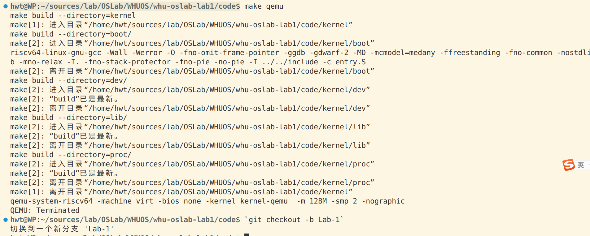
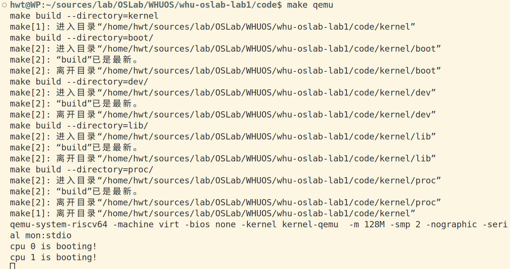
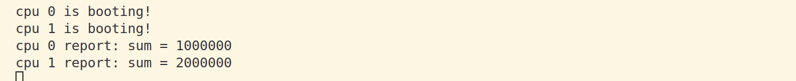
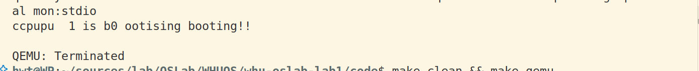
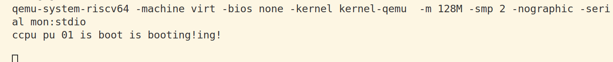

## 实验报告 — Lab 1：RISC-V 引导与裸机启动

## 1. 实验目的

- 理解 RISC-V 的启动流程（从 entry.S -> start.c -> main.c）以及多核引导的基本思路。
- 实现最小串口输出（基于 UART），能在 QEMU 上看到指定输出。
- 掌握调试方法（GDB + QEMU），能定位启动或输出问题。

## 2. 系统设计与代码组织

仓库主结构（与本次实验相关）：

- `kernel/boot/`：启动入口与 C 启动代码（`entry.S`, `start.c`, `main.c`）
- `kernel/dev/`：设备驱动（`uart.c`）
- `kernel/lib/`：打印与同步库（`print.c`, `spinlock.c`）
- `kernel/proc/`：与处理器/多核相关代码
- `kernel/kernel.ld`：链接脚本，定义入口与段布局

设计说明要点：

- 入口点 `_entry` 被放置在 `0x80000000`（由链接脚本指定），QEMU 会从这里开始执行。
- `entry.S` 负责最早期的处理：设置栈、将控制权交给 C 代码（`start.c`）。
- `start.c` 完成从 Machine mode 到 Supervisor/User mode 的必要设置，并最终跳转到 `main.c`。
- `uart.c` 提供最小的串口字符发送函数；`print.c` 封装 `printf`，并使用自旋锁保护输出以避免并发混乱。

## 3. 关键数据结构与符号

- `CPU_stack`：为每个 hart 保留一段内核栈空间，通常在 `start.c` 中定义为 `uint8 CPU_stack[NCPU * STACKSIZE]`。
- 链接脚本中常见符号：`_entry`, `etext`, `edata`, `end`，用于代码/数据段边界和 BSS 清零。

## 4. 实现步骤

1. 阅读并理解 `kernel/entry.S` 中的启动序列：设置初始栈地址、调用 `start`。
2. 在 `start.c` 中完成多核/模式切换逻辑（必要时），并跳转到 `main`。
3. 在 `lib/print.c` 中实现 `print_init` 与 `printf`。
4. 实现 `spinlock.c` 的简单自旋锁（基于原子交换或 `lr/sc` 指令），并在 `printf` 中使用锁保护串口操作。
5. 使用 Makefile 生成两个产物：
   - `kernel-qemu.elf`（带调试符号的 ELF，用于 gdb 加载）
   - `kernel-qemu`（裸二进制镜像，用于 QEMU 启动，使用 `objcopy -O binary` 从 ELF 生成）

## 5. 调试与测试流程

1. 编译并生成镜像：

```sh
make clean
make build --directory=kernel
```

2. 在一个终端启动 QEMU，并暂停等待 gdb 连接（端口示例 26000）：

```sh
qemu-system-riscv64 -machine virt -bios none -kernel kernel-qemu -m 128M -smp 2 -nographic -serial mon:stdio -S -gdb tcp::26000
```

3. 在另一终端启动 gdb 并加载 ELF（带符号文件）：

```sh
gdb-multiarch kernel-qemu.elf
(gdb) target remote :26000
(gdb) b _entry
(gdb) c
```

4. 到达入口或 `main` 后，使用 `n` / `s` 单步执行，或启用 TUI（`layout asm` 或 `gdb -tui`）查看源码与汇编。
5. 检查 UART 输出函数（`uart_putc` 与 `uart_init`）是否被调用：设置断点 `b uart_putc`、`b uart_init`。
6. 典型调试指令：'`(gdb) x/10i $pc`

## 6. 问题与解决方案

- 没有任何串口输出。

  - 排查：确认 `_entry` 是否被暴露并正确链接到 0x80000000；检查 `uart` 基地址是否与 QEMU 的 `virt` 设备一致（通常为 `0x10000000`）；在汇编最早阶段直接写一个字符到 UART 来验证硬件连通。
  - 解决：在 `entry.S` 中添加 `.globl _entry` 并重新编译；确认 `kernel.ld` 将 `_entry` 放到 `0x80000000`。
- gdb 无法定位函数（`Cannot find bounds of current function` / 无调试符号）

  - 排查：确认 ELF 未被 strip，且 gdb 加载的是 ELF（非裸二进制）。
  - 解决：链接产生 `kernel-qemu.elf`（保留符号），用 `objcopy` 生成裸二进制；在 gdb 中加载 `kernel-qemu.elf`。
- 执行 `make qemu` 后观察到以下现象：

  - 链接警告：`riscv64-linux-gnu-ld: 警告: 无法找到项目符号 _entry; 缺省为 0000000080000000`。原因是 `entry.S` 中 `_entry` 未被 `.globl` 导出。
  - 在早期 Makefile 中，`ls` 的通配符写法不当导致 `ls` 报错（`ls: 无法访问 './*/*/*.o': 没有那个文件或目录`），已修正为只匹配 `./*/*.o`。
  - gdb 报 `file format not recognized` 是因为使用了裸二进制 `kernel-qemu` 作 gdb 加载对象。已改为生成 `kernel-qemu.elf` 并用其进行调试。

## 8. 运行结果

- 添加输出前
- 添加输出后

  
- 加法使用锁前

  
- 加法使用锁后

  - 问题回答：要修复 sum 的不一致性，保证每次更新都在临界区内或使用原子操作；为最佳性能，采用本地累加 + 一次合并或原子加，而不要在持锁期间做 printf 等长操作
  - 结果图
  - 对应代码
- print去掉锁

  - 结果图
  - 对应修改：去掉start变量和print中使用了spin_lock的相关语句
