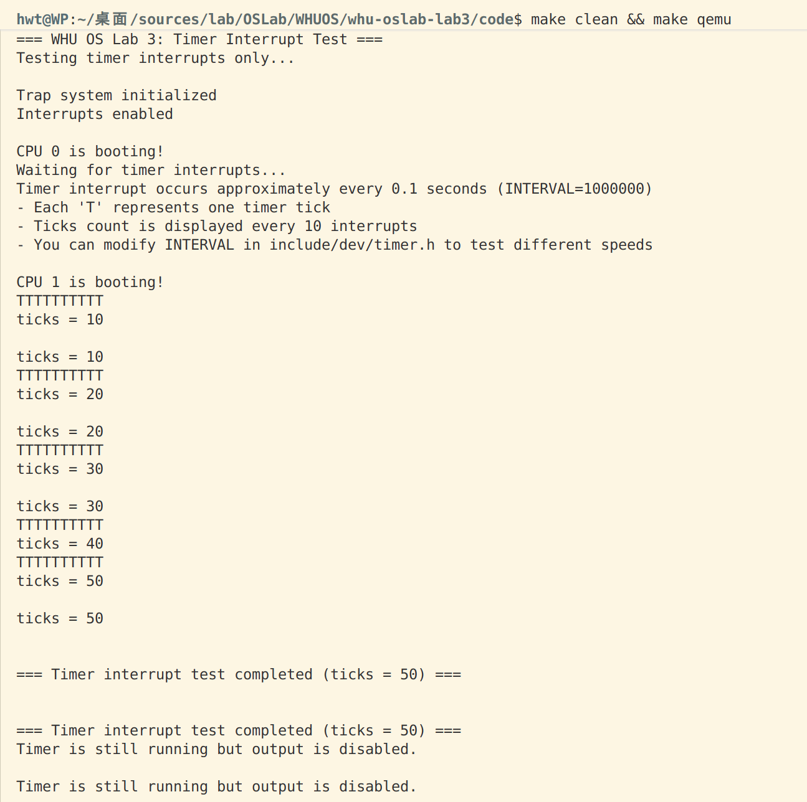

# WHU OS Lab 3 实验报告：中断处理实现

**实验名称**: RISC-V 操作系统内核中断处理
**实验时间**: 2025年10月20日
**实验平台**: QEMU RISC-V64 虚拟机

---

## 一、实验目的

本实验旨在实现 RISC-V 操作系统内核的中断处理机制，主要包括：

1. 理解 RISC-V 中断处理的基本原理和流程
2. 实现 M-mode 时钟中断的初始化和处理
3. 实现 S-mode 中断分发和处理机制
4. 实现外设中断（UART）的处理
5. 掌握中断上下文的保存和恢复
6. 理解多核环境下的中断处理

---

## 二、实验原理

### 2.1 RISC-V 特权级架构

RISC-V 定义了三个特权级：

- **M-mode (Machine Mode)**: 最高特权级，可访问所有硬件资源
- **S-mode (Supervisor Mode)**: 操作系统内核运行级别
- **U-mode (User Mode)**: 用户程序运行级别

### 2.2 中断处理机制

#### 2.2.1 中断类型

RISC-V 将 trap 分为两类：

- **中断 (Interrupt)**: 异步事件，由外部硬件触发
  - 时钟中断 (Timer Interrupt)
  - 外设中断 (External Interrupt)
  - 软件中断 (Software Interrupt)
- **异常 (Exception)**: 同步事件，由指令执行引起
  - 非法指令、页错误、系统调用等

#### 2.2.2 关键 CSR 寄存器

| 寄存器            | 功能                       | 读写权限 |
| ----------------- | -------------------------- | -------- |
| **stvec**   | S-mode trap 向量基地址     | 读写     |
| **sepc**    | 异常发生时的 PC            | 读写     |
| **scause**  | trap 原因 (中断/异常类型)  | 只读     |
| **stval**   | trap 附加信息 (如出错地址) | 只读     |
| **sstatus** | S-mode 状态寄存器          | 读写     |
| **sie**     | S-mode 中断使能            | 读写     |
| **sip**     | S-mode 中断挂起            | 读写     |

#### 2.2.3 scause 寄存器格式

```
63        62-0
┌─┬───────────┐
│I│ Exception │
│ │   Code    │
└─┴───────────┘

I=1: 中断
I=0: 异常

常用中断代码:
  1: S-mode 软件中断 (M-mode 时钟中断转发)
  5: S-mode 时钟中断
  9: S-mode 外设中断

常用异常代码:
  0: 指令地址不对齐
  2: 非法指令
  8: U-mode 系统调用 (ecall)
 12: 指令页错误
 13: 加载页错误
 15: 存储页错误
```

### 2.3 中断处理硬件

#### 2.3.1 CLINT (Core Local Interruptor)

- **地址**: 0x2000000
- **功能**: 提供定时器中断和核间软件中断
- **关键寄存器**:
  - `CLINT_MTIME`: 当前时间 (64位计数器)
  - `CLINT_MTIMECMP(hartid)`: 时钟比较值

#### 2.3.2 PLIC (Platform-Level Interrupt Controller)

- **地址**: 0x0c000000
- **功能**: 管理外部设备中断
- **特性**:
  - 支持中断优先级
  - 支持多核中断分发
  - Claim/Complete 机制防止中断丢失

#### 2.3.3 UART (串口)

- **地址**: 0x10000000
- **IRQ**: 10
- **功能**: 串口输入输出，支持中断模式

---

## 三、实验内容

### 3.1 实现的文件和函数

#### 3.1.1 kernel/dev/timer.c - 时钟管理

##### `timer_init()` - M-mode 时钟初始化

**功能**: 在 M-mode 下初始化时钟中断

**实现代码**:

```c
void timer_init()
{
    // 获取当前CPU的hartid
    int hartid = r_mhartid();

    // 设置第一次时钟中断的时间
    *(uint64*)CLINT_MTIMECMP(hartid) = *(uint64*)CLINT_MTIME + INTERVAL;

    // 准备timer_vector需要的信息
    uint64 *scratch = &mscratch[hartid][0];
    scratch[3] = CLINT_MTIMECMP(hartid);
    scratch[4] = INTERVAL;
    w_mscratch((uint64)scratch);

    // 设置M-mode trap处理函数为timer_vector
    w_mtvec((uint64)timer_vector);

    // 使能M-mode中断和时钟中断
    w_mstatus(r_mstatus() | MSTATUS_MIE);
    w_mie(r_mie() | MIE_MTIE);
}
```

**实现要点**:

- 设置 `CLINT_MTIMECMP` 为当前时间 + 间隔
- 配置 mscratch 数组供 timer_vector 使用
- 设置 mtvec 指向 timer_vector
- 使能 M-mode 时钟中断

##### `timer_create()` - 创建系统时钟

**功能**: 初始化 S-mode 系统时钟

**实现代码**:

```c
void timer_create()
{
    sys_timer.ticks = 0;
    initlock(&sys_timer.lk, "timer");
}
```

##### `timer_update()` - 更新时钟

**功能**: 线程安全地增加系统滴答计数

**实现代码**:

```c
void timer_update()
{
    acquire(&sys_timer.lk);
    sys_timer.ticks++;
    release(&sys_timer.lk);
}
```

##### `timer_get_ticks()` - 获取时钟滴答数

**功能**: 线程安全地读取当前 ticks

**实现代码**:

```c
uint64 timer_get_ticks()
{
    uint64 ticks;
    acquire(&sys_timer.lk);
    ticks = sys_timer.ticks;
    release(&sys_timer.lk);
    return ticks;
}
```

---

#### 3.1.2 kernel/trap/trap_kernel.c - 内核态中断处理

##### `trap_kernel_init()` - 初始化全局 trap 资源

**功能**: 初始化内核 trap 系统的全局资源

**实现代码**:

```c
void trap_kernel_init()
{
    timer_create();
}
```

##### `trap_kernel_inithart()` - 每个 CPU 核心的 trap 初始化

**功能**: 为每个 CPU 核心设置 trap 处理

**实现代码**:

```c
void trap_kernel_inithart()
{
    w_stvec((uint64)kernel_vector);
}
```

##### `trap_kernel_handler()` - 核心中断/异常处理逻辑

**功能**: 分发和处理所有内核态的中断和异常

**实现代码**:

```c
void trap_kernel_handler()
{
    uint64 sepc = r_sepc();
    uint64 sstatus = r_sstatus();
    uint64 scause = r_scause();
    uint64 stval = r_stval();

    // 安全性检查
    assert(sstatus & SSTATUS_SPP, "trap_kernel_handler: not from s-mode");
    assert(intr_get() == 0, "trap_kernel_handler: interrupt enabled");

    int trap_id = scause & 0xf;

    if (scause & (1ULL << 63)) {
        // 中断处理
        switch (trap_id) {
            case 1:  // S-mode 软件中断
                timer_interrupt_handler();
                break;
            case 5:  // S-mode 时钟中断
                printk("S-mode timer interrupt\n");
                break;
            case 9:  // S-mode 外设中断
                external_interrupt_handler();
                break;
            default:
                printk("Unknown interrupt: %s\n", interrupt_info[trap_id]);
                break;
        }
    } else {
        // 异常处理
        printk("Exception in kernel at sepc=0x%lx: %s\n", 
               sepc, exception_info[trap_id]);
        printk("  stval = 0x%lx\n", stval);
        panic("Unhandled exception in kernel mode");
    }
}
```

**实现要点**:

- 读取所有关键 CSR 寄存器
- 进行安全性检查
- 根据 scause 最高位判断中断/异常
- 分发到对应的处理函数

##### `timer_interrupt_handler()` - 时钟中断处理

**功能**: 处理由 M-mode 转发的时钟中断

**实现代码**:

```c
void timer_interrupt_handler()
{
    // 清除S-mode软件中断挂起位
    w_sip(r_sip() & ~2);

    // 更新系统时钟
    timer_update();

    // 打印时钟中断信息
    printk("Timer interrupt: ticks = %d\n", timer_get_ticks());
}
```

**实现要点**:

- 清除 SIP.SSIP 位
- 调用 timer_update() 增加 ticks
- 打印调试信息

##### `external_interrupt_handler()` - 外设中断处理

**功能**: 处理 PLIC 管理的外部设备中断

**实现代码**:

```c
void external_interrupt_handler()
{
    int irq = plic_claim();

    if (irq == UART_IRQ) {
        uart_intr();
    } else if (irq) {
        printk("Unexpected external interrupt irq=%d\n", irq);
    }

    if (irq) {
        plic_complete(irq);
    }
}
```

**实现要点**:

- 调用 plic_claim() 获取中断号
- 根据 IRQ 分发到具体设备驱动
- 调用 plic_complete() 通知 PLIC 完成

---

#### 3.1.3 kernel/trap/trap.S - 汇编中断入口

##### kernel_vector - S-mode 中断向量

**功能**: 保存/恢复上下文，调用 C 语言处理函数

**实现代码** (部分):

```assembly
kernel_vector:
    # 分配栈空间
    addi sp, sp, -256

    # 保存所有通用寄存器
    sd ra, 0(sp)
    sd sp, 8(sp)
    sd gp, 16(sp)
    # ... 保存 x4-x31

    # 调用 C 处理函数
    call trap_kernel_handler

    # 恢复所有寄存器
    ld ra, 0(sp)
    # ... 恢复其他寄存器

    # 恢复栈指针
    addi sp, sp, 256

    # 返回
    sret
```

##### timer_vector - M-mode 时钟中断向量

**功能**: 处理 M-mode 时钟中断，转发到 S-mode

**实现代码** (部分):

```assembly
timer_vector:
    # 暂存寄存器到 mscratch
    csrrw a0, mscratch, a0
    sd a1, 0(a0)
    sd a2, 8(a0)
    sd a3, 16(a0)

    # 更新 CLINT_MTIMECMP += INTERVAL
    ld a1, 24(a0)     # CLINT_MTIMECMP 地址
    ld a2, 32(a0)     # INTERVAL
    ld a3, 0(a1)
    add a3, a3, a2
    sd a3, 0(a1)

    # 触发 S-mode 软件中断
    li a1, 2
    csrw sip, a1

    # 恢复寄存器
    ld a3, 16(a0)
    ld a2, 8(a0)
    ld a1, 0(a0)
    csrrw a0, mscratch, a0

    mret
```

---

### 3.2 函数调用关系

#### 3.2.1 启动阶段函数调用

**kernel/boot/start.c** (M-mode):

```c
void start()
{
    // ... 配置特权级和内存保护
  
    // 初始化时钟中断
    timer_init();
  
    // 切换到 S-mode
    mret;
}
```

**kernel/boot/main.c** (S-mode):

```c
int main()
{
    int cpuid = r_tp();

    if(cpuid == 0) {
        print_init();
  
        // 初始化设备和中断系统
        uart_init();
        plic_init();
        trap_kernel_init();
        trap_kernel_inithart();
        plic_inithart();
  
        // 使能中断
        intr_on();
  
        started = 1;
    } else {
        while(started == 0);
  
        // 其他CPU核心初始化
        trap_kernel_inithart();
        plic_inithart();
        intr_on();
    }

    while (1);
}
```

---

## 四、中断处理流程

### 4.1 时钟中断完整流程

```
1. CLINT 时钟到期 (CLINT_MTIME >= CLINT_MTIMECMP)
    ↓
2. 触发 M-mode 时钟中断
    ↓
3. CPU 跳转到 mtvec (timer_vector)
    ↓
4. [trap.S] timer_vector:
    ├─ 保存寄存器 a0-a3 到 mscratch
    ├─ 更新 CLINT_MTIMECMP += INTERVAL
    ├─ 设置 SIP.SSIP (触发 S-mode 软件中断)
    └─ mret 返回
    ↓
5. 触发 S-mode 软件中断
    ↓
6. CPU 跳转到 stvec (kernel_vector)
    ↓
7. [trap.S] kernel_vector:
    ├─ 保存所有寄存器到栈
    └─ call trap_kernel_handler()
        ↓
8. [trap_kernel.c] trap_kernel_handler():
    ├─ 读取 scause = 0x8000000000000001
    └─ 调用 timer_interrupt_handler()
        ├─ 清除 SIP.SSIP
        ├─ timer_update() (ticks++)
        └─ printk("Timer interrupt: ticks = %d")
        ↓
9. 返回到 kernel_vector
    ├─ 恢复所有寄存器
    └─ sret 返回到被中断的代码
```

### 4.2 UART 中断完整流程

```
1. UART 接收到数据
    ↓
2. UART 硬件产生中断请求
    ↓
3. PLIC 接收中断请求并设置挂起位
    ↓
4. 触发 S-mode 外设中断
    ↓
5. CPU 跳转到 stvec (kernel_vector)
    ↓
6. [trap.S] kernel_vector:
    ├─ 保存所有寄存器到栈
    └─ call trap_kernel_handler()
        ↓
7. [trap_kernel.c] trap_kernel_handler():
    ├─ 读取 scause = 0x8000000000000009
    └─ 调用 external_interrupt_handler()
        ├─ plic_claim() → 获取 IRQ = 10 (UART)
        ├─ uart_intr()
        │   ├─ 读取 UART 数据
        │   └─ uart_putc_sync() 回显
        └─ plic_complete(10)
        ↓
8. 返回到 kernel_vector
    ├─ 恢复所有寄存器
    └─ sret 返回到被中断的代码
```

---

## 五、关键数据结构

### 5.1 timer_t 结构

```c
typedef struct timer {
    uint64 ticks;      // 时钟滴答计数
    spinlock_t lk;     // 保护 ticks 的自旋锁
} timer_t;
```

**设计说明**:

- 使用自旋锁保证多核环境下的线程安全
- ticks 记录系统启动以来的时钟中断次数

### 5.2 mscratch 数组

```c
static uint64 mscratch[NCPU][5];
```

**用途**:

- `[hartid][0..2]`: timer_vector 临时保存 a1, a2, a3
- `[hartid][3]`: CLINT_MTIMECMP(hartid) 地址
- `[hartid][4]`: INTERVAL 值

---

## 六、实验测试

### 6.1 时钟中断测试

**测试代码**：

```c++
#include "riscv.h"
#include "lib/print.h"
#include "dev/uart.h"
#include "dev/plic.h"
#include "trap/trap.h"

volatile static int started = 0;
int main()
{
    int cpuid = r_tp();

    if(cpuid == 0) {
        // CPU 0: 主核心初始化
        print_init();

        printf("\n=== WHU OS Lab 3: Timer Interrupt Test ===\n");
        printf("Testing timer interrupts only...\n\n");

        // 初始化trap系统（用于处理时钟中断）
        trap_kernel_init();       // 初始化内核trap系统（包括timer_create）
        trap_kernel_inithart();   // 初始化当前核心的trap（设置stvec）

        printf("Trap system initialized\n");

        // 使能中断
        intr_on();
        printf("Interrupts enabled\n\n");

        printf("CPU %d is booting!\n", cpuid);
        printf("Waiting for timer interrupts...\n");
        printf("Timer interrupt occurs approximately every 0.1 seconds (INTERVAL=1000000)\n");
        printf("- Each 'T' represents one timer tick\n");
        printf("- Ticks count is displayed every 10 interrupts\n");
        printf("- You can modify INTERVAL in include/dev/timer.h to test different speeds\n\n");
    
        __sync_synchronize();
        started = 1;  // 允许其他CPU继续启动

    } else {
        // 其他CPU核心初始化
        while(started == 0);
        __sync_synchronize();
    
        // 其他CPU核心也需要初始化trap
        trap_kernel_inithart();   // 初始化当前核心的trap
    
        // 使能中断
        intr_on();
    
        printf("CPU %d is booting!\n", cpuid);
    }

    // 主循环：等待中断
    while (1) {
        // 可以在这里添加其他测试代码
        // 中断会自动被处理
    }
}

```

**测试结果**:

多核输出只让CPU0输出

### 6.2 UART 中断测试

**测试代码**：

**测试结果**:

---
